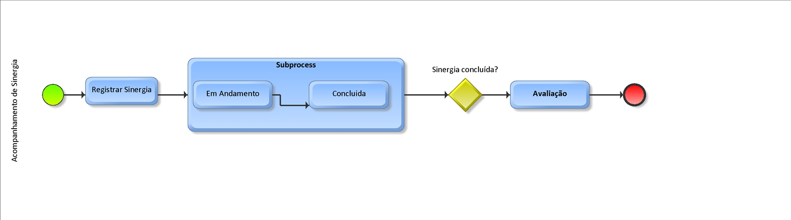
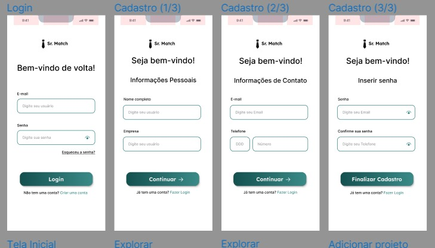
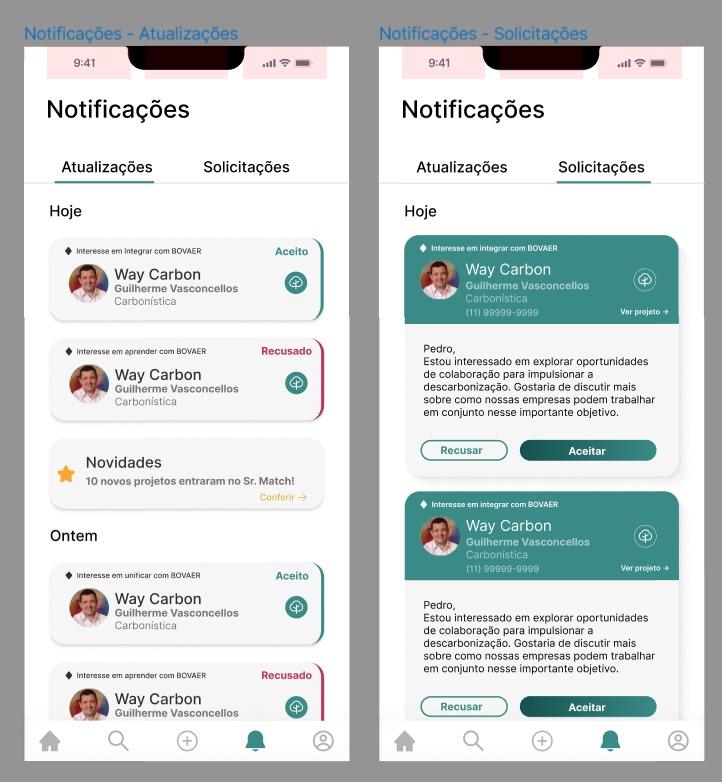
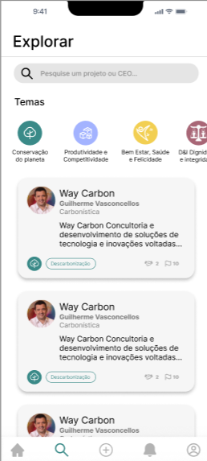
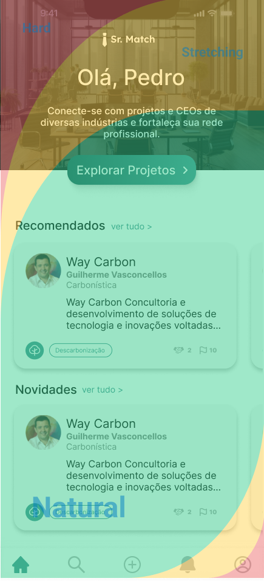
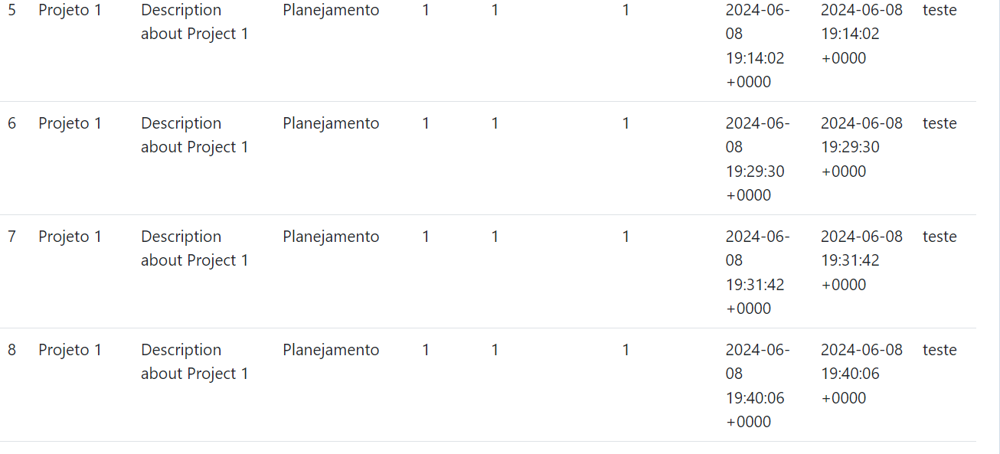

<table>
<tr>
<Table>
  <tr>
    <td><a href= "https://www.fdc.org.br/"></td>
    <td>
      <a href= "https://www.inteli.edu.br/"></a>
    </td>
  </tr>
</table>

# Nome do Projeto

## Nome do Grupo

## :student: Integrantes:

- <a href="https://www.linkedin.com/in/username/">Nome</a>
- <a href="https://www.linkedin.com/in/username/">Nome</a>
- <a href="https://www.linkedin.com/in/username/">Nome</a>
- <a href="https://www.linkedin.com/in/username/">Nome</a>
- <a href="https://www.linkedin.com/in/username/">Nome</a>
- <a href="https://www.linkedin.com/in/username/">Nome</a>

## Sumário

- [Nome do Projeto](#nome-do-projeto)
  - [Nome do Grupo](#nome-do-grupo)
  - [:student: Integrantes:](#student-integrantes)
  - [Sumário](#sumário)
- [1. Termos e Abreviações](#1-termos-e-abreviações)
- [2. Visão Geral do Projeto](#2-visão-geral-do-projeto)
  - [2.1 Entendimento do Parceiro](#21-entendimento-do-parceiro)
    - [2.1.1 Partes Interessadas](#211-partes-interessadas)
    - [2.1.2 Análise da Indústria](#212-análise-da-indústria)
    - [2.1.3 Modelo de Negócio](#213-modelo-de-negócio)
    - [2.1.4 Tendências](#214-tendências)
    - [2.1.5 Players de Mercado](#215-players-de-mercado)
  - [2.2 Problema](#22-problema)
- [3. Proposta da Solução](#3-proposta-da-solução)
  - [3.1 Descritivo Geral da Solução](#31-descritivo-geral-da-solução)
  - [3.2 Proposta Tecnológica e Benefícios](#32-proposta-tecnológica-e-benefícios)
  - [3.3 Proposta de Valor (Value Proposition Canvas)](#33-proposta-de-valor-value-proposition-canvas)
  - [3.4 Matriz de Risco](#34-matriz-de-risco)
      - [1) O Aplicativo desenvolvido não estar disponível em todos os dispositivos:](#1-o-aplicativo-desenvolvido-não-estar-disponível-em-todos-os-dispositivos)
      - [2) Dados não representativos para o sistema de recomendação:](#2-dados-não-representativos-para-o-sistema-de-recomendação)
      - [3) Falta de comunicação entre os membros do grupo:](#3-falta-de-comunicação-entre-os-membros-do-grupo)
      - [4) Aplicativo não possuir uma boa performance em dispositivos antigos:](#4-aplicativo-não-possuir-uma-boa-performance-em-dispositivos-antigos)
      - [4) Aplicativo não possuir uma boa performance em dispositivos antigos:](#4-aplicativo-não-possuir-uma-boa-performance-em-dispositivos-antigos-1)
      - [5) Conflitos entre membros do grupo:](#5-conflitos-entre-membros-do-grupo)
      - [6) Aplicativo ter uma péssima usabilidade:](#6-aplicativo-ter-uma-péssima-usabilidade)
      - [7) Arquitetura SOA não ser bem aplicada no desenvolvimento da solução:](#7-arquitetura-soa-não-ser-bem-aplicada-no-desenvolvimento-da-solução)
      - [8) A sociedade ser beneficiadas pelas parcerias entre os projetos dos CEOs:](#8-a-sociedade-ser-beneficiadas-pelas-parcerias-entre-os-projetos-dos-ceos)
      - [9) Otimizar os  matches entre os projetos](#9-otimizar-os--matches-entre-os-projetos)
  - [3.5 Estimativa de Investimento](#35-estimativa-de-investimento)
    - [Desenvolvimento do MVP](#desenvolvimento-do-mvp)
    - [Custos Operacionais Pós-Lançamento](#custos-operacionais-pós-lançamento)
      - [Alocação em Nuvem na AWS](#alocação-em-nuvem-na-aws)
      - [Manutenção da Plataforma](#manutenção-da-plataforma)
    - [Estimativa de Gasto Total](#estimativa-de-gasto-total)
- [4. Análise dos processos](#4-análise-dos-processos)
  - [4.1 Cadeia de Valor](#41-cadeia-de-valor)
  - [4.2 Modelagem de Processos](#42-modelagem-de-processos)
- [5. Requisitos](#5-requisitos)
  - [5.1 Requisitos Funcionais](#51-requisitos-funcionais)
    - [RF-001](#rf-001)
      - [Critérios de Aceitação](#critérios-de-aceitação)
      - [Descrição dos testes](#descrição-dos-testes)
    - [RF-002](#rf-002)
      - [Critérios de Aceitação](#critérios-de-aceitação-1)
      - [Descrição dos testes](#descrição-dos-testes-1)
    - [RF-003](#rf-003)
      - [Critérios de Aceitação](#critérios-de-aceitação-2)
      - [Descrição dos testes](#descrição-dos-testes-2)
    - [RF-004](#rf-004)
      - [Critérios de Aceitação](#critérios-de-aceitação-3)
      - [Descrição dos testes](#descrição-dos-testes-3)
    - [RF-005](#rf-005)
      - [Critérios de Aceitação](#critérios-de-aceitação-4)
      - [Descrição dos testes](#descrição-dos-testes-4)
    - [RF-006](#rf-006)
      - [Critérios de Aceitação](#critérios-de-aceitação-5)
      - [Descrição dos testes](#descrição-dos-testes-5)
    - [RF-007](#rf-007)
      - [Critérios de Aceitação](#critérios-de-aceitação-6)
      - [Descrição dos testes](#descrição-dos-testes-6)
  - [5.2 Requisitos não Funcionais](#52-requisitos-não-funcionais)
  - [5.3 Casos de Uso](#53-casos-de-uso)
    - [UC-001](#uc-001)
    - [UC-002](#uc-002)
    - [UC-003](#uc-003)
    - [UC-004](#uc-004)
    - [UC-005](#uc-005)
    - [UC-006](#uc-006)
    - [UC-007](#uc-007)
    - [UC-008](#uc-008)
    - [UC-009](#uc-009)
  - [5.4 Casos de Uso x Requisitos Funcionais](#54-casos-de-uso-x-requisitos-funcionais)
- [6. Projeto de Solução](#6-projeto-de-solução)
  - [6. Gestão de Desenvolvimento e Tecnologias](#6-gestão-de-desenvolvimento-e-tecnologias)
  - [6.1 Diagrama de Classes](#61-diagrama-de-classes)
    - [CEO:](#ceo)
    - [Projeto:](#projeto)
    - [Sinergia:](#sinergia)
    - [Subcategoria:](#subcategoria)
    - [Categoria:](#categoria)
  - [6.2 Arquitetura da Solução](#62-arquitetura-da-solução)
    - [Frontend](#frontend)
    - [API Gateway](#api-gateway)
    - [Backend](#backend)
    - [Database](#database)
    - [Imagem do diagrama da arquitetura](#imagem-do-diagrama-da-arquitetura)
  - [6.3 Diagrama de Implantação](#63-diagrama-de-implantação)
  - [6.4 Tecnologias e Ferramentas](#64-tecnologias-e-ferramentas)
    - [6.4.1 Backend: Tecnologias e Ferramentas](#641-backend-tecnologias-e-ferramentas)
    - [6.4.2 Cloud: Tecnologias e Ferramentas](#642-cloud-tecnologias-e-ferramentas)
    - [6.4.3 Frontend: Tecnologias e Ferramentas](#643-frontend-tecnologias-e-ferramentas)
  - [6.5 Padrões de Trabalho](#65-padrões-de-trabalho)
    - [6.5.1 Padrão de Código](#651-padrão-de-código)
    - [Práticas do Padrão de Código:](#práticas-do-padrão-de-código)
    - [6.5.2 Padrão de Commits](#652-padrão-de-commits)
    - [Estrutura da Mensagem de Commit no Conventional Commits:](#estrutura-da-mensagem-de-commit-no-conventional-commits)
    - [Elementos Estruturais do Commit:](#elementos-estruturais-do-commit)
    - [6.5.3 Estrutura de Pastas](#653-estrutura-de-pastas)
    - [6.5.4 Padrão de Branches](#654-padrão-de-branches)
- [7. Interface](#7-interface)
  - [7.1 Projeto de Interface (Wireframes)](#71-projeto-de-interface-wireframes)
    - [Tela Inicial](#tela-inicial)
    - [Tela de Login](#tela-de-login)
    - [Tela de Cadastro](#tela-de-cadastro)
    - [Página Inicial](#página-inicial)
    - [Tela de Exploração](#tela-de-exploração)
    - [Tela de Adicionar Projeto](#tela-de-adicionar-projeto)
    - [Tela de Notificações](#tela-de-notificações)
    - [Tela de Detalhes do Projeto](#tela-de-detalhes-do-projeto)
    - [Tela de Criação de Sinergia](#tela-de-criação-de-sinergia)
    - [Tela de Perfil do Usuário](#tela-de-perfil-do-usuário)
    - [Tela de Edição de Perfil](#tela-de-edição-de-perfil)
  - [7.2 Mockup](#72-mockup)
  - [7.2 Mockup](#72-mockup-1)
  - [7.3 Frontend](#73-frontend)
  - [7.4 Análise de Usabilidade do Frontend](#74-análise-de-usabilidade-do-frontend)
    - [Design System](#design-system)
    - [Heurísticas de Nielsen](#heurísticas-de-nielsen)
      - [Compatibilidade entre o sistema e o mundo real](#compatibilidade-entre-o-sistema-e-o-mundo-real)
      - [Cosistência e Padronização](#cosistência-e-padronização)
      - [Estética e design minimalista](#estética-e-design-minimalista)
    - [Zona do Polegar](#zona-do-polegar)
    - [Acessibilidade](#acessibilidade)
- [8. Projeto de Banco de Dados](#8-projeto-de-banco-de-dados)
  - [8.1 Especificação da Base de Dados para Modelo de Recomendação](#81-especificação-da-base-de-dados-para-modelo-de-recomendação)
    - [Datasets Utilizados](#datasets-utilizados)
    - [Estrutura de Dados](#estrutura-de-dados)
    - [Processo de Implementação](#processo-de-implementação)
    - [Considerações Finais](#considerações-finais)
  - [8.2 Modelo Conceitual](#82-modelo-conceitual)
  - [8.3 Modelo Lógico](#83-modelo-lógico)
    - [Estrutura de Tabelas](#estrutura-de-tabelas)
    - [Relacionamentos](#relacionamentos)
    - [Considerações Finais](#considerações-finais-1)
- [9. Construção da Solução](#9-construção-da-solução)
  - [9.1 Modelo de Recomendação](#91-modelo-de-recomendação)
    - [Objetivo do modelo](#objetivo-do-modelo)
    - [Metodologia](#metodologia)
    - [Implementação](#implementação)
    - [Avaliação do modelo](#avaliação-do-modelo)
    - [Benefícios esperados](#benefícios-esperados)
    - [Futuras expansões](#futuras-expansões)
  - [9.2 Estrutura da Solução](#92-estrutura-da-solução)
    - [Padrões de Produto](#padrões-de-produto)
    - [Processos de Construção de Código](#processos-de-construção-de-código)
    - [Descrição da API externa Utilizada](#descrição-da-api-externa-utilizada)
      - [Justificativa para o Uso das APIs no Projeto Sr. Match:](#justificativa-para-o-uso-das-apis-no-projeto-sr-match)
    - [Considerações Finais](#considerações-finais-2)
- [10. Testes de Software](#10-testes-de-software)
  - [10.1 Testes de Usabilidade para Mockup](#101-testes-de-usabilidade-para-mockup)
  - [10.2 Testes de Integração](#102-testes-de-integração)
    - [Buscando todas requisições](#buscando-todas-requisições)
    - [Criando um projeto](#criando-um-projeto)
    - [Atualizando uma sinergia](#atualizando-uma-sinergia)
    - [Deletando uma notifição](#deletando-uma-notifição)
  - [10.3 Testes da API Externa](#103-testes-da-api-externa)
    - [Pré-requisitos](#pré-requisitos)
  - [Testes de Integração](#testes-de-integração)
    - [Casos de Teste](#casos-de-teste)
    - [1. Teste de Conexão com a API do Google Maps](#1-teste-de-conexão-com-a-api-do-google-maps)
    - [2. Teste de Endereço Inexistente](#2-teste-de-endereço-inexistente)
  - [Testes Unitários](#testes-unitários)
  - [Casos de Teste](#casos-de-teste-1)
    - [Link da API Externa](#link-da-api-externa)
    - [Conclusão](#conclusão)
  - [10.4 Testes de Integração do Modelo de Recomendação](#104-testes-de-integração-do-modelo-de-recomendação)
    - [Introdução](#introdução)
    - [Pré-Condições](#pré-condições)
      - [Configuração do Ambiente de Teste:](#configuração-do-ambiente-de-teste)
      - [Mock do Serviço Externo:](#mock-do-serviço-externo)
      - [Dados de Mock:](#dados-de-mock)
    - [Cenário de Teste](#cenário-de-teste)
      - [Configuração do Mock Store:](#configuração-do-mock-store)
      - [Configuração do Servidor de Teste:](#configuração-do-servidor-de-teste)
      - [Definição da Rota de Teste:](#definição-da-rota-de-teste)
      - [Envio da Requisição de Teste:](#envio-da-requisição-de-teste)
      - [Validação da Resposta:](#validação-da-resposta)
    - [Pós-Condições](#pós-condições)
      - [Status da Resposta:](#status-da-resposta)
      - [Estrutura da Resposta:](#estrutura-da-resposta)
    - [Screenshot do resultado](#screenshot-do-resultado)
    - [Conclusão](#conclusão-1)
  - [10.5 Diagrama de sequência Utilizamos](#105-diagrama-de-sequência-utilizamos)
  - [Desenvolvimento](#desenvolvimento)
- [11. Procedimento de Implantação da Solução](#11-procedimento-de-implantação-da-solução)
  - [11.1 Procedimento de Implantação do Sistema](#111-procedimento-de-implantação-do-sistema)
    - [Configuração das Instâncias EC2](#configuração-das-instâncias-ec2)
      - [1.1. Instância “project\_instance”](#11-instância-project_instance)
      - [1.2. Instância “ceo\_instance”](#12-instância-ceo_instance)
      - [1.3. Instância “model\_instance”](#13-instância-model_instance)
      - [1.4. Instância “core\_instance”](#14-instância-core_instance)
      - [1.5. Instância “frontend\_instance”](#15-instância-frontend_instance)
    - [Configurações do Ambiente](#configurações-do-ambiente)
      - [1. Instalação do Projeto nas Instâncias EC2](#1-instalação-do-projeto-nas-instâncias-ec2)
    - [Configurações do Front-end](#configurações-do-front-end)
  - [11.2 Procedimento de Implantação do Banco de Dados](#112-procedimento-de-implantação-do-banco-de-dados)
    - [Configuração do PostgreSQL](#configuração-do-postgresql)
    - [Conexão ao Banco de Dados](#conexão-ao-banco-de-dados)
    - [Execução dos Serviços do Backend](#execução-dos-serviços-do-backend)
  - [11.3 Documentação Automática do Sistema](#113-documentação-automática-do-sistema)
    - [Instalação do Go](#instalação-do-go)
    - [Configuração do Banco de Dados](#configuração-do-banco-de-dados)
    - [Inicialização da Documentação](#inicialização-da-documentação)
    - [Acesso à Documentação](#acesso-à-documentação)
  - [12. Melhorias futuras](#12-melhorias-futuras)
    - [1. Adição de Dashboards](#1-adição-de-dashboards)
    - [2. Adição de uma Aba “Projetos em Alta”](#2-adição-de-uma-aba-projetos-em-alta)
    - [3. Chatbot](#3-chatbot)
    - [4. Recomendação por Conteúdo](#4-recomendação-por-conteúdo)
    - [5. Tutorial de Uso da Plataforma](#5-tutorial-de-uso-da-plataforma)
    - [6. Salvar/Favoritar Projetos](#6-salvarfavoritar-projetos)
    - [7. Feedback e Avaliação de Projetos](#7-feedback-e-avaliação-de-projetos)
- [Referências](#referências)
- [Apêndice](#apêndice)

# 1. Termos e Abreviações

<conteúdo>

# 2. Visão Geral do Projeto

<conteúdo>

## 2.1 Entendimento do Parceiro

&emsp;A Fundação Dom Cabral (FDC) é uma escola de negócios brasileira de renome internacional, reconhecida por seu compromisso com o desenvolvimento de executivos, líderes e organizações. A FDC busca constantemente inovar em suas metodologias de ensino e expandir seu impacto por meio de parcerias estratégicas e uso de tecnologia. O projeto SOAP, uma solução de aplicativo para dispositivos móveis, emerge como uma iniciativa para fortalecer a rede de CEOs’ Legacy, facilitando a gestão de sinergias entre projetos empresariais.

### 2.1.1 Partes Interessadas

&emsp;Identificar e compreender as partes interessadas é fundamental para o sucesso do projeto SOAP. Essa seção descreve os principais grupos e indivíduos que têm interesse direto ou indireto no projeto, detalhando suas expectativas, responsabilidades e o impacto do projeto sobre eles.

- **CEOs e Líderes Empresariais**: Como usuários finais do aplicativo, os CEOs buscam encontrar e explorar sinergias entre diferentes projetos para impulsionar inovação e crescimento sustentável. Eles esperam uma plataforma intuitiva que facilite a descoberta de novas oportunidades de colaboração.
- **Equipe de Gestão do CEOs’ Legacy da FDC**: Responsável por supervisionar a execução do projeto e assegurar que ele alinhe-se com os objetivos estratégicos da Fundação Dom Cabral. Esta equipe espera que o aplicativo SOAP aumente o engajamento entre os líderes empresariais e enriqueça a comunidade de CEOs’ Legacy.
- **Departamento de Tecnologia da Informação (TI) da FDC**: Fornece suporte técnico e infraestrutura necessários para o desenvolvimento, implementação e manutenção do aplicativo. A equipe de TI busca garantir a segurança dos dados, a integridade do sistema e a escalabilidade da solução proposta.
- **Alunos e Comunidade Acadêmica da FDC**: Beneficiários indiretos do aplicativo, podem aproveitar as sinergias e colaborações geradas entre os líderes empresariais para enriquecer sua experiência educacional e networking.
- **Parceiros e Patrocinadores da FDC**: Inclui empresas e organizações que apoiam financeiramente ou estrategicamente a Fundação Dom Cabral. Eles têm interesse em ver o impacto positivo do projeto na promoção da inovação e do desenvolvimento sustentável no ambiente empresarial.
- **Equipe de Desenvolvimento do Projeto SOAP**: Composta por engenheiros de software, designers de UX/UI e gerentes de projeto, esta equipe está no coração do desenvolvimento do aplicativo. Eles buscam entregar uma solução que atenda às necessidades das partes interessadas, mantendo altos padrões de qualidade e inovação.

### 2.1.2 Análise da Indústria

&emsp;A análise da indústria é crucial para compreender o ambiente no qual a Fundação Dom Cabral (FDC) e o projeto SOAP operam. Esta seção examina o setor de educação executiva e desenvolvimento de liderança, focando no contexto atual, desafios e oportunidades.

&emsp;O setor de educação executiva tem testemunhado uma evolução significativa nos últimos anos, impulsionada pela rápida transformação digital e pela necessidade de líderes empresariais de adaptarem-se a um ambiente de negócios cada vez mais volátil e globalizado. Instituições de renome como a FDC desempenham um papel vital ao oferecer programas que não apenas ampliam o conhecimento de negócios dos executivos, mas também aprimoram suas habilidades de liderança e visão estratégica.

&emsp;Uma tendência notável no setor é a crescente demanda por programas personalizados e flexíveis que podem ser adaptados às necessidades específicas de aprendizado dos líderes empresariais. Isso inclui a oferta de cursos online, módulos de aprendizado à distância e plataformas interativas, como o projeto SOAP pretende ser, que permitem aos executivos aprenderem no seu próprio ritmo e de acordo com suas agendas ocupadas.

&emsp;Além disso, há um foco crescente na sustentabilidade e responsabilidade social nas práticas de negócios. Programas de educação executiva estão incorporando esses temas em seus currículos, refletindo a importância de liderar com um propósito e criar valor não apenas para os acionistas, mas para a sociedade como um todo.

&emsp;No entanto, a indústria enfrenta desafios, incluindo a adaptação a tecnologias emergentes e a manutenção da relevância em um mercado saturado de informações. Instituições que conseguem inovar na entrega de conteúdo e engajar efetivamente sua audiência estarão melhor posicionadas para liderar neste ambiente competitivo.

&emsp;A FDC, com sua rica história e compromisso com a excelência, está bem posicionada neste setor. O projeto SOAP, com seu foco em facilitar a gestão de sinergias entre líderes empresariais e projetos, é um exemplo da inovação contínua da FDC, buscando não apenas atender às necessidades atuais de seus clientes, mas também antecipar as tendências futuras do setor.

### 2.1.3 Modelo de Negócio

&emsp;O modelo de negócios da Fundação Dom Cabral (FDC) está fundamentado em sua excelência acadêmica e sua abordagem prática para resolver desafios empresariais reais. Focando em educação executiva, consultoria e pesquisa, a FDC procura criar valor não só para os indivíduos e organizações que atende, mas também para a sociedade em geral. Este modelo é caracterizado por três pilares principais:

1. **Educação Executiva Personalizada**: A FDC oferece uma gama diversificada de programas, incluindo cursos abertos, programas customizados para empresas e módulos internacionais. Esses programas são desenhados para atender às necessidades específicas de desenvolvimento de líderes e equipes, abrangendo desde habilidades gerenciais fundamentais até temas avançados de estratégia e inovação.
2. **Consultoria Estratégica e de Gestão**: Além da educação executiva, a FDC presta serviços de consultoria, ajudando organizações a navegar por desafios complexos de negócios. Utilizando uma vasta rede de especialistas e uma metodologia baseada em pesquisa aplicada, a FDC propõe soluções inovadoras que são diretamente aplicáveis ao contexto organizacional do cliente.
3. **Pesquisa e Desenvolvimento**: O compromisso com a pesquisa é central para o modelo de negócios da FDC. Por meio de seus centros de pesquisa, a Fundação contribui com conhecimentos importantes para a comunidade empresarial, ao mesmo tempo em que alimenta seus próprios programas com insights atualizados e baseados em evidências. Isso assegura que a oferta educacional da FDC esteja sempre alinhada com as tendências globais e as melhores práticas de gestão.

&emsp;O projeto SOAP insere-se neste modelo como uma ferramenta digital que visa potencializar a capacidade da FDC de gerar sinergias entre os líderes empresariais e projetos. Ao oferecer uma plataforma que facilita o networking, a descoberta de oportunidades de colaboração e a gestão de projetos compartilhados, o SOAP amplia a missão da FDC de desenvolver líderes que promovam o progresso sustentável das organizações e da sociedade.

&emsp;Este modelo de negócios, apoiado por valores de excelência, inovação e impacto social, coloca a FDC em uma posição única para responder aos desafios atuais e futuros do mundo dos negócios. O projeto SOAP é uma expressão natural dessa abordagem, oferecendo uma nova dimensão de valor para os participantes dos programas da FDC e para a comunidade empresarial mais ampla.

### 2.1.4 Tendências

&emsp;A indústria de educação executiva e desenvolvimento de liderança está passando por transformações significativas, impulsionadas por mudanças globais em tecnologia, economia e sociedade. Identificar essas tendências é crucial para a Fundação Dom Cabral (FDC) e para o projeto SOAP, pois oferece insights valiosos para alinhar estratégias e inovações às expectativas e necessidades futuras do mercado. Aqui estão algumas das principais tendências que moldam o setor:

1. **Digitalização e Aprendizado Híbrido**: A pandemia de COVID-19 acelerou a adoção de plataformas digitais e formatos de aprendizado híbrido. Líderes empresariais buscam flexibilidade e opções de aprendizado que combinem o melhor dos mundos presencial e online. A tendência é uma demanda crescente por soluções de aprendizado que sejam não apenas acessíveis remotamente, mas também altamente interativas e personalizadas.
2. **Foco em Sustentabilidade e Responsabilidade Social Corporativa (RSC)**: Há um crescente reconhecimento da importância de incorporar a sustentabilidade e a RSC nas estratégias de negócios. Líderes são encorajados a considerar o impacto ambiental e social de suas decisões, impulsionando a demanda por programas educacionais que integrem esses conceitos em suas currículos.
3. **Inteligência Artificial e Personalização**: A IA está transformando o setor de educação, permitindo a personalização do aprendizado e oferecendo insights preditivos que melhoram a experiência do usuário. As plataformas educacionais estão cada vez mais utilizando algoritmos de IA para adaptar o conteúdo às necessidades individuais dos alunos, otimizando o processo de aprendizado.
4. **Desenvolvimento de Habilidades Socioemocionais**: Além das competências técnicas, as habilidades socioemocionais como liderança, comunicação, empatia e resiliência estão se tornando cada vez mais valorizadas. Há uma demanda crescente por programas que não apenas aprimorem o conhecimento de negócios, mas também preparem líderes para gerenciar equipes de forma eficaz e navegar por ambientes de trabalho complexos.
5. **Networking e Colaboração**: A capacidade de construir redes de contato robustas e colaborar em projetos multifuncionais é uma competência essencial para os líderes atuais. A tendência é por plataformas que facilitam o networking e a colaboração entre executivos de diferentes setores e geografias, promovendo a troca de ideias e a inovação conjunta.

&emsp;O projeto SOAP é uma resposta direta a essas tendências, buscando oferecer uma solução inovadora que apoie o desenvolvimento contínuo de líderes alinhados com as necessidades e desafios do futuro. Ao integrar tecnologia avançada e focar no networking e na colaboração, o SOAP se posiciona na vanguarda da educação executiva, contribuindo significativamente para a missão da FDC de formar líderes que promovam o progresso sustentável.

### 2.1.5 Players de Mercado

&emsp;A paisagem competitiva na indústria de educação executiva e desenvolvimento de liderança é diversificada e dinâmica, com várias instituições de renome competindo e colaborando para moldar o futuro da liderança empresarial. A Fundação Dom Cabral (FDC) se posiciona estrategicamente entre esses players, destacando-se por sua abordagem inovadora e foco em resultados práticos e sustentáveis. Vamos examinar alguns dos principais concorrentes no mercado e como a FDC se compara:

1. **Harvard Business School (HBS)**: Conhecida globalmente por seus programas de MBA e educação executiva, a HBS é um marco no setor. Com forte ênfase em pesquisa e estudos de caso, a HBS oferece a seus alunos uma compreensão profunda das práticas de negócios globais. A FDC diferencia-se pela sua proximidade com o contexto empresarial brasileiro e latino-americano, oferecendo programas que são altamente adaptados às realidades locais.
2. **INSEAD**: Com campi na Europa, Ásia e Oriente Médio, o INSEAD é um dos líderes mundiais em educação executiva internacional. Oferece uma perspectiva verdadeiramente global sobre gestão e liderança. Enquanto o INSEAD enfatiza a diversidade e o alcance global, a FDC se destaca pela sua capacidade de integrar conhecimentos globais com as necessidades específicas do mercado brasileiro e latino-americano.
3. **London Business School (LBS)**: A LBS é reconhecida por seu foco em finanças e estratégia global, atraindo estudantes e profissionais de todo o mundo. A escola se destaca por sua pesquisa de ponta e programas customizados para executivos. A FDC, por sua vez, oferece um forte enraizamento nas práticas de negócios sustentáveis e responsabilidade social, refletindo as tendências emergentes e as demandas do mercado.
4. **Stanford Graduate School of Business**: Renomada por sua inovação e empreendedorismo, a Stanford GSB oferece programas que encorajam os líderes a pensar de forma criativa e disruptiva. Comparativamente, a FDC incorpora inovação e empreendedorismo em seu currículo, mas também enfatiza a importância da gestão responsável e do desenvolvimento social.

&emsp;Esses players de mercado, cada um com seus pontos fortes e enfoques únicos, contribuem para um ecossistema rico e competitivo na educação executiva. A FDC se distingue por sua abordagem focada na realidade empresarial brasileira e latino-americana, combinando conhecimento global com insights locais. Além disso, o projeto SOAP simboliza o compromisso da FDC com a inovação tecnológica, oferecendo uma nova ferramenta para promover a colaboração e o desenvolvimento de lideranças no mercado atual.

## 2.2 Problema

&emsp;O principal desafio que a Fundação Dom Cabral enfrenta, e que o projeto SOAP procura endereçar, é a complexidade inerente à gestão de sinergias entre projetos empresariais dentro da rede de CEOs’ Legacy. A ausência de uma plataforma centralizada que facilite a identificação de oportunidades de colaboração e sinergia entre diferentes líderes e projetos resulta em oportunidades perdidas para inovação e desenvolvimento sustentável. Esse cenário limita a capacidade dos líderes de ampliar o impacto de seus projetos, além de dificultar a comunicação e colaboração efetiva.

&emsp;Adicionalmente, a falta de visibilidade e acesso facilitado a informações detalhadas sobre projetos de outros líderes contribui para uma rede menos coesa e menos produtiva. Isso não apenas impede a formação de parcerias estratégicas, mas também restringe o compartilhamento de conhecimento e melhores práticas entre os CEOs e suas organizações.

&emsp;Por fim, a carência de uma solução tecnológica intuitiva e acessível que suporte a gestão de sinergias traduz-se em um processo manual, desgastante e propenso a erros, afetando diretamente a eficiência operacional da FDC e de seus parceiros. Tais desafios destacam a necessidade premente de uma plataforma como o SOAP, que promova não apenas a transparência e a eficiência, mas também estimule uma cultura de colaboração e inovação conjunta.

# 3. Proposta da Solução

&emsp;Nesta seção, será descrita a solução proposta, as tecnologias utilizadas para construí-la e seus benefícios. Além disso, será empregada a Value Proposition Canvas para compreender como o produto entregará valor aos usuários, a Matriz de Risco para entender quais riscos podem afetar o projeto e como lidar com eles, e, por último, será realizada uma estimativa do investimento necessário para viabilizar a construção do produto.

## 3.1 Descritivo Geral da Solução

&emsp;A solução desenvolvida consiste em um aplicativo para dispositivos móveis que possibilitará os CEOs que participam do CEOs Legacy, movimento criado pela Fundação Dom Cabral(FDC), a criarem parceria com projetos de outros CEOs. A plataforma permitira que os líderes cadastrem seus projetos, interagem e criem sinergia com outros projetos, assim promovendo o networking dentro do movimento. Também permitira uma visão mais ambragente para os colaboradores da FDC, podendo acompanhar a criação e desenvolvimento de parcerias entres os projetos e com isso dimensionando o impacto do CEOs Legacy.

&emsp;&emsp;O aplicativo utilizará de sistema de recomendação para recomendar projetos de posssível interesse dos CEOs para que ele possa decidir com qual criar parceria com seu projeto.

## 3.2 Proposta Tecnológica e Benefícios

No projeto em questão, a seleção de tecnologias desempenha um papel muito importante, já que é isso que delimitará os recursos utilizados e o desenvolvimento que irá ser seguida. Com isso, foram escolhidas tecnologias como React Native, Go, arquitetura SOA e um sistema de recomendação, cada uma com um papel específico e fundamental para o funcionamento do sistema como um todo.

A Arquitetura Orientada a Serviços (SOA) é um paradigma de arquitetura de software que define a utilização de serviços para suportar os requisitos de negócio do software. Em SOA, um serviço é uma unidade de funcionalidade que atua de forma independente. Esses serviços podem ser combinados e reutilizados para criar processos de negócios complexos. Ela permite a integração eficiente de sistemas ao permitir que diferentes serviços se comuniquem entre si através de protocolos de comunicação definidos. Isso é feito através de uma interface bem definida, que é independente da implementação do serviço, o que significa que os detalhes de como o serviço é implementado não afetam como ele é consumido.

No contexto desse projeto, a arquitetura SOA pode facilitar a integração de diferentes componentes do sistema, como o aplicativo móvel e o backend. Por exemplo, um serviço pode ser criado para gerenciar a lógica de negócios relacionada ao cadastro de projetos. Além disso, a arquitetura SOA promove a reutilização de serviços, isso significa que, uma vez que um serviço é criado, ele pode ser reutilizado em diferentes partes do sistema ou mesmo em diferentes sistemas. Isso pode resultar em economia de tempo e esforço, pois evita a necessidade de reescrever a mesma lógica de negócios várias vezes.

Os sistemas de recomendação são ferramentas que desempenham um papel crucial na personalização da experiência do usuário. Eles operam por meio de algoritmos complexos que analisam os padrões de comportamento do usuário, suas interações anteriores e outros fatores relevantes para prever as preferências do usuário e sugerir itens que possam ser de seu interesse. No contexto do projeto, um sistema de recomendação é ainda mais importante, pois com o foco em filtragem colaborativa por conteúdo, o sistema de recomendação não apenas analisa as preferências individuais dos CEOs, mas também busca identificar sinergias entre diferentes projetos. Isso é feito analisando o conteúdo dos projetos - como o setor de atuação, os objetivos do projeto, as tecnologias utilizadas, entre outros - e comparando-os para encontrar semelhanças e complementaridades.

Um exemplo pode ser se um CEO tem um histórico de interesse em projetos que envolvem tecnologias sustentáveis, o sistema de recomendação pode sugerir outros projetos que também se concentram em sustentabilidade. Da mesma forma, se dois projetos estão operando no mesmo setor e têm objetivos semelhantes, o sistema de recomendação pode identificar essa sinergia e sugerir aos CEOs envolvidos que colaborem ou compartilhem insights. À medida que mais CEOs usam a plataforma e mais projetos são adicionados, o sistema de recomendação pode continuar refinando suas sugestões, tornando-as cada vez mais precisas e relevantes.

## 3.3 Proposta de Valor (Value Proposition Canvas)

&emsp;O Value Proposition Canvas é uma ferramenta de planejamento estratégico que permite às empresas adquirirem um maior entendimento das necessidades, desejos e desafios dos clientes. Através de duas seções, Proposta de Valor e Perfil do Cliente, o canvas é definido para retratar aspectos fundamentais da solução e público-alvo, permitindo análises mais estruturadas e resultando em produtos que atendam melhor as expectativas do usuário. Nesse sentido, o segmento Proposta de Valor apresenta informações sobre os recursos e funções que serão oferecidos no produto de maneira geral, para solucionar as dores enfrentadas pelos clientes e para proporcionar benefícios. De modo semelhante, o segmento Perfil do Cliente é também constituído de três campos que informam sobre as tarefas que o usuário realiza, as dores que ele encontra e os ganhos esperados ao realizar essas atividades.

<div align="center">

<sub>Figura 1 - Value Proposition Canvas</sub>


<sup>Fonte: Elaborado pelos autores</sup>

</div>

&emsp;O Value Proposition Canvas para o parceiro foi elaborado considerando a CEO's Legacy da Fundação Dom Cabral. A solução pensada para esse projeto consiste em um aplicativo para dispositivo móvel integrado com um serviço de recomendação. A seção Perfil do Cliente foi preenchida para retratar as necessidades e dores do cliente, em que foram listadas as tarefas realizadas pelos membros da CEO's Legacy, como o registro de projetos, visualização e interação com outros projetos e a criação de relações (sinergias) entre eles. Esse processo permitiu uma melhor compreensão das possíveis dificuldades enfrentadas, incluindo a falta de mensuração para as sinergias criadas, a dificuldade em encontrar projetos com possibilidade de sinergia e a falta de ferramentas para interação nos projetos. Os benefícios esperados pelos clientes são direcionados para uma melhor organização dos projetos existentes, atualização das relações estabelecidas e uma fácil navegação.

&emsp;A seção Proposta de Valor foi preenchida com base nas necessidades identificadas no perfil do cliente, descrevendo as funcionalidades planejadas para alcançar os benefícios esperados e superar os obstáculos atuais. Assim, recursos como ferramentas para criar e visualizar sinergias, interagir e recomendar projetos relevantes são essenciais para garantir uma experiência do usuário mais satisfatória e completa. Por consequência, a possibilidade de utilizar uma interface intuitiva, que facilite a organização dos projetos e o acompanhamento das sinergias estabelecidas contribui para a construção de benefícios para o cliente.

## 3.4 Matriz de Risco

<conteúdo>

&emsp;&emsp;A Matriz de Riscos e Oportunidades é essencial para compreender os diversos cenários que podem impactar um projeto. Por meio dessa análise, identificamos tanto os possíveis obstáculos quanto as oportunidades que podem surgir, permitindo uma gestão proativa para alcançar os objetivos com sucesso. Este recurso oferece uma visão abrangente e estratégica, orientando as decisões a fim de prevenir problemas e nos preparar para as possíveis oportunidades.

<div align="center">
  <p>Imagem 2 - Matriz de Riscos e Oportunidades</p>
  
  <p>Fonte: elaborada pelos autores.</p>
</div>

#### 1) O Aplicativo desenvolvido não estar disponível em todos os dispositivos:

&emsp;&emsp;A limitação do aplicativo a certos tipos de dispositivos, como Android ou iOS, diminuiria o alcance da solução desenvolvida, prejudicando sua acessibilidade e impacto potencial. Isso poderia ocorrer devido à escolha da linguagem de programação utilizada no desenvolvimento do produto, uma vez que nem todas as linguagens possuem suporte para todos os sistemas operacionais dos dispositivos móveis.

**Plano de ação:**Para evitar essa restrição, é importante escolher uma linguagem de programação e um framework de desenvolvimento que ofereçam suporte a uma ampla gama de plataformas móveis. Isso pode incluir o uso de tecnologias como React Native ou Flutter, que permitem o desenvolvimento de aplicativos móveis multiplataforma que podem ser executados em dispositivos Android e iOS.

&emsp;&emsp;Além disso, é essencial realizar testes extensivos em diferentes dispositivos e sistemas operacionais para garantir a compatibilidade e a funcionalidade adequada do aplicativo em todas as plataformas suportadas. Dessa forma, é possível maximizar o alcance da solução e garantir uma experiência consistente para todos os usuários, independentemente do dispositivo que estão usando.

**Resposável:**Davi Arantes

#### 2) Dados não representativos para o sistema de recomendação:

&emsp;&emsp;Este risco é crítico, pois a falta de dados de qualidade inviabiliza a construção de um sistema de recomendação, uma das principais funcionalidades da solução. Sem dados adequados, os CEOs não receberiam recomendações de projetos de seu interesse, o que comprometeria a utilidade do aplicativo. Isso poderia ocorrer dependendo dos dados disponibilizados pelo parceiro de projeto.

**Plano de ação:**Para resolver esse risco, é essencial garantir que os dados utilizados pelos modelos de recomendação sejam adequados e de alta qualidade. Isso pode envolver a coleta de dados relevantes e precisos sobre os projetos e os interesses dos CEOs. Garantir a qualidade e a disponibilidade dos dados é fundamental para o sucesso do sistema de recomendação e, consequentemente, da solução como um todo.

**Resposável:**Bruna Brasil

#### 3) Falta de comunicação entre os membros do grupo:

&emsp;&emsp;A ausência de comunicação entre os membros do grupo pode levar a uma compreensão inadequada dos requisitos, progresso das atividades e colaboração. Isso pode resultar em mal-entendidos, atrasos no projeto e falta de alinhamento entre os membros da equipe. Várias podem ser a causa desse risco, como falta de centralização de um canal de comunicação, membros deixarem de ir às dailys, etc.

**Plano de ação:**Para evitar esse problema, é essencial estabelecer canais de comunicação claros e eficazes desde o início do projeto. Isso pode incluir reuniões regulares de equipe, comunicação por meio de ferramentas colaborativas online, como mensagens instantâneas e plataformas de gerenciamento de projetos, e práticas de transparência e compartilhamento de informações.

&emsp;&emsp;Além disso, é importante promover uma cultura de comunicação aberta e incentivar os membros da equipe a expressarem suas opiniões, preocupações e ideias livremente. Isso ajuda a garantir que todos os membros estejam alinhados com os objetivos do projeto e possam contribuir de forma significativa para o seu sucesso.

**Resposável:**Breno Santana

#### 4) Aplicativo não possuir uma boa performance em dispositivos antigos:

&emsp;&emsp;Celulares mais antigos podem encontrar dificuldades para utilizar a plataforma devido à capacidade de processamento necessária.

**Plano de ação:**Para mitigar esse risco, é importante evitar o uso de tecnologias de desenvolvimento pesadas e funcionalidades muito complexas que possam sobrecarregar dispositivos mais antigos.

#### 4) Aplicativo não possuir uma boa performance em dispositivos antigos:

&emsp;Celulares mais antigos podem encontrar dificuldades para utilizar a plataforma devido à capacidade de processamento necessária. Para mitigar esse risco, é importante evitar o uso de tecnologias de desenvolvimento pesadas e funcionalidades muito complexas que possam sobrecarregar dispositivos mais antigos.

&emsp;&emsp;Ao adotar uma abordagem de desenvolvimento mais leve e focada na eficiência, é possível garantir que o aplicativo seja acessível e utilizável em uma ampla variedade de dispositivos, incluindo aqueles com recursos mais limitados. Isso pode envolver minimização de recursos gráficos e uma cuidadosa seleção de funcionalidades que priorizem a usabilidade e o desempenho em dispositivos mais antigos.

&emsp;&emsp;Além disso, é importante realizar testes abrangentes em uma variedade de dispositivos e condições de uso para identificar e resolver quaisquer problemas de desempenho que possam surgir. Dessa forma, podemos garantir uma experiência consistente e satisfatória para todos os usuários, independentemente do dispositivo que estão utilizando.

**Resposável:**Davi Arantes

#### 5) Conflitos entre membros do grupo:

&emsp;&emsp;A possibilidade de conflito entre os membros do grupo pode atrapalhar o desenvolvimento e a entrega das atividades dentro do prazo estabelecido. Desentendimentos podem ocorrer por frustações, problema de comunição, atraso nas entregas e por vários outros motivos.

**Plano de ação:**Uma maneira eficaz de evitar esse risco é adotar a Comunicação Não Violenta (CNV), que ajuda na construção de um feedback construtivo sem criar intrigas e desentendimentos entre os membros do grupo.

&emsp;&emsp;A CNV é uma abordagem de comunicação que se concentra em expressar sentimentos e necessidades de forma clara e respeitosa, ao mesmo tempo em que se mantém aberto ao entendimento das perspectivas dos outros. Isso ajuda a evitar mal-entendidos, ressentimentos e conflitos desnecessários, promovendo um ambiente de trabalho colaborativo e produtivo.

&emsp;&emsp;Ao utilizar a CNV, os membros do grupo podem aprender a expressar suas preocupações e opiniões de maneira construtiva, enquanto também estão abertos a ouvir e entender as perspectivas dos outros. Isso facilita a resolução de conflitos de forma eficaz e promove um ambiente de trabalho harmonioso e cooperativo.

&emsp;&emsp;Além disso, é importante estabelecer canais de comunicação abertos e transparentes dentro do grupo, onde os membros se sintam confortáveis para expressar suas preocupações e ideias livremente. Isso ajuda a evitar mal-entendidos e a resolver conflitos de maneira proativa antes que eles se tornem um obstáculo para o desenvolvimento e entrega das atividades no prazo.

**Resposável:**Breno Santana

#### 6) Aplicativo ter uma péssima usabilidade:

&emsp;&emsp;É fundamental que o aplicativo móvel tenha uma alta usabilidade para garantir que todos os tipos de usuários, independentemente de seu nível de habilidade digital, possam tirar proveito da plataforma. Uma das possíveis causas desse risco seria o mal planejamento da interface e falta de teste em dispositiveis móveis.

**Plano de ação:**Podemos garantir uma alta usabilidade com testes de usabilidade durante o processo de desenvolvimento, o que nos permite identificar áreas que podem precisar de ajustes para melhorar a experiência do usuário.

&emsp;&emsp;Os testes de usabilidade nos permitem obter feedback direto dos usuários em relação à navegabilidade, intuitividade e eficácia do aplicativo. Ao observar como os usuários interagem com a interface, podemos identificar pontos de confusão, dificuldade ou fricção e fazer ajustes para tornar a experiência mais fluida e amigável.

&emsp;&emsp;Além disso, é importante envolver uma variedade de usuários representativos em nossos testes de usabilidade, incluindo aqueles com diferentes níveis de experiência digital e habilidades técnicas. Isso nos permite identificar e resolver problemas de usabilidade que podem afetar diferentes segmentos de usuários.

&emsp;&emsp;Em resumo, os testes de usabilidade são uma ferramenta crucial para garantir que o aplicativo móvel ofereça uma experiência de usuário excepcional e atenda às necessidades e expectativas de todos os usuários, independentemente de seu nível de habilidade digital.

**Resposável:**Paula Piva

#### 7) Arquitetura SOA não ser bem aplicada no desenvolvimento da solução:

&emsp;&emsp;A arquitetura de Serviços Orientados a Serviços (SOA) oferece diversos benefícios para um software, porém, se não for implementada corretamente, essas vantagens podem ser desperdiçadas. Garantir que a arquitetura de software seja bem aplicada envolve uma análise crítica do problema e uma abstração adequada para que o aplicativo desenvolvido possa resolvê-lo de forma eficaz. Uma possível causa para problemas na implementação é a falta de uma análise prévia do problema. Sem uma compreensão aprofundada dos requisitos e das necessidades do sistema, os desenvolvedores podem criar uma arquitetura SOA que não atenda adequadamente às demandas do ambiente em que será utilizada.

**Plano de ação:**Para conter os riscos associados à implementação incorreta da arquitetura SOA e mitigar a falta de análise prévia do problema, é fundamental iniciar o projeto com uma análise detalhada dos requisitos e necessidades do sistema. Isso envolve realizar entrevistas com stakeholders, analisar casos de uso e modelar processos de negócios para garantir uma compreensão abrangente do problema a ser resolvido.

&emsp;&emsp;É essencial pensar cuidadosamente sobre quais aspectos devem ser separados em serviços e como modularizar a solução desenvolvida para aproveitar todos os benefícios que a arquitetura SOA pode proporcionar ao desenvolvimento. Uma falha comum que pode levar a essa situação é a falta de abstração adequada dos componentes do sistema em serviços independentes. Se os desenvolvedores não conseguem identificar corretamente quais partes do sistema podem ser encapsuladas em serviços separados, a arquitetura resultante pode ser fragmentada e difícil de gerenciar.

&emsp;&emsp;Para mitigar esse risco, é importante estabelecer padrões e diretrizes claras para o design e implementação da arquitetura SOA. Além disso, é fundamental fornecer treinamento e capacitação adequados para a equipe de desenvolvimento, garantindo que eles tenham as habilidades necessárias para abstrair corretamente os componentes do sistema em serviços independentes.

&emsp;&emsp;Ao seguir este plano de ação e manter um foco contínuo na qualidade e eficácia da arquitetura SOA, é possível mitigar os riscos associados à implementação incorreta e maximizar os benefícios dessa abordagem arquitetônica.

**Resposável:**Marcelo Assis

#### 8) A sociedade ser beneficiadas pelas parcerias entre os projetos dos CEOs:

&emsp;O aplicativo desenvolvido promoverá parcerias entre os projetos dos CEOs que participam do CEOs Legacy. Esses projetos abrangem uma variedade de temas, mas todos têm em comum o objetivo de agregar valor para a sociedade. Com novas parcerias sendo formadas e contribuindo mutuamente, a sociedade só tem a ganhar com o desenvolvimento desses projetos.

&emsp;Através do aplicativo, os CEOs poderão encontrar projetos complementares e estabelecer colaborações estratégicas para ampliar o impacto de suas iniciativas. Essas parcerias podem envolver a troca de recursos, conhecimentos e experiências, bem como a cooperação em iniciativas conjuntas para abordar desafios sociais complexos.

&emsp;Ao promover a colaboração e o compartilhamento de recursos entre os projetos dos CEOs, o aplicativo contribuirá para o fortalecimento da comunidade empresarial e para o avanço de soluções inovadoras para os problemas sociais. Com uma rede de parcerias cada vez mais robusta, os projetos terão maior alcance e capacidade de gerar impacto positivo em diversas áreas da sociedade.

#### 9) Otimizar os  matches entre os projetos

&emsp;A forma atual de realizar matches entre os projetos dentro do CEOs Legacy exige esforço para procurar projetos com os quais os líderes se identifiquem. Com um aplicativo para recomendar projetos para cada CEO com base em seus interesses, facilita-se a procura, otimizando o fechamento de parcerias.

&emsp;Ao utilizar um algoritmo de recomendação personalizado, o aplicativo pode analisar os interesses, histórico de atividades e perfis dos CEOs para sugerir projetos que estejam alinhados com suas áreas de interesse e expertise. Isso reduz o tempo gasto na busca manual por projetos relevantes e aumenta as chances de encontrar colaborações significativas.

&emsp;Dessa forma, ao tornar o processo de matchmaking mais eficiente e personalizado, o aplicativo contribui para maximizar o potencial de colaboração entre os líderes do CEOs Legacy, promovendo um ambiente de networking mais dinâmico e produtivo.

&emsp;&emsp;Ao finalizar esta seção, fica claro que essa ferramenta é importante em nosso planejamento de projeto. Ao identificar e avaliar as possíveis dificuldades e oportunidades, estamos melhor preparados para tomar decisões e agir. Essa análise nos permite mitigar os riscos, capitalizar as oportunidades e ajustar nossa abordagem conforme necessário, aumentando assim as chances de sucesso e agregando valor à Fundação Dom Cabral.

## 3.5 Estimativa de Investimento

&emsp; A estimativa de investimento para o projeto da plataforma de gestão de sinergias envolve duas fases principais: o desenvolvimento do Produto Mínimo Viável (MVP) e os custos operacionais pós-lançamento.

### Desenvolvimento do MVP

&emsp; O desenvolvimento do MVP será realizado por uma equipe de 5 desenvolvedores Juniors, com um regime de trabalho estimado em 2 horas por dia, 5 dias por semana, ao longo de 10 semanas. Com um custo de R$200,00 por hora para cada desenvolvedor, a estimativa de custo para o desenvolvimento é a seguinte:

- Horas diárias por desenvolvedor: 2 horas
- Dias de trabalho por semana: 5 dias
- Semanas de trabalho: 10 semanas
- Custo por hora por desenvolvedor: R$200,00
- Custo diário por desenvolvedor: R$200,00 * 2 = R$400,00
- Custo semanal por desenvolvedor: R$400,00 * 5 = R$2.000,00
- Custo total por desenvolvedor para 10 semanas: R$2.000,00 * 10 = R$20.000,00
- Custo total para 5 desenvolvedores: R$20.000,00 * 5 = R$100.000,00

### Custos Operacionais Pós-Lançamento

#### Alocação em Nuvem na AWS

&emsp; Para a estimativa do custo da infraestrutura de nuvem na AWS, consideramos uma configuração que suporte o tráfego esperado e os serviços necessários após o lançamento. Incluímos serviços como EC2 para servidores virtuais, RDS para banco de dados, S3 para armazenamento e outros serviços adicionais. A estimativa aproximada mensal para o primeiro ano é de R$5.000,00, considerando a escalabilidade e a reserva de instâncias.

- Custo mensal estimado da AWS: R$5.000,00
- Custo anual estimado da AWS: R$5.000,00 * 12 = R$60.000,00

#### Manutenção da Plataforma

A manutenção da plataforma será realizada por um desenvolvedor Junior alocado por 20 horas mensais, com um custo de R$200,00 por hora.

- Custo mensal para manutenção: 20 horas * R$200,00 = R$4.000,00
- Custo anual para manutenção: R$4.000,00 * 12 = R$48.000,00

### Estimativa de Gasto Total

O gasto total do início do desenvolvimento até um ano após o lançamento é a soma do desenvolvimento do MVP, do custo anual da AWS e da manutenção da plataforma:

- Desenvolvimento do MVP: R$100.000,00
- Custo anual da AWS: R$60.000,00
- Custo anual de manutenção: R$48.000,00
- **Gasto total estimado: R$100.000,00 + R$60.000,00 + R$48.000,00 = R$208.000,00**

Essa estimativa de investimento oferece uma visão clara dos custos envolvidos para stakeholders e investidores, permitindo planejamento financeiro adequado e assegurando recursos suficientes para o sucesso do projeto.

# 4. Análise dos processos

<conteúdo>

## 4.1 Cadeia de Valor

<conteúdo>

## 4.2 Modelagem de Processos

O **CEO’s Legacy** é um programa criado pela **Fundação Dom Cabral** há sete anos, com o objetivo de reunir **CEOs de grandes empresas** para construir uma **jornada individual de legado** . Nesse projeto, os CEOs têm a oportunidade de apresentar seus projetos, conectar-se com outros líderes e manifestar interesses, criando sinergias significativas. Vamos detalhar os macroprocessos envolvidos no escopo do **CEO’s Legacy** :

1. **Rede de Colaboradores** :

   * **Atração de CEOs** : O programa busca atrair CEOs de diferentes setores e empresas. A diversidade de experiências e perspectivas enriquece a rede de colaboradores.
   * **Manutenção da Rede** : A Fundação Dom Cabral mantém a rede ativa, promovendo interações entre os CEOs. Isso pode incluir eventos sociais, fóruns online ou grupos de discussão.
2. **Avaliação dos Projetos** :

   * **Seleção de CEOs** : A Fundação Dom Cabral avalia os projetos propostos pelos CEOs. A seleção considera a relevância, impacto e alinhamento com os objetivos do CEO’s Legacy.
   * **Alinhamento com o Legado** : Os projetos escolhidos devem estar alinhados com o legado que o CEO deseja deixar. Essa avaliação é fundamental para garantir que os projetos contribuam para um impacto positivo duradouro.
3. **Gestão de Projetos**

   - **Elaboração de Encontros e Reuniões** : Os CEOs participam de encontros e reuniões regulares, onde apresentam seus projetos e compartilham experiências. Esses eventos promovem visibilidade e permitem a troca de ideias entre os líderes.
   - **Visibilidade dos Projetos** : Durante esses encontros, os projetos são discutidos, analisados e debatidos. A exposição dos projetos permite que outros CEOs conheçam as iniciativas e possam oferecer insights ou colaboração.

O tópico anterior pode ser observado na imagem:

Figura 3: Criação de Sinergia


Fonte: Elaboração Grupo SOAP

4. **Acompanhamento de Sinergias**:

- **Conexões entre CEOs** : Os administradores do CEO’s Legacy acompanham as conexões geradas a partir dos encontros. Eles identificam oportunidades de sinergia entre projetos e facilitam a colaboração entre os CEOs.
- **Feedback e Aprendizado** : O acompanhamento também envolve feedback contínuo sobre os projetos. Os CEOs compartilham aprendizados e desafios, contribuindo para o crescimento mútuo.

Este tópico pode ser observado na imagem a seguir:

Figura 4: Acompanhamento de sinergias



Fonte: Elaboração grupo SOAP

Esses processos são essenciais para o sucesso do CEO’s Legacy, permitindo que os CEOs construam um legado significativo e promovam mudanças positivas em suas organizações e na sociedade como um todo. Analisando os macroprocessos do **CEO’s Legacy** , identificamos oportunidades de aprimoramento e expansão no contexto do projeto **Sr Match** , que visa evoluir e complementar o legado do CEO’s Legacy. Dentro do **Sr Match** , destacamos os seguintes processos de negócio:

1. **Cadastro de Projetos** :

   * **Descrição** : Nesse processo, os CEOs cadastram seus projetos no sistema. Esses projetos podem variar em escopo, impacto e setor de atuação.
   * **Passo a Passo** :
     1. O CEO faz login no sistema.
     2. Acessa a seção de “Cadastro de Projetos”.
     3. Preenche informações detalhadas sobre o projeto, incluindo título, descrição, objetivos, recursos necessários e prazos.
     4. Anexa documentos relevantes, como apresentações ou planos de ação.
     5. Submete o projeto para revisão.
2. **Identificação de Sinergias** :

   * **Descrição** : Esse processo visa encontrar conexões entre os projetos dos CEOs. Identificar áreas de sinergia pode levar a colaborações mais eficazes.
   * **Passo a Passo** :
     1. O sistema analisa os projetos cadastrados.
     2. Utiliza algoritmos de recomendação para identificar projetos semelhantes ou complementares.
     3. Gera uma lista de possíveis sinergias entre projetos.
     4. Notifica os CEOs sobre essas oportunidades.
3. **Interesse e Manifestação de Interesse** :

   * **Descrição** : Nesse processo, os CEOs podem expressar interesse em projetos de outros líderes e iniciar uma interação.
   * **Passo a Passo** :
     1. O CEO explora a lista de projetos recomendados.
     2. Seleciona um projeto de interesse.
     3. Envia uma solicitação de conexão ou “match” para o outro CEO.
     4. O outro CEO pode aceitar ou recusar a solicitação.
4. **Acompanhamento de Sinergias** :

   * **Descrição** : Esse processo envolve monitorar as sinergias em andamento, concluídas ou avaliadas.
   * **Passo a Passo** :
     1. Os administradores do sistema acompanham as conexões entre CEOs.
     2. Mantêm registros das sinergias solicitadas e em andamento.
     3. Quando uma sinergia é concluída, registram os resultados e o impacto.
     4. Coletam feedback dos CEOs envolvidos.

Esses dois últimos tópicos podem ser observados na imagem a seguir:

Figura 5: Sinergias da criação até a conclusão


Fonte: Elaboração grupo SOAP

Esses processos, integrados ao legado do CEO’s Legacy, visam criar um ecossistema dinâmico e colaborativo, onde líderes podem não apenas apresentar projetos, mas também encontrar oportunidades de colaboração significativas para impulsionar seus legados individuais e impactar positivamente suas organizações e a sociedade.

Portanto, ao unir a estrutura sólida do CEO’s Legacy com as inovações propostas pelo **Sr Match** , estamos moldando um futuro onde a colaboração entre CEOs transcende barreiras, gerando resultados transformadores e duradouros.

# 5. Requisitos

Nesta seção, exploraremos em detalhes os requisitos funcionais e não funcionais do projeto, elementos essenciais para garantir o sucesso e a eficácia do sistema. Os requisitos funcionais definem as funcionalidades específicas que o sistema deve oferecer, enquanto os requisitos não funcionais abrangem aspectos como desempenho, segurança, usabilidade e escalabilidade, todos fundamentais para a experiência do usuário e a operação eficiente da aplicação.

## 5.1 Requisitos Funcionais

&emsp;&emsp;Primordialmente, os requisitos funcionais são descrições de serviços que o sistema deve disponibilizar. Eles descrevem as funcionalidades ou serviços que o sistema deve fornecer aos usuários finais. Os requisitos funcionais são, portanto, declarações de alto nível das funcionalidades. Por conseguinte, são descritos em termos de serviços, tais como “O sistema deve ser capaz de...” ou “O sistema deve permitir que o usuário...”.

&emsp;&emsp;Destarte, a seguir estão listados os requisitos funcionais da aplicação web a ser desenvolvida. Todos esses requisitos foram extraídos a partir de entrevistas com os stakeholders e de reuniões com a equipe de desenvolvimento. Ademais, contemplam a descrição, os critérios de aceitação e os cenários de testes.

### RF-001

**Cadastro e Gerenciamento de Usuário (CEO)**

A aplicação deve permitir o cadastro de CEOs como usuários, além de gerenciar seus perfis.

#### Critérios de Aceitação

1. A aplicação deve permitir que um novo usuário (CEO) se cadastre no sistema.
2. Todos os campos obrigatórios para o registro do usuário devem ser validados (nome, título, foto, bio, empresa).
3. A aplicação deve verificar se o usuário (CEO) já existe no sistema antes de efetuar o cadastro.
4. Se o usuário (CEO) já existir, o sistema deve informar e impedir a duplicação.
5. A aplicação deve fornecer uma confirmação de sucesso após o cadastro do usuário.
6. O usuário cadastrado deve ser adicionado ao banco de dados e estar acessível para operações futuras (edição, visualização).

7. [ ] O usuário deve poder recuperar a senha e editar seu perfil após o cadastro.

#### Descrição dos testes

<div align="center">
   <sub>Quadro 1 - Descrição dos casos de teste do RF-001</sub>


| Nome                                        | Pré-condição                   | Procedimentos                                                                               | Resultado Esperado                                                   | Pós-condição                                                           |
| --------------------------------------------- | ----------------------------------- | --------------------------------------------------------------------------------------------- | ---------------------------------------------------------------------- | --------------------------------------------------------------------------- |
| Cadastro de usuário (CEO) bem-sucedido     | Usuário não está logado        | Preencher o formulário de cadastro e submeter                                              | Confirmação de cadastro e redirecionamento ao perfil do usuário   | O usuário deve estar acessível para visualização e outras operações |
| Tentativa de cadastro de usuário duplicado | Usuário não está logado        | Preencher o formulário de cadastro com dados de um usuário (CEO) já existente e submeter | Mensagem de erro indicando que o usuário já está cadastrado       | Não deve haver duplicação do usuário no sistema                       |
| Recuperação de senha bem-sucedida         | Usuário cadastrado e não logado | Solicitar recuperação de senha e seguir os passos indicados                               | Confirmação de redefinição de senha e possibilidade de login     | Acesso do usuário ao sistema com a nova senha                            |
| Edição de perfil bem-sucedida             | Usuário logado e no perfil       | Alterar informações no formulário de edição de perfil e submeter                       | Confirmação de atualização e visualização do perfil atualizado | As informações do usuário devem ser atualizadas no banco de dados      |

<sup>Fonte: Os autores (2024)</sup>

</div>

### RF-002

**Cadastro e Gerenciamento de Projetos**

A aplicação deve permitir que os usuários (CEOs) cadastrem e gerenciem projetos.

#### Critérios de Aceitação

1. A aplicação deve permitir que o usuário cadastre um novo projeto no sistema.
2. Todos os campos obrigatórios para o registro do projeto devem ser validados (nome do projeto, descrição, área de foco, imagens, status).
3. A aplicação deve verificar se o projeto já existe no sistema antes de efetuar o cadastro.
4. Se o projeto já existir, o sistema deve informar o usuário e impedir a duplicação.
5. A aplicação deve fornecer uma confirmação de sucesso após o cadastro de um novo projeto.
6. O projeto cadastrado deve ser adicionado ao banco de dados e aparecer na lista de projetos disponíveis para visualização.
7. O usuário deve ser capaz de editar e excluir seus projetos cadastrados.

#### Descrição dos testes

<div align="center">
   <sub>Quadro 2 - Descrição dos casos de teste do RF-002</sub>


| Nome                                       | Pré-condição                            | Procedimentos                                                                        | Resultado Esperado                                                     | Pós-condição                                                          |
| -------------------------------------------- | -------------------------------------------- | -------------------------------------------------------------------------------------- | ------------------------------------------------------------------------ | -------------------------------------------------------------------------- |
| Cadastro de projeto bem-sucedido           | Usuário logado e na página de cadastro   | Preencher o formulário de cadastro do projeto e submeter                            | Confirmação de cadastro e inclusão do projeto na lista de projetos  | O projeto deve estar acessível para visualização e outras operações |
| Tentativa de cadastro de projeto existente | Usuário logado e na página de cadastro   | Preencher o formulário de cadastro com dados de um projeto já existente e submeter | Mensagem de erro indicando que o projeto já está cadastrado          | Não deve haver duplicação do projeto no sistema                       |
| Edição de projeto bem-sucedida           | Usuário logado e visualizando seu projeto | Alterar informações no formulário de edição do projeto e submeter               | Confirmação de atualização e visualização do projeto atualizado  | As informações do projeto devem ser atualizadas no banco de dados      |
| Exclusão de projeto bem-sucedida          | Usuário logado e visualizando seu projeto | Solicitar a exclusão do projeto e confirmar                                         | Confirmação de exclusão e remoção do projeto da lista de projetos | O projeto excluído não deve mais aparecer na lista de projetos         |

<sup>Fonte: Os autores (2024)</sup>

</div>

### RF-003

**Interação com Projetos**

A aplicação deve permitir que os usuários (CEOs) interajam com projetos por meio de curtidas e recebam recomendações com base nessas interações.

#### Critérios de Aceitação

1. A aplicação deve permitir que o usuário "curta" projetos apresentados na plataforma.
2. A aplicação deve registrar e armazenar as curtidas de cada usuário para análise de preferências.
3. Com base nas interações dos usuários, a aplicação deve gerar recomendações de projetos similares.
4. A lista de projetos recomendados deve ser dinâmica e atualizada regularmente conforme novas interações ocorrem.
5. O sistema de recomendação deve considerar os temas, áreas de foco, e status dos projetos ao fazer sugestões.
6. Os usuários devem poder visualizar os projetos que curtiram em uma seção específica de seu perfil.

#### Descrição dos testes

<div align="center">
   <sub>Quadro 3 - Descrição dos casos de teste do RF-003</sub>


| Nome                                                | Pré-condição                              | Procedimentos                                                             | Resultado Esperado                                                                                                  | Pós-condição                                                                    |
| ----------------------------------------------------- | ---------------------------------------------- | --------------------------------------------------------------------------- | --------------------------------------------------------------------------------------------------------------------- | ------------------------------------------------------------------------------------ |
| Curtida em projeto bem-sucedida                     | Usuário logado e navegando na plataforma    | Localizar um projeto e clicar no ícone de curtida                        | Projeto é marcado como curtido; usuário vê confirmação visual da curtida                                       | Projeto curtido influencia as recomendações e aparece na seção do perfil       |
| Recebimento de recomendações baseadas em curtidas | Usuário logado e interagiu com projetos     | Navegar até a aba de recomendações                                     | Usuário visualiza projetos recomendados com base nas suas interações prévias                                    | Lista de recomendações é atualizada com projetos similares aos curtidos         |
| Visualização de projetos curtidos                 | Usuário logado e com projetos já curtidos  | Acessar seção específica no perfil para visualizar projetos curtidos   | Usuário visualiza lista de todos os projetos que já curtiu                                                        | -                                                                                  |
| Atualização dinâmica de recomendações          | Usuário logado e com histórico de curtidas | Curtir novos projetos e depois acessar a aba de recomendações novamente | A lista de recomendações reflete as novas interações, apresentando projetos similares aos recentemente curtidos | As recomendações permanecem relevantes e adaptadas às preferências do usuário |

<sup>Fonte: Os autores (2024)</sup>

</div>

### RF-004

**Conexão e Sinergia entre CEOs**

A aplicação deve facilitar a conexão entre CEOs e permitir a gestão de sinergias entre seus projetos.

#### Critérios de Aceitação

1. A aplicação deve permitir que um usuário (CEO) envie solicitações de conexão a outros CEOs.
2. Os usuários devem poder aceitar ou recusar solicitações de conexão recebidas.
3. Uma vez estabelecida a conexão, os CEOs devem poder criar e gerenciar sinergias relacionadas aos seus projetos.
4. O sistema deve permitir aos usuários atualizar o status das sinergias (por exemplo, em discussão, em andamento, concluído).
5. Deve haver uma seção ou aba específica onde os CEOs possam visualizar suas conexões e o estado das sinergias.

#### Descrição dos testes

<div align="center">
   <sub>Quadro 4 - Descrição dos casos de teste do RF-004</sub>


| Nome                                            | Pré-condição                                    | Procedimentos                                                      | Resultado Esperado                                                                      | Pós-condição                                                                              |
| ------------------------------------------------- | ---------------------------------------------------- | -------------------------------------------------------------------- | ----------------------------------------------------------------------------------------- | ---------------------------------------------------------------------------------------------- |
| Envio de solicitação de conexão bem-sucedido | Usuário logado e visualizando perfil de outro CEO | Clicar no botão de enviar solicitação de conexão               | Solicitação de conexão enviada; o CEO receptor recebe notificação da solicitação | Solicitação de conexão pendente de resposta do receptor                                   |
| Aceitação de solicitação de conexão        | Usuário logado e com solicitações de conexão   | Aceitar uma solicitação de conexão recebida                     | Conexão estabelecida entre os dois CEOs; possibilidade de iniciar gestão de sinergias | Conexão listada nas conexões do usuário; início da colaboração em potenciais sinergias |
| Recusa de solicitação de conexão             | Usuário logado e com solicitações de conexão   | Recusar uma solicitação de conexão recebida                     | Solicitação de conexão recusada; o CEO remetente é notificado da recusa             | Solicitação removida; sem conexão estabelecida                                            |
| Atualização do status da sinergia             | CEOs conectados e com sinergias em andamento       | Alterar o status de uma sinergia existente entre os projetos       | Status da sinergia atualizado; ambos os CEOs visualizam a atualização                 | Progresso da sinergia refletido no status atualizado                                         |
| Visualização de conexões e sinergias         | Usuário logado e com conexões estabelecidas      | Navegar até a seção ou aba específica de conexões e sinergias | Usuário visualiza lista de conexões e o estado das sinergias associadas               | -                                                                                            |

<sup>Fonte: Os autores (2024)</sup>

</div>

### RF-005

**Explorar e Recomendações**

A aplicação deve oferecer uma funcionalidade de exploração que mostre projetos recomendados com base nas preferências e interações do usuário.

#### Critérios de Aceitação

1. A aplicação deve apresentar uma aba de "Explorar" onde os projetos recomendados são exibidos aos usuários.
2. O sistema de recomendação deve considerar interações prévias dos usuários, como projetos curtidos, visualizados e sinergias estabelecidas, para personalizar as recomendações.
3. As recomendações devem ser atualizadas regularmente para refletir novas interações e preferências do usuário.
4. Os usuários devem poder filtrar e buscar projetos na aba de "Explorar" com base em critérios específicos, como área de foco, status ou palavras-chave.
5. A aplicação deve fornecer informações claras sobre por que um projeto foi recomendado, se possível.

#### Descrição dos testes

<div align="center">
   <sub>Quadro 5 - Descrição dos casos de teste do RF-005</sub>


| Nome                                                      | Pré-condição                                           | Procedimentos                                                                                                    | Resultado Esperado                                                                                          | Pós-condição                                                                                |
| ----------------------------------------------------------- | ----------------------------------------------------------- | ------------------------------------------------------------------------------------------------------------------ | ------------------------------------------------------------------------------------------------------------- | ------------------------------------------------------------------------------------------------ |
| Visualização de recomendações personalizadas          | Usuário logado e com histórico de interações          | Navegar até a aba de "Explorar"                                                                                 | Usuário vê uma lista de projetos recomendados baseados em suas interações anteriores                    | -                                                                                              |
| Atualização de recomendações após novas interações | Usuário logado e com novas interações (curtidas, etc.) | Interagir com novos projetos e depois voltar à aba de "Explorar"                                                | A lista de recomendações reflete as novas interações, com novos projetos recomendados                   | As recomendações permanecem relevantes e alinhadas às preferências atualizadas do usuário |
| Uso de filtros na aba de Explorar                         | Usuário logado e na aba de "Explorar"                    | Utilizar filtros de busca para refinar os resultados exibidos                                                    | A lista de projetos recomendados é ajustada para refletir os critérios de filtragem aplicados             | -                                                                                              |
| Entendimento do motivo da recomendação                  | Usuário logado e explorando recomendações              | Selecionar um projeto recomendado para visualizar detalhes, incluindo o motivo da recomendação, se disponível | Usuário compreende a razão pela qual um projeto específico foi recomendado, baseado em suas interações | -                                                                                              |

<sup>Fonte: Os autores (2024)</sup>

</div>

### RF-006

**Perfil e Dashboard do Usuário**

A aplicação deve oferecer uma aba de perfil onde os usuários (CEOs) possam visualizar e gerenciar suas informações pessoais, projetos, sinergias estabelecidas e seguidores.

#### Critérios de Aceitação

1. A aplicação deve permitir aos usuários visualizar e editar suas informações pessoais no perfil (nome, título, foto, bio, empresa).
2. Os usuários devem poder acessar uma visão geral de seus projetos, incluindo status e interações (curtidas, visualizações).
3. A aba de perfil deve exibir as sinergias estabelecidas entre o usuário e outros CEOs, com opções para gerenciar e atualizar o status dessas sinergias.
4. Os usuários devem ser capazes de visualizar uma lista de CEOs que seguiram seu perfil, bem como aqueles que eles seguem.
5. O dashboard do usuário deve fornecer estatísticas e insights relevantes sobre o engajamento com seus projetos e perfil.

#### Descrição dos testes

<div align="center">
   <sub>Quadro 6 - Descrição dos casos de teste do RF-006</sub>


| Nome                                    | Pré-condição                               | Procedimentos                                                   | Resultado Esperado                                                                                                   | Pós-condição                                                                             |
| ----------------------------------------- | ----------------------------------------------- | ----------------------------------------------------------------- | ---------------------------------------------------------------------------------------------------------------------- | --------------------------------------------------------------------------------------------- |
| Atualização do perfil do usuário     | Usuário logado e no perfil                   | Alterar informações no perfil e salvar                        | Informações atualizadas visíveis no perfil do usuário                                                            | Informações do perfil atualizadas no banco de dados                                       |
| Visualização de projetos no perfil    | Usuário logado e com projetos cadastrados    | Acessar perfil e navegar até a seção de projetos             | Lista de projetos do usuário exibida, com informações de status e interações                                    | -                                                                                           |
| Gerenciamento de sinergias no perfil    | Usuário logado e com sinergias estabelecidas | Acessar perfil e navegar até a seção de sinergias            | Visualização e gestão das sinergias, com opções para atualizar status                                           | Alterações no status das sinergias refletidas no sistema                                  |
| Visualização de seguidores e seguidos | Usuário logado e com conexões estabelecidas | Acessar perfil e verificar as seções de seguidores e seguidos | Listas de seguidores e usuários seguidos acessíveis, promovendo a interação e o networking na plataforma         | -                                                                                           |
| Insights no dashboard do usuário       | Usuário logado e com atividade na plataforma | Acessar o dashboard através do perfil                          | Visualização de estatísticas e insights sobre interações com projetos e perfil, como curtidas e visualizações | Usuário tem acesso a informações que podem ajudar a otimizar sua presença na plataforma |

<sup>Fonte: Os autores (2024)</sup>

</div>

### RF-007

**Notificações**

A aplicação deve notificar os usuários (CEOs) sobre atividades relevantes relacionadas aos seus perfis e projetos.

#### Critérios de Aceitação

1. A aplicação deve enviar notificações para os usuários sobre novas curtidas em seus projetos.
2. Os usuários devem receber notificações sobre novas solicitações de conexão e sinergias estabelecidas.
3. Notificações sobre atualizações no status de projetos ou sinergias em que o usuário está envolvido devem ser enviadas.
4. Os usuários devem ser capazes de visualizar um histórico de todas as notificações recebidas.
5. A aplicação deve permitir aos usuários personalizar suas preferências de notificação (ativar/desativar tipos específicos de notificações).

#### Descrição dos testes

<div align="center">
   <sub>Quadro 7 - Descrição dos casos de teste do RF-007</sub>


| Nome                                                      | Pré-condição                                       | Procedimentos                                                                                        | Resultado Esperado                                                                                               | Pós-condição                                                                                 |
| ----------------------------------------------------------- | ------------------------------------------------------- | ------------------------------------------------------------------------------------------------------ | ------------------------------------------------------------------------------------------------------------------ | ------------------------------------------------------------------------------------------------- |
| Recebimento de notificação de nova curtida              | Usuário logado e com projetos publicados             | Outro usuário curte um projeto do usuário                                                          | Usuário recebe notificação de que seu projeto foi curtido                                                     | Usuário pode visualizar a curtida no projeto                                                   |
| Recebimento de notificação de solicitação de conexão | Usuário logado                                       | Outro usuário envia uma solicitação de conexão                                                   | Usuário recebe notificação de nova solicitação de conexão                                                  | Usuário pode aceitar ou recusar a solicitação diretamente pela notificação                 |
| Atualização de status de projeto/sinergia               | Usuário logado e com sinergias/projetos em andamento | O status de um projeto ou sinergia envolvendo o usuário é atualizado                               | Usuário recebe notificação sobre a atualização do status                                                    | Usuário é incentivado a verificar o projeto/sinergia atualizado(a)                            |
| Visualização de histórico de notificações            | Usuário logado e com notificações recebidas        | Usuário acessa a seção de notificações                                                          | Usuário visualiza o histórico de todas as notificações recebidas                                             | Usuário pode revisitar projetos ou perfis a partir das notificações                          |
| Personalização das preferências de notificação       | Usuário logado                                       | Usuário acessa configurações de perfil para ativar/desativar tipos específicos de notificações | Usuário personaliza suas preferências de notificação e recebe apenas os tipos de notificações selecionados | Sistema atualiza as preferências de notificação do usuário e envia notificações de acordo |

<sup>Fonte: Os autores (2024)</sup>

</div>

## 5.2 Requisitos não Funcionais

Os requisitos não funcionais são essenciais para garantir a qualidade e o desempenho de um sistema, embora não estejam diretamente ligados às funcionalidades visíveis ao usuário. Eles englobam aspectos como a velocidade de carregamento de telas, a eficiência no uso de recursos e a segurança dos dados.

Dessa forma, são considerados requisitos não funcionais neste projeto:

1. **Adequação Funcional**

   - **Integridade Funcional**: Garantir que todas as funcionalidades, como visualização de projetos, recomendações, e interação (curtidas, solicitações de parceria), funcionem corretamente e abranjam todas as necessidades do usuário.
   - **Correção Funcional**: Garantir que os resultados das interações (curtidas, solicitações, etc.) sejam corretos e consistentes.
   - **Adequação Funcional**: Capacidade de realizar todas as tarefas e objetivos específicos do sistema, como registro de solicitações, projetos em andamento, e concluídos.
2. **Eficiência de Performance**

   - **Comportamento do Tempo**: Tempo de resposta rápido ao visualizar projetos, interagir com recomendações e realizar outras ações no sistema, dessa forma buscamos em termos mensuráveis atingir um tempo limite de resposta de cinco segundos para grandes tarefas ou milésimos de segundos para cliques.
   - **Uso de Recursos**: Utilização eficiente de recursos como memória e processamento para garantir um desempenho otimizado, esse tópico tem relação a criar um código limpo e estruturado.
   - **Capacidade**: Suportar um número máximo esperado de usuários e atividades simultâneas sem degradação significativa de desempenho, para este projeto mensuramos no máximo 500 usuários e 1200 atividades simultâneas.
3. **Compatibilidade**

   - **Interoperabilidade**: Integração suave com outros sistemas ou plataformas externas, necessário para a troca de informações ou funcionalidades adicionais, este requisito prevê que o nosso sistema seja facilmente conectado e, para tal realização será necessário implementar um sistema atualizado.
   - **Coexistência**: Funcionamento adequado em conjunto com outros componentes ou módulos do sistema, mantendo a integridade das funcionalidades, esse requisito é essencial para manter a integração e não ocorrerem erros ou travamentos com os usuários.
4. **Usabilidade**

   - **Reconhecimento Apropriado e Inteligibilidade**: Facilidade de compreensão das funcionalidades principais, como visualizar projetos, recomendações e interagir com eles, esse tópico também diz respeito a garantir que os usuários reconheçam facilmente as funcionalidades disponíveis e sua relevância para suas necessidades, esse requisito têm relação com o sistema ser intuitivo o suficiente para que o usuário consiga aprender a utilizar o sistema enquanto utiliza o mesmo.
   - **Operabilidade**: Facilidade de uso e controle das ações, como enviar solicitações, gerenciar projetos, etc., esse recurso é importante para garantir a não frustração do usuário devido a não conseguir interagir com o sistema.
5. **Confiabilidade**

   - **Maturidade**: Baixa taxa de defeitos ou erros no sistema ao longo do tempo, a nossa métrica inicial é ter no máximo 2 erros a cada 100 usuários por dia.
   - **Disponibilidade**: Tempo de operação contínua e alta disponibilidade do sistema para os usuários, noss principal objetivo com esse requisito é manter o sistema disponível durante o dia todo.
   - **Tolerância a Falhas**: Capacidade de lidar com situações anômalas, como picos de tráfego ou falhas temporárias, sem impacto significativo no funcionamento geral, temos como meta ter no máximo 2 quedas de sistema a cada três meses.
6. **Segurança**

   - **Confidencialidade**: Proteção dos dados sensíveis dos usuários, como informações de contato e detalhes de projetos.
   - **Integridade**: Garantia de que os dados permaneçam íntegros e não sejam modificados sem autorização.
   - **Autenticidade**: Verificação da identidade dos usuários para prevenir acesso não autorizado.
7. **Manutenibilidade**

   - **Analisabilidade**: Facilidade de análise e compreensão do código fonte para manutenção e melhorias futuras, para isso implementaremos as possíveis boas práticas.
   - **Modificabilidade**: Facilidade de realizar alterações e adicionar novas funcionalidades sem comprometer a estabilidade do sistema, para isso utilizaremos uma arquitetura flexível chamada SOA.
   - **Estabilidade**: Manter a estabilidade do sistema ao longo do tempo, evitando impactos indesejados nas funcionalidades existentes, para isso utilizaremos frameworks confiáveis.
8. **Portabilidade**

   - **Adaptabilidade**: Capacidade de se adaptar a diferentes ambientes de execução, tais como diferentes sistemas operacionais.
   - **Instalabilidade**: Facilidade de instalação e configuração do sistema em diferentes ambientes de implantação.
   - **Coexistência**: Funcionamento harmonioso com outras aplicações ou sistemas utilizados pelos usuários.

Esses requisitos garantem que o sistema de recomendações seja confiável, eficiente, seguro e fácil de usar, atendendo às expectativas dos usuários e seguindo as melhores práticas de desenvolvimento de software.Esses requisitos não funcionais garantirão que o sistema de recomendações seja confiável, eficiente, seguro e fácil de usar, atendendo às expectativas dos usuários e às melhores práticas de desenvolvimento de software.

## 5.3 Casos de Uso

**Casos de uso** são uma parte essencial da **modelagem de sistemas** e desempenham um papel crucial na **documentação** . Eles representam **interações** entre **usuários** (também conhecidos como **atores** ) e o sistema, ajudando a definir **metas** e **requisitos funcionais** . Um **diagrama de caso de uso** visualiza essas interações e fornece uma visão geral do relacionamento entre atores e o sistema, auxiliando na compreensão do escopo do sistema. Neste projeto, são considerados casos de uso:

### UC-001

**História de usuário:** Como CEO, eu quero criar uma conta no aplicativo, para conseguir colocar meus projetos e criar sinergias.
**Prioridade:** Alta

<div align="center">

<sub>Figura 6 - Diagrama de caso de uso referente ao item 1</sub>


<sup>Fonte: Elaborado pelos autores</sup>

</div>

### UC-002

**História de usuário:** Como CEO, eu quero acessar meu perfil, para conseguir ver e editar minhas informações.
**Prioridade:** Alta

<div align="center">

<sub>Figura 7 - Diagrama de caso de uso referente ao item 2</sub>


<sup>Fonte: Elaborado pelos autores</sup>

</div>

### UC-003

**História de usuário:** Como CEO, eu quero cadastrar e editar meus projetos, para que outros CEOs consigam encontrá-los sempre com informações **atualizada:**.
Prioridade: Alta

<div align="center">

<sub>Figura 8 - Diagrama de caso de uso referente ao item 3</sub>


<sup>Fonte: Elaborado pelos autores</sup>

</div>

### UC-004

**História de usuário:** Como CEO, eu quero avaliar a relevância dos projetos para mim, para receber recomendações de projetos pertinentes.
**Prioridade:** Alta

<div align="center">

<sub>Figura 9 - Diagrama de caso de uso referente ao item 4</sub>


<sup>Fonte: Elaborado pelos autores</sup>

</div>

Os casos de uso 5, 6 e 7 listados a seguir possuem seu diagrama representado na figura 10.

### UC-005

**História de usuário:** Como CEO, eu quero demonstrar meu interesse em outro projeto, para poder criar sinergia.
**Prioridade:** Alta

### UC-006

**História de usuário:** Como CEO, eu quero receber notificações de pedidos de sinergia, para entrar em contato com o outro CEO pessoalmente.
**Prioridade:** Média

### UC-007

**História de usuário:** Como CEO, eu quero escolher o tipo das minhas sinergias, para comunicar qual é o meu interesse com cada projeto.
**Prioridade:** Média

<div align="center">

<sub>Figura 10 - Diagrama de caso de uso referente aos itens 5, 6 e 7</sub>


<sup>Fonte: Elaborado pelos autores</sup>

</div>

### UC-008

**História de usuário:** Como CEO, eu quero gerenciar minhas sinergias, para poder atualizar o andamento das parcerias.
**Prioridade:** Média

<div align="center">

<sub>Figura 11 - Diagrama de caso de uso referente ao item 80</sub>


<sup>Fonte: Elaborado pelos autores</sup>

</div>

### UC-009

**História de usuário:** Como CEO, eu quero visualizar todos os projetos cadastrados no aplicativo, para ter acesso a uma maior variedade de temas.
**Prioridade:** Alta

<div align="center">

<sub>Figura 12 - Diagrama de caso de uso referente ao item 9</sub>


<sup>Fonte: Elaborado pelos autores</sup>

</div>

Em resumo, os casos de uso apresentados abrangem as histórias de usuário essenciais para o pleno funcionamento de nossa aplicação. Esses casos fornecem uma visão abrangente das funcionalidades críticas que foram planejadas e implementadas para atender às necessidades e expectativas dos usuários, contribuindo significativamente para a eficácia e a qualidade geral do sistema.

Os requisitos não funcionais são essenciais para garantir a qualidade e o desempenho de um sistema, embora não estejam diretamente ligados às funcionalidades visíveis ao usuário. Eles englobam aspectos como a velocidade de carregamento de telas, a eficiência no uso de recursos e a segurança dos dados.

Dessa forma, são considerados requisitos não funcionais neste projeto:

1. **Adequação Funcional**

   - **Integridade Funcional**: Garantir que todas as funcionalidades, como visualização de projetos, recomendações, e interação (curtidas, solicitações de parceria), funcionem corretamente e abranjam todas as necessidades do usuário.
   - **Correção Funcional**: Garantir que os resultados das interações (curtidas, solicitações, etc.) sejam corretos e consistentes.
   - **Adequação Funcional**: Capacidade de realizar todas as tarefas e objetivos específicos do sistema, como registro de solicitações, projetos em andamento, e concluídos.
2. **Eficiência de Performance**

   - **Comportamento do Tempo**: Tempo de resposta rápido ao visualizar projetos, interagir com recomendações e realizar outras ações no sistema, dessa forma buscamos em termos mensuráveis atingir um tempo limite de resposta de cinco segundos para grandes tarefas ou milésimos de segundos para cliques.
   - **Uso de Recursos**: Utilização eficiente de recursos como memória e processamento para garantir um desempenho otimizado, esse tópico tem relação a criar um código limpo e estruturado.
   - **Capacidade**: Suportar um número máximo esperado de usuários e atividades simultâneas sem degradação significativa de desempenho, para este projeto mensuramos no máximo 500 usuários e 1200 atividades simultâneas.
3. **Compatibilidade**

   - **Interoperabilidade**: Integração suave com outros sistemas ou plataformas externas, necessário para a troca de informações ou funcionalidades adicionais, este requisito prevê que o nosso sistema seja facilmente conectado e, para tal realização será necessário implementar um sistema atualizado.
   - **Coexistência**: Funcionamento adequado em conjunto com outros componentes ou módulos do sistema, mantendo a integridade das funcionalidades, esse requisito é essencial para manter a integração e não ocorrerem erros ou travamentos com os usuários.
4. **Usabilidade**

   - **Reconhecimento Apropriado e Inteligibilidade**: Facilidade de compreensão das funcionalidades principais, como visualizar projetos, recomendações e interagir com eles, esse tópico também diz respeito a garantir que os usuários reconheçam facilmente as funcionalidades disponíveis e sua relevância para suas necessidades, esse requisito têm relação com o sistema ser intuitivo o suficiente para que o usuário consiga aprender a utilizar o sistema enquanto utiliza o mesmo.
   - **Operabilidade**: Facilidade de uso e controle das ações, como enviar solicitações, gerenciar projetos, etc., esse recurso é importante para garantir a não frustração do usuário devido a não conseguir interagir com o sistema.
5. **Confiabilidade**

   - **Maturidade**: Baixa taxa de defeitos ou erros no sistema ao longo do tempo, a nossa métrica inicial é ter no máximo 2 erros a cada 100 usuários por dia.
   - **Disponibilidade**: Tempo de operação contínua e alta disponibilidade do sistema para os usuários, noss principal objetivo com esse requisito é manter o sistema disponível durante o dia todo.
   - **Tolerância a Falhas**: Capacidade de lidar com situações anômalas, como picos de tráfego ou falhas temporárias, sem impacto significativo no funcionamento geral, temos como meta ter no máximo 2 quedas de sistema a cada três meses.
6. **Segurança**

   - **Confidencialidade**: Proteção dos dados sensíveis dos usuários, como informações de contato e detalhes de projetos.
   - **Integridade**: Garantia de que os dados permaneçam íntegros e não sejam modificados sem autorização.
   - **Autenticidade**: Verificação da identidade dos usuários para prevenir acesso não autorizado.
7. **Manutenibilidade**

   - **Analisabilidade**: Facilidade de análise e compreensão do código fonte para manutenção e melhorias futuras, para isso implementaremos as possíveis boas práticas.
   - **Modificabilidade**: Facilidade de realizar alterações e adicionar novas funcionalidades sem comprometer a estabilidade do sistema, para isso utilizaremos uma arquitetura flexível chamada SOA.
   - **Estabilidade**: Manter a estabilidade do sistema ao longo do tempo, evitando impactos indesejados nas funcionalidades existentes, para isso utilizaremos frameworks confiáveis.
8. **Portabilidade**

   - **Adaptabilidade**: Capacidade de se adaptar a diferentes ambientes de execução, tais como diferentes sistemas operacionais.
   - **Instalabilidade**: Facilidade de instalação e configuração do sistema em diferentes ambientes de implantação.
   - **Coexistência**: Funcionamento harmonioso com outras aplicações ou sistemas utilizados pelos usuários.

Esses requisitos garantem que o sistema de recomendações seja confiável, eficiente, seguro e fácil de usar, atendendo às expectativas dos usuários e seguindo as melhores práticas de desenvolvimento de software.Esses requisitos não funcionais garantirão que o sistema de recomendações seja confiável, eficiente, seguro e fácil de usar, atendendo às expectativas dos usuários e às melhores práticas de desenvolvimento de software.

## 5.4 Casos de Uso x Requisitos Funcionais

&emsp; Todos os casos de uso elaborados podem ser relacionados com os requisitos funcionais desenvolvidos. Essa relação pode ser exibida como:


|         | UC1 | UC2 | UC3 | UC4 | UC5 | UC6 | UC7 | UC8 | UC9 |
| --------- | ----- | ----- | ----- | ----- | ----- | ----- | ----- | ----- | ----- |
| **RF1** | x   | x   |     |     |     |     |     |     |     |
| **RF2** | x   |     | x   |     |     |     |     |     |     |
| **RF3** |     |     |     | x   |     |     |     |     |     |
| **RF4** | x   |     |     |     | x   | x   | x   | x   |     |
| **RF5** |     |     |     |     | x   |     |     |     | x   |
| **RF6** |     | x   |     |     |     |     |     |     |     |
| **RF7** |     |     |     |     |     |     |     | x   |     |

# 6. Projeto de Solução

Aqui está o texto de introdução para a seção 6 inteira:

## 6. Gestão de Desenvolvimento e Tecnologias

Nesta seção, abordaremos aspectos fundamentais da gestão de desenvolvimento e tecnologias adotadas no projeto Sr Match. Desde a modelagem e arquitetura até os padrões de trabalho e escolhas de tecnologias, cada elemento foi cuidadosamente planejado para garantir eficiência, qualidade e escalabilidade em todas as etapas do desenvolvimento.

Começando pela modelagem, exploraremos o Diagrama de Classes de Domínio, oferecendo uma visão detalhada das entidades, atributos e relacionamentos cruciais no sistema. Em seguida, adentramos na Arquitetura da Solução, que adota uma abordagem orientada a serviços para garantir modularidade, interoperabilidade e eficiência operacional.

Além disso, discutimos as tecnologias e ferramentas selecionadas para cada área, desde o Backend até o Frontend e Cloud, destacando as escolhas fundamentadas em critérios como desempenho, escalabilidade e modernidade, visando atender às demandas específicas do projeto.

Na seção de Padrões de Trabalho, abordamos a importância dos padrões de código, commits, estrutura de pastas e branches, delineando práticas e diretrizes essenciais para a consistência, qualidade e colaboração no desenvolvimento do software.

Ao final, reunimos todos esses elementos em um ecossistema coeso e estratégico, alinhado com as melhores práticas de engenharia de software e tecnologias atuais, para entregar um sistema robusto, flexível e orientado aos objetivos e necessidades do CEOs' Legacy.

## 6.1 Diagrama de Classes

&emsp;Os diagramas de classes de domínio concentram-se na modelagem das classes específicas de um domínio de negócio, proporcionando uma representação visual das entidades, seus atributos e relacionamentos. São componentes essenciais para a análise e design de sistemas, permitindo uma compreensão detalhada das estruturas e comportamentos dentro de um contexto específico. Ao empregar os Diagramas de Classes de Domínio, os desenvolvedores podem conceber soluções mais alinhadas às necessidades do negócio, resultando em sistemas mais eficientes e eficazes.

&emsp;No software desenvolvido para a FDC, o diagrama de classe de domínio evidencia as entidades cruciais no sistema, como CEOs, projetos e sinergias, assim como seus relacionamentos entre si. Essa ferramenta é de suma importância para a compreensão da organização, entendimento e documentação do aplicativo.

<div align="center">
  <p>Imagem 13 - Diagrama de Classe de Domínio 
  
  <p>Fonte: elaborada pelos autores.</p>
</div>

### 1. **Usuários (Users)**
**Atributos:**
- `id`: Identificador único do usuário.
- `name`: Nome do usuário.
- `email`: E-mail do usuário.
- `password`: Senha do usuário.
- `company`: Empresa do usuário.
- `instagram`: Conta do Instagram do usuário.
- `linkedin`: Conta do LinkedIn do usuário.

**Métodos:**
- `addProject(project: Project)`: Adiciona um projeto ao usuário.
- `removeProject(projectId: int)`: Remove um projeto do usuário.
- `updateProject(projectId: int)`: Atualiza um projeto do usuário.
- `evaluateProject(projectId: int, rating: int)`: Avalia um projeto.

### 2. **Projetos (Projects)**
**Atributos:**
- `id`: Identificador único do projeto.
- `name`: Nome do projeto.
- `description`: Descrição do projeto.
- `status`: Estado atual do projeto.
- `created_at`: Data de criação do projeto.
- `updated_at`: Data da última atualização do projeto.

**Métodos:**
- `receiveSinergies(synergy: Sinergies)`: Recebe sinergias de outros projetos.
- `sendSinergie(projectId: Project)`: Envia sinergias para outro projeto.

### 3. **Sinergias (Sinergies)**
**Atributos:**
- `id`: Identificador único da sinergia.
- `status`: Estado atual da sinergia.
- `description`: Descrição da sinergia.

**Métodos:**
- `createSynergy(projectId: int)`: Cria uma sinergia relacionada a um projeto.
- `updateSinergy(projectId: int)`: Atualiza uma sinergia existente.
- `deleteSinergy(projectId: int)`: Deleta uma sinergia.

### 4. **Atualizações (Updates)**
**Atributos:**
- `id`: Identificador único da atualização.
- `title`: Título da atualização.
- `description`: Descrição da atualização.
- `date`: Data da atualização.

**Métodos:**
- `createPost(newInfos: InfosProject, projectId: int)`: Cria uma postagem de atualização para um projeto.
- `deletePost(updateId: int)`: Deleta uma postagem de atualização.

### 5. **Subcategorias (Subcategories)**
**Atributos:**
- `id`: Identificador único da subcategoria.
- `name`: Nome da subcategoria.

**Métodos:**
- `associateProject(project: Project)`: Associa um projeto a uma subcategoria.
- `dissasociateProject(projectId: int)`: Dissocia um projeto de uma subcategoria.

### 6. **Categorias (Categories)**
**Atributos:**
- `id`: Identificador único da categoria.
- `name`: Nome da categoria.

**Métodos:**
- `addSubcategorie(subcategorie: Subcategories)`: Adiciona uma subcategoria à categoria.
- `removeSubcategorie(subcategoryId: int)`: Remove uma subcategoria da categoria.

### 7. **Avaliações (Ratings)**
**Atributos:**
- `id`: Identificador único da avaliação.
- `date`: Data da avaliação.
- `level`: Numero que representa a nota da avaliação.

**Métodos:**
- `createReview(useId: int, projectId: int)`: Cria uma avaliação de um projeto dado por um usuário.
- `updateReview(userId: int, projectId: int)`: Atualiza a avaliação de um projeto dado por um usuário.

### Relações:
- **Projeto para Usuários**: Um usuário pode ter vários projetos, mas um projeto específico está associado a apenas um usuário.
- **Projeto para Avaliações**: Um projeto pode ter várias avaliações, mas uma avalição específica está associado a apenas um um projeto.
- **Usuários para Avaliações**: Um usuário pode ter várias avaliações sobre projetos, mas uma avaliação é de apenas um usuário específico.
- **Projetos para Sinergias**: Um projeto pode ter várias sinergias com outros projetos, mas uma sinergia específica é referente a apenas dois projetos específicos.
- **Projetos para Atualizações**: Um projeto pode ter várias atualizações, mas uma atualização é de apenas um projeto específico.
- **Projeto para Subcategorias**: Um projeto pode estar associado a várias subcategorias.
- **Subcategorias para Categorias**: Uma subcategoria pertence a uma e apenas uma categoria.

Este diagrama é fundamental para entender como as diversas entidades interagem dentro do sistema, fornecendo uma base clara para o desenvolvimento e manutenção do software.

## 6.2 Arquitetura da Solução

&emsp; A arquitetura da solução proposta para o aplicativo de gestão de sinergias adota uma Arquitetura Orientada a Serviços (SOA), caracterizada pela sua modularidade e pela interoperabilidade dos serviços. Esta abordagem é ideal para o projeto do CEOs’ Legacy, onde diferentes serviços precisam ser combinados e reutilizados de maneira flexível, promovendo eficiência e agilidade operacional.

### Frontend

- (RF-003) Interação com Projetos: Por meio de serviços web, esta camada fornece aos CEOs uma interface rica e interativa, permitindo-lhes gerir e interagir com os projetos de forma eficiente.
- (RF-006) Dashboard de Perfil de Usuário: Dashboards são alimentados por serviços que agregam dados relevantes ao perfil do usuário, permitindo uma visão personalizada e atualizada de suas sinergias e atividades.
- (RF-007) Notificações: Os serviços de notificação mantêm os usuários informados sobre novidades e desenvolvimentos, fundamentais para o engajamento e para a manutenção do interesse dos CEOs.

### API Gateway

&emsp; Funciona como uma camada de mediação para as requisições entre o serviço do frontend e os serviços do backend, consolidando os princípios de SOA ao garantir que os serviços sejam acessados de maneira controlada e segura.

### Backend

- Projeto (RF-002) Cadastro e Gerenciamento de Projetos: Este microserviço gerencia todas as operações relacionadas aos projetos. Com a SOA, garante-se que esse serviço possa ser consumido por diferentes clientes de maneira uniforme e desacoplada.
- CEO (RF-001) Cadastro e Gerenciamento de Usuário (CEO): Responsável pelo gerenciamento de informações dos CEOs, este serviço pode ser integrado a diferentes pontos do sistema para autenticação e autorização.
- Recomendação (RF-004 e RF-005): A inteligência por trás das recomendações e conexões de sinergia está encapsulada em serviços que utilizam algoritmos avançados e análise de dados para fornecer insights valiosos.

### Database

&emsp; Os dados persistidos em um repositório centralizado estão estruturados de forma a serem consumidos e manipulados por múltiplos serviços. A SOA favorece a integridade e a consistência dos dados em um ambiente distribuído, assegurando que os serviços possam operar com informações confiáveis e atualizadas.

### Imagem do diagrama da arquitetura

<div align="center">

<sub>Figura 14 - Foto Do Diagrama da Arquitetura</sub>


<sup>Fonte: Elaborado pelos autores</sup>

</div>

&emsp; A adoção da SOA facilita a integração com outros sistemas e parceiros, habilitando o aplicativo a se adaptar a um ecossistema em constante evolução. Com essa estrutura, o sistema se torna mais resiliente e preparado para a evolução, refletindo as melhores práticas de arquitetura de sistemas na criação de soluções escaláveis e sustentáveis para a gestão de sinergias do CEOs’ Legacy.

## 6.3 Diagrama de Implantação

No contexto da arquitetura proposta, as instâncias EC2 e o banco de dados RDS (PostgreSQL) desempenham papéis cruciais na operação e funcionamento do sistema. As instâncias EC2 são configuradas para atender a diferentes necessidades do aplicativo, desde a interação do CEO até a gestão de projetos, o treinamento de modelos e a coordenação do núcleo do sistema. Enquanto isso, o banco de dados PostgreSQL armazena dados vitais do aplicativo em tabelas específicas, possibilitando operações essenciais como atualizações, avaliações, gerenciamento de sinergias, e mais.

EC2 (CEO): Essa instância representa o servidor onde o CEO (Chief Executive Officer) usuário de alto nível interage com o aplicativo. Ele pode receber recomendações de projetos com base em dados e métricas.
EC2 (Projetos): Essa instância está relacionada à gestão de projetos. Ela pode processar solicitações de recomendação, calcular métricas e fornecer informações sobre os projetos.
RDS (PostgreSQL): O banco de dados PostgreSQL armazena os dados do aplicativo, incluindo tabelas como “updates”, “ratings”, “synergies”, “projects”, “users”, “subcategories” e “categories”.
EC2 (Modelo): Essa instância é responsável por treinar e manter o modelo de recomendação. Ela processa os dados do banco de dados e gera recomendações personalizadas.
EC2 (Core): Essa instância é o núcleo do aplicativo. Ela coordena as interações entre os componentes, gerencia a lógica de negócios e garante a escalabilidade e disponibilidade do sistema.

<div align="center">
  <p>Imagem 15 - DIagrama de implantação</p>
  
  <p>Fonte: elaborada pelos autores.</p>
</div>


Em resumo, a estrutura de implantação delineada no diagrama reflete uma abordagem robusta e escalável para o aplicativo em questão. As instâncias EC2 são dimensionadas e configuradas de forma a atender às demandas específicas de cada função no sistema, enquanto o banco de dados PostgreSQL oferece a base sólida para armazenamento e manipulação eficiente dos dados essenciais. Essa arquitetura é projetada para garantir não apenas a funcionalidade operacional, mas também a flexibilidade e adaptabilidade necessárias para acompanhar as necessidades em evolução do aplicativo.

## 6.4 Tecnologias e Ferramentas

Ao selecionar as tecnologias e ferramentas para o projeto, consideramos critérios específicos alinhados às nossas necessidades de qualidade, desempenho e aprendizado. Abaixo estão as tecnologias escolhidas para cada área:

### 6.4.1 Backend: Tecnologias e Ferramentas

No Backend, priorizamos tecnologias que oferecem desempenho otimizado, são atuais e proporcionam resultados sólidos para o modelo de recomendação. As tecnologias escolhidas são:

- **GoLang:** Linguagem de programação desenvolvida pelo Google, conhecida por sua eficiência e velocidade de execução.
- **Flask:** Framework leve para construção de APIs em Python, oferecendo flexibilidade e simplicidade no desenvolvimento.
- **Pandas:** Biblioteca em Python utilizada para manipulação e análise de dados, essencial para processamento eficiente de grandes volumes de informações.
- **API Google Maps:** Ferramenta poderosa que oferece serviços de localização, mapeamento e geocodificação, essencial para integrar funcionalidades baseadas em localização nos nossos aplicativos.

### 6.4.2 Cloud: Tecnologias e Ferramentas

Na área de Cloud, optamos por tecnologias que oferecem escalabilidade, segurança e facilidade de gerenciamento. As tecnologias selecionadas são:

- **EC2 (Amazon Elastic Compute Cloud):** Serviço da AWS que permite a execução de instâncias de computação de forma escalável e gerenciável, facilitando a implantação e operação de aplicações.
- **RDS (Amazon Relational Database Service):** Serviço de banco de dados relacional da AWS que oferece escalabilidade automática, backups automatizados e alta disponibilidade para bancos de dados SQL.

Essas escolhas foram feitas com base em análises cuidadosas das necessidades do projeto, visando garantir um ambiente de desenvolvimento eficiente, escalável e de alta qualidade.

### 6.4.3 Frontend: Tecnologias e Ferramentas

No Frontend, priorizamos tecnologias que oferecem maleabilidade de código, facilidade de desenvolvimento e uma experiência de usuário intuitiva. As principais tecnologias escolhidas são:

React Native: Um framework de desenvolvimento de aplicativos móveis que permite a criação de aplicativos nativos para iOS e Android usando JavaScript e React. Com o React Native, podemos compartilhar uma base de código entre as plataformas, reduzindo o tempo de desenvolvimento e mantendo a consistência na experiência do usuário em diferentes dispositivos.
Expo Go: É uma ferramenta dentro do ecossistema Expo que facilita o desenvolvimento de aplicativos móveis com React Native. Ela oferece live reloading, simplificação de configurações, suporte multiplataforma e integração com APIs e componentes prontos, permitindo desenvolvimento rápido e eficiente sem a necessidade de configurações nativas complexas.
Expo:  Tecnologia para desenvolvimento de aplicativos móveis com React Native que oferece um conjunto abrangente de ferramentas e serviços. Inclui o Expo CLI para gerenciamento de projetos, o Expo SDK com APIs e componentes prontos, e serviços de compilação e publicação, permitindo criar, testar e lançar aplicativos de maneira rápida e simplificada, sem a necessidade de configurações nativas complexas.

Essas escolhas foram feitas com base em análises cuidadosas das necessidades do projeto, visando garantir um ambiente de desenvolvimento eficiente, escalável e de alta qualidade.

## 6.5 Padrões de Trabalho

No contexto deste projeto, a adoção de padrões de trabalho desempenha um papel fundamental na manutenção da consistência e eficiência do produto. Entre os diversos padrões empregados, destacam-se:

### 6.5.1 Padrão de Código

O Padrão de Código é um conjunto de diretrizes formais que estabelece critérios precisos e consistentes para a escrita, estruturação e organização do código-fonte em um projeto de software. A adoção dessas diretrizes é fundamental para promover a consistência, legibilidade e manutenibilidade do código ao longo do tempo, além de facilitar a colaboração entre desenvolvedores e garantir a qualidade do software produzido.

### Práticas do Padrão de Código:

1. **Nomenclatura de Variáveis**:
   - Utilizar o padrão camelCase para nomear variáveis, garantindo clareza e uniformidade na identificação de elementos no código.
2. **Nomenclatura de Arquivos**:
   - Utilizar o padrão snake_case para nomear arquivos, facilitando a identificação e organização dos diferentes componentes do projeto.
3. **Ordem de Importação**:
   - Organizar as importações de forma hierárquica, priorizando as importações do sistema e em seguida as importações específicas do projeto, seguindo uma sequência lógica e consistente.
4. **Documentação de Tipo e Estrutura**:
   - Documentar de forma clara e abrangente o tipo e a estrutura de dados utilizados no código, fornecendo informações essenciais para a compreensão e manutenção do sistema.
5. **Padrões de Funções e Métodos**:
   - Nomear funções e métodos de maneira descritiva e significativa, seguindo um padrão consistente de nomenclatura e estruturação, incluindo parâmetros e retornos.
6. **Indentação**:
   - Utilizar uma indentação de dois espaços para melhorar a legibilidade e organização do código-fonte, seguindo uma prática amplamente aceita e adotada pela comunidade de desenvolvimento.
7. **Dependency Injection (DI)**:
   - Aplicar o padrão de Dependency Injection para gerenciar as dependências entre os componentes do sistema, aumentando a flexibilidade, modularidade e testabilidade do código.
8. **Test-Driven Development (TDD)**:
   - Adotar o Test-Driven Development como prática para escrever testes antes da implementação do código funcional, promovendo a criação de código mais limpo, robusto e com menos bugs desde o início do desenvolvimento.

Essas diretrizes devem ser seguidas de maneira consistente por todos os membros da equipe de desenvolvimento, sendo parte integrante do processo de desenvolvimento de software e da cultura de qualidade adotada pela organização.

### 6.5.2 Padrão de Commits

O Padrão de Commits desempenha um papel crucial no controle de versão de um projeto. Ele estabelece regras claras para a estrutura e mensagem dos commits, o que garante que as alterações sejam registradas de forma clara e concisa. Isso não apenas facilita a rastreabilidade, revisão e reversão de modificações, mas também contribui para um histórico de desenvolvimento mais organizado e informativo.

Para este projeto, adotamos o padrão de commits do Conventional Commits, que segue as seguintes definições:

### Estrutura da Mensagem de Commit no Conventional Commits:

A mensagem de commit deve seguir o formato:

```
<type>[optional scope]: <description>

[optional body]

[optional footer(s)]
```

### Elementos Estruturais do Commit:

- `fix`: Corrige um bug na base de código (correlacionado com o Versionamento Semântico `PATCH`).
- `feat`: Introduz um novo recurso na base de código (correlacionado com o Versionamento Semântico `MINOR`).
- `BREAKING CHANGE`: Indica uma alteração significativa na API (correlacionada com o Versionamento Semântico `MAJOR`). Pode fazer parte de commits de qualquer tipo.

Além disso, o Conventional Commits permite outros tipos de commits, como `build`, `chore`, `ci`, `docs`, `style`, `refactor`, `perf`, `test`, entre outros, proporcionando uma categorização clara das alterações realizadas.

Exemplos de Mensagens de Commit no Conventional Commits:

```
feat: add new login functionality

BREAKING CHANGE: Changed authentication mechanism to OAuth 2.0.
```

```
fix(parser): resolve parsing issue with nested arrays

Updated parser to handle nested arrays correctly.
```

Esses padrões não só garantem uma comunicação clara da intenção por trás de cada commit, mas também facilitam a automação de tarefas e a geração automática de CHANGELOGs, além de contribuir para um ambiente de desenvolvimento mais colaborativo e eficiente.

### 6.5.3 Estrutura de Pastas

A Estrutura de Pastas desempenha um papel crucial na organização dos arquivos e diretórios dentro do repositório do projeto. Ao adotar uma estrutura bem definida e intuitiva, é possível facilitar significativamente a localização e o gerenciamento dos recursos, evitando a desordem e a redundância de informações. Isso, por sua vez, promove uma gestão eficiente do código e dos artefatos relacionados ao projeto, resultando em um ambiente de desenvolvimento mais organizado e produtivo.

1. **Backend:**

   - CEO, Projetos, Recomendação e API Gateway: Esta subdivisão dentro da pasta Backend segue a abordagem de microserviços, onde cada serviço (CEO, Projetos, Recomendação e API Gateway) é responsável por uma parte específica da lógica de negócios e integração do sistema. A inclusão do API Gateway dentro da pasta Backend é estratégica para centralizar e gerenciar todas as solicitações de API, proporcionando uma camada única de entrada para as diferentes partes do sistema. Isso simplifica a arquitetura, facilitando o controle de acesso, segurança, monitoramento e versionamento das APIs, além de promover uma melhor organização e colaboração entre as equipes de desenvolvimento.
2. **Frontend:**

   - A pasta Frontend contém os recursos relacionados à interface de usuário, como HTML, CSS, JavaScript, imagens e outros assets. Essa separação é crucial para garantir uma divisão clara entre a lógica de apresentação e a lógica de negócios, seguindo o princípio de separação de preocupações (Separation of Concerns). Além disso, ter uma pasta dedicada ao frontend facilita a colaboração entre designers e desenvolvedores, permitindo que cada equipe trabalhe de forma eficiente em suas áreas de especialização.
3. **Database**

   - Os scripts e arquivos necessários para a criação e configuração do banco de dados são agrupados em uma pasta separada por motivos de organização e controle. Isso permite que a equipe de desenvolvimento tenha fácil acesso aos scripts de inicialização, migração e manutenção do banco de dados. Além disso, ao manter esses recursos em uma pasta dedicada, podemos garantir que as alterações no esquema do banco de dados sejam controladas e versionadas adequadamente junto com o código-fonte do projeto.

Essa divisão e estruturação das pastas são fundamentais para garantir uma arquitetura de software bem organizada, modular e escalável. Cada pasta e diretório tem sua função específica, facilitando a colaboração entre equipes, a manutenção do código e a evolução do projeto de forma sustentável ao longo do tempo.

### 6.5.4 Padrão de Branches

No nosso projeto, estamos seguindo um padrão de branches baseado na branch `develop`, utilizando a seguinte convenção:

- `docs/nome-da-documentação`: Utilizada para alterações e adições relacionadas à documentação do projeto.
- `feat/nome-da-parte-no-codigo`: Utilizada para desenvolvimento de novas funcionalidades ou partes específicas do código.

O fluxo de trabalho segue as etapas abaixo:

1. **Desenvolvimento na Branch `docs/nome-da-documentação` ou `feat/nome-da-parte-no-codigo`**:

   - Cada desenvolvedor trabalha em sua respectiva branch baseada na `develop`.
   - Todas as alterações relacionadas à documentação são feitas na branch `docs/nome-da-documentação`.
   - Novas funcionalidades ou partes do código são desenvolvidas na branch `feat/nome-da-parte-no-codigo`.
2. **Abertura de Pull Requests para a Branch `develop`**:

   - Após concluir o desenvolvimento de uma funcionalidade ou documentação, um Pull Request (PR) é aberto para mesclar as alterações na branch `develop`.
   - O PR passa por revisão pelos pares e por testes automatizados para garantir a qualidade do código.
3. **Integração na Branch `develop`**:

   - Após a revisão e aprovação do PR, as alterações são integradas na branch `develop`.
   - Qualquer correção ou ajuste necessário é realizado nessa fase.
4. **Merge na Branch `main` ao Final da Sprint**:

   - Ao final da sprint ou ciclo de desenvolvimento, um PR é aberto para mesclar a branch `develop` na branch `main`.
   - Esse processo marca o término da sprint e a versão estável do código é disponibilizada na branch `main` para implantação em produção.

Seguir esse padrão de branches e fluxo de trabalho ajuda a manter a organização do código, facilita a colaboração entre os membros da equipe, e garante um processo de desenvolvimento consistente e controlado.

# 7. Interface

<conteúdo>

## 7.1 Projeto de Interface (Wireframes)

&emsp;O desenvolvimento dos wireframes para o projeto Sr. Match seguiu uma abordagem centrada no usuário, buscando oferecer uma experiência intuitiva e eficiente. Cada tela foi projetada com foco na clareza e na facilidade de uso, assegurando que os CEOs e líderes empresariais possam navegar e gerenciar projetos e sinergias com poucos cliques.

&emsp;Para um primeiro planejamento, foram construídos wireframes considerando três tamanhos de tela: celulares grandes (430 x 932), celulares médios (390 x 844) e tablets (1024 x 1366). Cada tela será detalhada utilizando o wireframe para celulares grandes, mas todos os wireframes podem ser conferidos <a href="https://excalidraw.com/#json=_lqSRCEDCbKGpdWT1kIoh,L7LdZApwlXte73rcstg7XA">aqui</a>.

<div align="center">
  <p>Imagem 15 - Visão geral do wireframe para telas médias</p>
  
  <p>Fonte: elaborada pelos autores.</p>
</div>

<div align="center">
  <p>Imagem 16 - Visão geral do wireframe para telas grandes</p>
  
  <p>Fonte: elaborada pelos autores.</p>
</div>

<div align="center">
  <p>Imagem 17 - Visão geral do wireframe para tablets</p>
  
  <p>Fonte: elaborada pelos autores.</p>
</div>

### Tela Inicial

&emsp; O design da tela inicial foi concebido para promover uma identificação imediata com a marca SOAP, utilizando um logo centralizado que estabelece uma conexão visual direta com os usuários. Os ícones na parte inferior da tela foram escolhidos para serem reconhecíveis e fáceis de entender, permitindo que os usuários se orientem rapidamente no aplicativo. A utilização de gestos comuns de toque e deslizamento garante uma experiência fluída e natural.

<div align="center">
  <p>Imagem 18 - Tela Inicial do Aplicativo</p>
  
  <p>Fonte: elaborada pelos autores.</p>
</div>

- **Design Minimalista**: Logo proeminente para reforçar a identidade de marca desde o primeiro contato.
- **Ícones Intuitivos**: Seleção de ícones familiares para facilitar a navegação.
- **Acesso Rápido**: Botões "Criar conta" e "Login" para uma transição imediata às funções essenciais do aplicativo.

### Tela de Login

&emsp; A tela de login é um dos primeiros pontos de contato do usuário com o aplicativo e foi meticulosamente projetada para garantir uma experiência de entrada rápida e sem frustrações. A justificativa para a disposição vertical e centrada dos campos de email e senha foi maximizar a eficiência e minimizar o esforço do usuário durante o processo de login, aproveitando os padrões existente na maioria dos aplicativos.

&emsp; As técnicas empregadas nesta tela incluem campos de entrada de texto que se ajustam e são facilmente acessíveis, independentemente do tamanho do dispositivo, garantindo que o aplicativo seja amigável para uso com uma mão e em uma variedade de dispositivos móveis. Além disso, a tela deve ser otimizada para oferecer feedback tátil sutil e visual através de micro-interações quando o usuário interage com os campos de texto e o botão de login. Além disso, a implementação de validações em tempo real para os campos de entrada, fornece aos usuários confirmações imediatas da exatidão das informações fornecidas antes de submeter o formulário.

<div align="center">
  <p>Imagem 19 - Tela de Login do Aplicativo</p>
  
  <p>Fonte: elaborada pelos autores.</p>
</div>

- **Fluxo Direto**: Campo de email e senha dispostos de forma clara para agilizar o processo de login.
- **Facilidade de Recuperação**: Link de recuperação de senha acessível para resolver problemas de acesso rapidamente.
- **Orientação Intuitiva**: Caminho óbvio para novos usuários criarem uma conta, assegurando que todos encontrem seu caminho no aplicativo.

### Tela de Cadastro

&emsp; No design da tela de cadastro, cada elemento foi posicionado para guiar os novos usuários através do processo de criação da conta de forma intuitiva e sem esforço. A escolha de um título acolhedor e um fluxo de campos sequenciais foi deliberada para estabelecer uma experiência positiva desde o início, reforçando a filosofia de boas-vindas da plataforma.

&emsp;Para aprimorar a usabilidade em dispositivos móveis, técnicas avançadas como campos de entrada responsivos foram implementadas, que se ajustam para acomodar diferentes tamanhos de teclado virtual. A escolha por uma verificação dupla de senha foi motivada pela tendência móvel de garantir segurança sem adicionar complexidade desnecessária.

&emsp;O feedback coletado através das perguntas com o cliente refletiram que os usuários precisam de clareza e simplicidade na hora do cadastro. O link de alternância para a tela de login fornece uma maneira rápida de mudar de acesso caso entrarem na tela de cadastro por engano.

<div align="center">
  <p>Imagem 20 - Tela de Cadastro do Aplicativo</p>
  
  <p>Fonte: elaborada pelos autores.</p>
</div>

- **Convite Acolhedor**: O título "Seja Bem-vindo!" estabelece um tom receptivo para novos usuários.
- **Formulário Completo**: Os campos solicitam todas as informações necessárias para o cadastro, sem excessos, respeitando o tempo do usuário.
- **Fluxo Lógico**: A sequência de preenchimento segue a lógica convencional de cadastros, facilitando a intuitividade do processo.
- **Dupla Verificação**: O campo de confirmação de senha minimiza erros de digitação, garantindo maior segurança no cadastro.
- **Alternativa de Login**: Para usuários já cadastrados, o link "Fazer login" é estrategicamente colocado para redirecionar ao login rapidamente.

### Página Inicial

&emsp;A página inicial é desenhada para dar boas-vindas ao usuário de volta ao aplicativo, criando uma sensação de continuidade e reconhecimento. A saudação personalizada não é apenas um toque de cordialidade, mas também uma demonstração técnica da capacidade do aplicativo de oferecer uma experiência personalizada, causando uma sensação de acolhimento.

&emsp;O kick-off com o parceiro destacou a importância de acesso rápido e direto ao conteúdo relevante. Assim, os caminhos de navegação foram projetados para minimizar a sobrecarga cognitiva, posicionando os conteúdos estrategicamente na interface e enfatizando as categorias "Recomendados" e "Novidades". Elementos visuais, como cards de projeto, são grandes e táteis, facilitando a interação em dispositivos móveis e seguindo as melhores práticas de design responsivo. A funcionalidade de "Explorar por categoria" permite que o usuário identifique um rápido acesso a todos os projetos, garantindo a intuitividade.

<div align="center">
  <p>Imagem 21 - Página Inicial</p>
  
  <p>Fonte: elaborada pelos autores.</p>
</div>

- **Saudação Personalizada**: O cabeçalho com "Olá, Nome!" cria uma sensação de personalização e boas-vindas ao usuário.
- **Navegação Intuitiva**: A opção "Explorar por categoria" sugere um caminho direto para todos os projetos, estimulando a interação com o conteúdo do aplicativo.
- **Seções Destacadas**: "Recomendados" e "Novidades" são categorias claramente delimitadas, permitindo que o usuário identifique rapidamente as áreas de interesse.
- **Acessibilidade Visual**: O uso de elementos grandes para projetos favorece uma seleção rápida e uma experiência visualmente atraente.

### Tela de Exploração

&emsp;A Tela de Exploração foi meticulosamente desenhada para capacitar o usuário a descobrir conteúdos novos e relevantes com facilidade. A barra de pesquisa, posicionada de forma proeminente no topo, serve como um convite ao usuário para iniciar sua jornada de descoberta no aplicativo. A decisão de colocar a barra de pesquisa em um local consistente com muitos outros aplicativos respeita os hábitos de navegação dos usuários, permitindo uma transição suave de outras plataformas para o Sr. Match.

&emsp;A utilização de grades e blocos para categorização não só adere às convenções modernas de design móvel, mas também facilita a digitalização visual dos usuários e a capacidade de toque. Além disso, o funcionamento das subcategorias como tags evita a expansão desnecessária do wireframe, garantindo que os usuários tenham um design fluído e facilmente acessível. As técnicas de design responsivo garantem que esta experiência seja consistente em dispositivos de vários tamanhos.

<div align="center">
  <p>Imagem 22 - Tela de Exploração</p>
  
  <p>Fonte: elaborada pelos autores.</p>
</div>

- **Barra de Pesquisa Acessível**: A localização e o destaque da barra de pesquisa incentivam a exploração ativa e direcionada de conteúdo por parte do usuário.
- **Layout Organizado**: As categorias são dispostas em uma grade clara em conjunto com as subcategorias.
- **Design Clean**: A tela mantém um design limpo e organizado, priorizando a usabilidade e a estética minimalista.

### Tela de Adicionar Projeto

&emsp;Na Tela de Adicionar Projeto, a colocação consciente dos campos de formulário e a simplificação do processo de entrada de dados foram projetadas para incentivar os usuários a contribuir com seus projetos para a plataforma. O layout foi estrategicamente desenvolvido para seguir uma ordem lógica, que é intuitiva para o processo de pensamento do usuário ao introduzir informações sobre um novo projeto.

&emsp;Técnicas avançadas de mobile, como menus dropdown adaptativos e áreas de texto expansíveis, foram implementadas para garantir uma experiência uniforme, independentemente do dispositivo. Essas técnicas permitem que o formulário se adapte dinamicamente ao conteúdo enquanto é preenchido, assegurando que o design responsivo mantenha a legibilidade e a acessibilidade.

<div align="center">
  <p>Imagem 23 - Tela de Adicionar Projeto</p>
  
  <p>Fonte: elaborada pelos autores.</p>
</div>

- **Processo Guiado**: A estrutura do formulário orienta o usuário através do processo de adição de um novo projeto, desde o nome até a descrição detalhada.
- **Seletores de Categoria**: Menus dropdown para categorias e subcategorias simplificam a organização e a classificação do projeto.
- **Espaço para Descrição**: Um campo amplo para descrição permite que os usuários forneçam detalhes importantes sobre o projeto, facilitando o entendimento e o interesse de outros CEOs.

### Tela de Notificações

&emsp;A Tela de Notificações foi projetada para ser um centro de comunicações para o usuário, onde informações importantes e atualizações são apresentadas de forma organizada e prioritária. O design prioriza a clareza, com notificações divididas em categorias que refletem diferentes tipos de ações e informações. Isso foi feito para ajudar os usuários a gerenciar rapidamente suas interações e responsabilidades dentro do aplicativo.

&emsp;Técnicas de design móvel avançado, como listas deslizantes e toques para ações rápidas, foram utilizadas para melhorar a eficiência da interface, permitindo aos usuários interagir com as notificações de forma rápida e direta. Isso é particularmente importante para um público de CEOs e líderes empresariais, que muitas vezes precisam de acesso rápido a informações em movimento.

&emsp;A notificações foram planejadas para garantir que cada uma fosse relevante para o contexto específico do usuário, melhorando significativamente a experiência do uso. Assim, cada notificação de solicitação de energia é personalizada para informar qual é o interesse do contato. No mockup, pretende-se detalhar com mais informções os cards, informando dados dos CEOs, projetos e descrição do pedido de sinergia. Além disso, notificações que ressaltam os novos projetos adicionados fazem parte da composição da tela, garantindo que o usuário sempre tenha acesso a novidades.

<div align="center">
  <p>Imagem 24 - Tela de Notificações</p>
  
  <p>Fonte: elaborada pelos autores.</p>
</div>

- **Informações Atualizadas**: A seção "Hoje" apresenta as notificações mais recentes para manter os usuários informados sobre as últimas interações.
- **Categorias Claras**: Notificações categorizadas por "Interesse em integrar" ou "Interesse em aprender" permitem uma leitura rápida do tipo de ação requerida.
- **Acesso a Novos Conteúdos**: Um link direto para "Novos projetos" encoraja os usuários a descobrir as últimas adições à plataforma.
- **Design Consistente**: A linguagem visual segue o estilo estabelecido em outras telas para uma experiência de usuário coesa.

### Tela de Detalhes do Projeto

&emsp;A Tela de Detalhes do Projeto serve como um microcosmo do aplicativo, onde os usuários podem ver o coração de suas iniciativas empresariais e as possibilidades de parceria. O posicionamento dos elementos nesta tela é intencional, proporcionando aos usuários uma compreensão imediata da natureza e do progresso de seus projetos. O botão "Criar Sinergia" é colocado de forma estratégica para encorajar os usuários a tomar ações colaborativas, um aspecto central da missão do Sr. Match.

&emsp;As técnicas de design adotadas incluem a utilização de elementos visuais que representam o progresso, permitindo que os usuários visualizem o estado atual do projeto numa olhada rápida. Isso é particularmente útil em dispositivos móveis, onde o espaço é limitado e a clareza é crucial. O design também incorpora a capacidade de expansão para acomodar detalhes adicionais conforme necessário, adaptando-se ao contexto específico do usuário e do projeto.

<div align="center">
  <p>Imagem 25 - Tela de Detalhes do Projeto</p>
  
  <p>Fonte: elaborada pelos autores.</p>
</div>

- **Visualização do Projeto**: Oferece uma visão clara dos detalhes do projeto, incluindo categoria e subcategoria, facilitando a compreensão do escopo do projeto.
- **Botão de Ação**: O botão "Criar Sinergia" incentiva e facilita a interação e colaboração entre os CEOs no projeto.
- **Progresso do Projeto**: Um timeline gráfico exibe as fases do projeto, de "Planejamento" a "Finalizado", permitindo um acompanhamento intuitivo do status atual.
- **Engajamento Comunitário**: A seção "Interessados" mostra outros CEOs que estão acompanhando o projeto, promovendo um sentido de comunidade e colaboração potencial.

### Tela de Criação de Sinergia

&emsp;A Tela de Criação de Sinergia é uma peça chave na facilitação da colaboração entre os usuários da plataforma Sr. Match. A colocação cuidadosa do título e dos campos de formulário segue uma hierarquia visual clara, encorajando o usuário a seguir o fluxo natural do processo de solicitação. A escolha de um menu dropdown para seleção de interesse visa reduzir o esforço cognitivo e acelerar o processo de preenchimento do formulário.

&emsp;Para aproveitar as capacidades dos dispositivos móveis modernos, foi empregada uma estratégia de design responsivo adaptativo, garantindo que a tela seja facilmente navegável independentemente do tamanho ou orientação do dispositivo. Além disso, a área de texto expansível se ajusta de forma dinâmica à entrada do usuário, proporcionando uma interação fluida e sem distrações. A construção do campo expansível de descrição permite aos usuários elaborarem sobre suas ideias e intenções.

<div align="center">
  <p>Imagem 26 - Tela de Criação de Sinergia</p>
  
  <p>Fonte: elaborada pelos autores.</p>
</div>

- **Iniciativa de Colaboração**: A tela é dedicada a fomentar parcerias, com um formulário simples para solicitar ou propor uma sinergia com o projeto.
- **Seleção de Interesse**: Um menu dropdown permite especificar o interesse do usuário, o que ajuda a categorizar e direcionar a proposta de sinergia de maneira adequada.
- **Espaço para Detalhes**: O amplo campo de texto convida a compartilhar detalhes sobre a proposta, encorajando uma comunicação clara e objetiva.
- **Envio Simplificado**: Um botão de envio bem visível conclui o processo, tornando a ação de estabelecer uma sinergia rápida e descomplicada.

### Tela de Perfil do Usuário

&emsp;A Tela de Perfil do Usuário foi estrategicamente desenhada para refletir a identidade e as atividades do usuário dentro da plataforma SOAP, promovendo um ambiente digital que é ao mesmo tempo pessoal e profissional. A opção de editar o perfil é imediatamente acessível, reforçando a ideia de que o usuário pode controlar como se apresenta aos seus colegas CEOs e líderes empresariais.

&emsp;Esta tela emprega técnicas avançadas de design para mobile, como o design responsivo que se adapta a diferentes tamanhos de tela e orientações do dispositivo, garantindo que a experiência do usuário seja consistente, seja em um smartphone ou tablet. Além disso, o layout utiliza uma navegação por abas para organizar eficientemente as informações em categorias claras, o que facilita o acesso e a gestão dos projetos e sinergias do usuário com simples toques ou deslizes.

<div align="center">
  <p>Imagem 27 - Tela de Perfil do Usuário</p>
  
  <p>Fonte: elaborada pelos autores.</p>
</div>

- **Personalização do Perfil**: O botão "Editar" oferece aos usuários a capacidade de personalizar seus perfis, incentivando a posse de suas identidades digitais na plataforma.
- **Informações Visíveis**: Detalhes como nome, empresa e número de projetos e interesses são exibidos, fornecendo um resumo rápido das atividades do usuário.
- **Gerenciamento de Conteúdo**: Abas separadas para "Projetos" e "Sinergias" permitem uma navegação simplificada entre o conteúdo que o usuário gerencia ou participa.
- **Design Funcional**: A organização da tela possibilita uma visão geral eficiente da presença do usuário na rede, facilitando a gestão e o acompanhamento de suas colaborações.

&emsp; Para facilitar a visualização dos projetos e sinergias, é possível interagir com gestos fáceis e usuais, deslizando a tela e ampliando o espaço de visualização da seção. Para melhorar a usabilidade, a identificação e redes sociais do CEO continuam aparecendo fixadas no topo da tela, juntamente com a troca rápida entre a aba de projetos e sinergias.

<div align="center">
  <p>Imagem 28 - Visão Geral de Projetos e Sinergias</p>
  
  <p>Fonte: elaborada pelos autores.</p>
</div>

- **Navegação Estruturada**: As abas "Projetos" e "Sinergias" organizam as informações para fácil acesso e transição suave entre as áreas de foco do usuário.
- **Detalhes do Usuário**: O topo da tela apresenta o nome do usuário e a empresa, mantendo a identidade pessoal e profissional no centro da experiência.
- **Listagem Intuitiva**: A apresentação dos projetos e sinergias em lista facilita a visualização do conteúdo e a seleção para detalhes mais aprofundados.
- **Design Consistente**: A estética visual alinha-se com outras telas para manter a coesão e a familiaridade ao longo da experiência do usuário.

### Tela de Edição de Perfil

&emsp;A Tela de Edição de Perfil foi cuidadosamente projetada para empoderar os usuários a gerenciarem sua identidade dentro do aplicativo. Cada elemento foi colocado com a intenção de maximizar a eficiência e a clareza do processo de edição. A possibilidade de atualizar informações profissionais e pessoais diretamente na plataforma reflete o compromisso com a flexibilidade e personalização do usuário.

&emsp;Para melhorar a experiência móvel, técnicas avançadas como campos de entrada autoajustáveis foram implementadas, garantindo que a interface seja responsiva e adaptável a diferentes tamanhos de tela. Isso é essencial para manter a funcionalidade e estética da página em dispositivos com tamanhos variados.

<div align="center">
  <p>Imagem 29 - Tela de Edição de Perfil</p>
  
  <p>Fonte: elaborada pelos autores.</p>
</div>

- **Autonomia do Usuário**: A tela permite aos usuários atualizar suas informações pessoais e profissionais, como nome, empresa e redes sociais, promovendo a autonomia no controle de sua presença digital na plataforma.
- **Integração de Redes Sociais**: Campos dedicados para Instagram, Facebook e LinkedIn incentivam a conexão entre as redes profissionais dos usuários e a plataforma.
- **Área de Descrição Expansiva**: Um amplo espaço para edição de descrição pessoal ou do perfil corporativo fornece liberdade para expressão e personalização.
- **Botão de Salvar Bem Posicionado**: Localizado de forma estratégica, o botão de salvar confirma as mudanças feitas pelo usuário de maneira clara e direta.

## 7.2 Mockup

## 7.2 Mockup

&emsp: Um mockup é uma representação visual de como será a interface de um sistema ou aplicativo. Ele é projetado para mostrar o layout, a disposição dos elementos na tela, as cores, fontes e outros aspectos visuais sem necessariamente incluir funcionalidades ou interações complexas. No contexto deste projeto mobile de recomendação de projetos para CEOs, o mockup seria uma espécie de esboço que apresenta como a interface do seu aplicativo será organizada.
A seguir, apresentamos as imagens do mockup:

<div align="center">
  <p>Imagem 30 - Tela de carregamento</p>
  
  <p>Fonte: elaborada pelos autores.</p>
</div>

&emsp: A tela de carregamento do aplicativo "SrMatch" é a primeira experiência que os usuários encontram ao iniciar o aplicativo. Localizada no centro da tela, é exibido o logotipo "SrMatch", juntamente com uma animação de carregamento. O objetivo principal dessa tela é informar aos usuários que o aplicativo está em processo de inicialização, proporcionando uma experiência visualmente agradável e transmitindo a identidade da marca "SrMatch".

<div align="center">
  <p>Imagem 31 - Tela de Pré login</p>
  
  <p>Fonte: elaborada pelos autores.</p>
</div>

&emsp:As telas de pré-login do aplicativo "SrMatch" apresentam aos usuários as opções de login e cadastro, além de um carrossel informativo. Essas telas são o ponto de entrada para os usuários que ainda não estão autenticados no aplicativo.

&emsp:Ao acessar a tela de pré-login, os usuários são recebidos com duas opções principais:

1. *Login:* Um botão proeminente que permite aos usuários existentes acessarem suas contas, fornecendo suas credenciais de login.
2. *Cadastrar-se:* Um botão secundário que direciona os novos usuários para o processo de criação de conta, onde podem fornecer as informações necessárias para se registrarem no aplicativo.

&emsp:Além das opções de login e cadastro, a tela de pré-login apresenta um carrossel informativo. Este carrossel exibe uma série de frases breves que descrevem as principais funcionalidades e recursos do aplicativo "SrMatch", fornecendo aos usuários uma visão geral das possibilidades que os aguardam após o login. As frases no carrossel são projetadas para captar o interesse do usuário e incentivá-lo a explorar mais o aplicativo.

&emsp:Essas telas de pré-login são projetadas para facilitar a entrada e a integração dos usuários no aplicativo "SrMatch", oferecendo uma experiência intuitiva e informativa desde o primeiro contato.

<div align="center">
  <p>Imagem 32 - Tela de Login e Cadastro</p>
  
  <p>Fonte: elaborada pelos autores.</p>
</div>

Tela de Login:

&emsp:A tela de login do aplicativo "SrMatch" apresenta um design simples e intuitivo, com apenas dois campos para entrada de informações:

1. *E-mail:* O usuário insere seu endereço de e-mail registrado no aplicativo.
2. *Senha:* O usuário digita sua senha associada à conta.

&emsp:Além disso, a tela de login inclui um link proeminente com o texto "Já tem uma conta? Fazer login", permitindo aos usuários que já possuem uma conta acessarem rapidamente o processo de login, caso tenham inadvertidamente acessado a tela de cadastro.

*Tela de Cadastro:*

&emsp:A tela de cadastro solicita informações adicionais para criar uma nova conta no aplicativo "SrMatch". Optamos por incluir os seguintes campos:

1. *Nome:* O usuário fornece seu nome completo.
2. *E-mail:* O usuário insere um endereço de e-mail válido para associar à nova conta.
3. *Telefone:* O usuário insere seu número de telefone para facilitar a comunicação e a verificação da conta.
4. *Empresa:* O usuário informa o nome da empresa à qual está associado, caso aplicável.
5. *Senha:* O usuário cria uma senha para proteger sua conta.
6. *Confirmar Senha:* O usuário confirma a senha digitada anteriormente, garantindo a precisão e segurança das informações.

&emsp:Ambas as telas foram projetadas para oferecer uma experiência de usuário simples e eficiente, incentivando os usuários a entrarem ou se cadastrarem no aplicativo "SrMatch" de maneira intuitiva.

<div align="center">
  <p>Imagem 33 - Tela de Inicial</p>
  
  <p>Fonte: elaborada pelos autores.</p>
</div>

&emsp:Na tela inicial do aplicativo, os usuários são recebidos com duas seções principais:

&emsp:A primeira seção destaca os "Projetos Recomendados", uma seleção personalizada com base nos interesses e atividades anteriores do usuário. Esses projetos são escolhidos para oferecer uma experiência relevante e direcionada.

&emsp:A segunda seção apresenta as "Novidades na Plataforma", destacando os projetos mais recentes adicionados. Isso mantém os usuários atualizados sobre as últimas oportunidades e novidades, incentivando a exploração contínua da comunidade de projetos do aplicativo.

<div align="center">
  <p>Imagem 34 - Tela de explorar</p>
  
  <p>Fonte: elaborada pelos autores.</p>
</div>

&emsp:A tela de "Explorar" apresenta uma visão geral de todos os projetos disponíveis no aplicativo, permitindo que os usuários naveguem e descubram novas oportunidades. Além disso, oferece a funcionalidade de navegar por categorias, facilitando a busca por projetos específicos de interesse do usuário.

<div align="center">
  <p>Imagem 35 - Tela de criação de projeto</p>
  
  <p>Fonte: elaborada pelos autores.</p>
</div>

A tela de criação de projeto no aplicativo inclui campos para inserir o título do projeto, tema, subtema e descrição. No campo "Título do Projeto", o usuário insere o nome do projeto de forma clara e descritiva. Em seguida, há espaços separados para especificar o tema principal do projeto e, se necessário, um subtema mais específico. O campo de descrição permite detalhar os objetivos, atividades planejadas, público-alvo e benefícios esperados do projeto, fornecendo informações abrangentes para comunicar seu propósito e natureza aos demais usuários da plataforma.

<div align="center">
  <p>Imagem 36 - Tela de notificações</p>
  
  <p>Fonte: elaborada pelos autores.</p>
</div>

A tela de notificações do aplicativo é dividida em duas seções principais para manter o CEO informado de forma eficiente:

1. *Notificações de Atualizações de Projetos:*

   - Mostra as últimas novidades e progresso nos projetos de interesse do CEO, garantindo que ele esteja sempre atualizado sobre as mudanças relevantes.
2. *Notificações de Solicitações:*

   - Uma aba separada para notificações relacionadas a solicitações recebidas ou enviadas pelo CEO, incluindo convites para sinergias, respostas a solicitações feitas e outras interações importantes.
   - Também inclui notificações sobre a aceitação ou recusa de solicitações feitas pelo CEO em relação a outros projetos ou colaboradores.

Essa organização facilita o acompanhamento das atividades e interações relevantes para o CEO, garantindo uma gestão eficaz das notificações e das ações necessárias em cada contexto.

<div align="center">
  <p>Imagem 37 - Tela de perfil do ceo</p>
  
  <p>Fonte: elaborada pelos autores.</p>
</div>

A tela do perfil do CEO é o ponto central para conhecer detalhes importantes sobre a pessoa em questão. Ela apresenta uma lista dos projetos em que o CEO está envolvido, destacando seu papel e contribuição em cada um. Além disso, mostra as sinergias criadas, indicando as colaborações bem-sucedidas e os benefícios alcançados através dessas parcerias estratégicas. A biografia oferece insights sobre as habilidades e experiências do CEO, enquanto a foto e o nome da empresa em que trabalha adicionam um toque pessoal e profissional ao perfil, tornando-o facilmente reconhecível e informativo para os demais usuários da plataforma.

<div align="center">
  <p>Imagem 38 - Tela de pedido de sinergia</p>
  
  <p>Fonte: elaborada pelos autores.</p>
</div>

A tela de pedido de sinergia é projetada para facilitar a seleção de um projeto para criar sinergia com outro. Nessa tela, os usuários podem escolher o projeto de interesse, especificar o tipo de sinergia desejada (por exemplo, colaboração em uma área específica, parceria estratégica, etc.) e adicionar um comentário detalhando os motivos e objetivos da sinergia proposta. Essa interface proporciona uma maneira clara e direta de iniciar o processo de colaboração entre projetos dentro do aplicativo.

<div align="center">
  <p>Imagem 39 - Tela de visualização do projeto</p>
  
  <p>Fonte: elaborada pelos autores.</p>
</div>

A tela de detalhes do projeto apresenta informações abrangentes, como o status atual do projeto, a oportunidade de criar sinergia com outros projetos ou colaboradores, a empresa responsável pelo projeto, o número de pessoas interessadas e as sinergias criadas até o momento. Além disso, os usuários têm a possibilidade de avaliar se gostaram ou não do projeto, fornecendo feedback valioso para melhorias e decisões futuras.

<div align="center">
  <p>Imagem 40 - Tela de atividades do projeto</p>
  
  <p>Fonte: elaborada pelos autores.</p>
</div>

A tela de registro de atualizações do projeto exibe uma lista cronológica das atualizações feitas, cada entrada contendo a data, um título que resume a atualização e um campo para inserir um comentário detalhado sobre a mudança realizada. Os usuários podem visualizar e adicionar novas atualizações diretamente nesta tela, mantendo um registro claro e organizado das evoluções do projeto ao longo do tempo.

<div align="center">
  <p>Imagem 41 - Tela de interessados no projeto</p>
  
  <p>Fonte: elaborada pelos autores.</p>
</div>

A imagem acima representa a tela do nosso aplicativo onde as pessoas interessadas em criar sinergia com um projeto são exibidas em cards, cada um contendo informações como nome, cargo, foto e área de interesse. Os usuários podem interagir com essas pessoas através de botões clicáveis para adicionar como conexão, enviar mensagem ou visualizar perfil completo.

Enfim, este mockup tem como principal objetivo validar a ideia do protótipo com o cliente e servir como base para o desenvolvimento do frontend.

## 7.3 Frontend

&emsp; A seção de frontend da aplicação Sr. Match, desenvolvida em React Native com Expo, descreve a implementação das interfaces de usuário (UI) baseadas nos wireframes e mockups fornecidos. Este documento detalha como os elementos de UX foram implementados, as mudanças necessárias durante o desenvolvimento e os desafios enfrentados.

&emsp; A implementação do frontend seguiu estritamente os designs e funcionalidades especificadas nos mockups. A seguir, cada componente chave e tela são descritos em termos de suas funcionalidades e implementação:

1. **Tela de Login e Cadastro**
    - **UX Design**: Simplicidade e clareza, com campos de entrada claros e botões de ação destacados.
    - **Implementação**:
      - Componentes de formulário utilizando <TextInput> para campos de e-mail e senha.
      - Validação de formulários para garantir que os campos estejam preenchidos corretamente antes de permitir a submissão.
      - Botões de ação (<Button>) claramente visíveis para login e cadastro, implementados usando botões estilizados do React Native.
    - **Mudanças Necessárias**: Ajustes de layout para melhor responsividade em diferentes tamanhos de tela.
    - **Desafios Enfrentados**: Implementação da validação de formulários que fornecesse feedback imediato ao usuário, garantindo uma experiência de usuário (UX) suave e sem interrupções.

2. **Tela Principal e Navegação**
    - **UX Design**: Acesso fácil às funcionalidades principais da aplicação, com um menu de navegação intuitivo.
    - **Implementação**:
      - Navegação utilizando React Navigation, criando uma estrutura de navegação que inclui stacks e tabs para uma experiência de usuário fluida.
      - Tela principal que exibe projetos recomendados e permite a exploração de novos projetos.
      - Uso de componentes como <FlatList> para exibir listas de projetos e sinergias, garantindo desempenho otimizado e scroll suave.
    - **Mudanças Necessárias**: Ajuste no sistema de navegação para incluir ícones e labels que facilitem a identificação das diferentes seções da aplicação.
    - **Desafios Enfrentados**: Garantir uma navegação fluida e rápida, mesmo com uma quantidade significativa de dados sendo carregada e exibida.

3. **Tela de Exploração de Projetos**
    - **UX Design**: Facilitar a busca e filtragem de projetos por tema e subtema.
    - **Implementação**:
      - Componentes de busca e filtros utilizando <Picker> e <TextInput>.
      - Integração com a API para buscar dados de projetos e exibi-los dinamicamente.
      - Layout flexível que se adapta a diferentes tamanhos de dispositivos móveis.
    - **Mudanças Necessárias**: Melhorar a usabilidade dos filtros, permitindo seleção múltipla e melhor feedback visual ao usuário.
    - **Desafios Enfrentados**: Implementação de uma interface de busca eficiente que não degradasse o desempenho da aplicação.

4. **Tela de Notificações**
    - **UX Design**: Notificações claras e organizadas, permitindo fácil visualização e ação por parte do usuário.
    - **Implementação**:
      - Componentes de notificação utilizando <FlatList> para exibir notificações de forma organizada.
      - Ações rápidas (aceitar, recusar) integradas diretamente nas notificações.
    - **Mudanças Necessárias**: Implementação de feedback visual para ações de notificação, como animações ou mudanças de cor.
    - **Desafios Enfrentados**: Garantir que as notificações fossem atualizadas em tempo real sem impactar a performance da aplicação.

5. **Tela de Detalhes do Projeto**
    - **UX Design**: Apresentação detalhada das informações do projeto, facilitando a compreensão e a decisão de colaboração.
    - **Implementação**:
      - Uso de `<ScrollView>` para permitir rolagem de conteúdo detalhado.
      - Componentes visuais para destacar informações chave, como status do projeto, descrição e detalhes do CEO.
    - **Mudanças Necessárias**: Ajustes na hierarquia visual para priorizar informações mais importantes.
    - **Desafios Enfrentados**: Manter a interface limpa e informativa, evitando sobrecarregar o usuário com excesso de informações.

6. **Tela de Perfil do Usuário**
    - **UX Design**: Oferecer uma visão clara e editável das informações do usuário, facilitando a personalização e atualização de dados.
    - **Implementação**:
      - Componentes de formulário para editar informações pessoais, de contato e redes sociais.
      - Integração com a API para atualização dos dados do usuário em tempo real.
    - **Mudanças Necessárias**: Adicionar validação de campos para garantir a consistência dos dados inseridos.
    - **Desafios Enfrentados**: Garantir que as atualizações fossem refletidas imediatamente na UI sem causar inconsistências.

7. **Tela de Pedido de Sinergia**
    - **UX Design**: Simplificar o processo de solicitação de sinergia, permitindo ao usuário selecionar projetos e descrever interesses.
    - **Implementação**:
      - Componentes de seleção para escolher projetos e campos de interesse.
      - Campos de texto para adicionar comentários e justificar a solicitação.
      - Botões de ação para enviar ou cancelar a solicitação.
    - **Mudanças Necessárias**: Refinar a interface para melhorar a usabilidade e reduzir a complexidade do formulário.
    - **Desafios Enfrentados**: Implementação de lógica para garantir que todos os campos obrigatórios fossem preenchidos antes de permitir a submissão.

8. **Tela de Registro de Atividade**
    - **UX Design**: Facilitar o registro e acompanhamento das atividades relacionadas às sinergias entre projetos.
    - **Implementação**:
      - Formulário de registro com campos para data, título e descrição da atividade.
      - Integração com a API para salvar e recuperar registros de atividades.
    - **Mudanças Necessárias**: Melhorar a navegação entre diferentes registros e adicionar filtros para facilitar a busca de atividades específicas.
    - **Desafios Enfrentados**: Garantir que a interface fosse intuitiva e que os registros pudessem ser facilmente gerenciados.

9. **Tela de Listagem de Sinergias**
    - **UX Design**: Exibir de forma clara todas as sinergias em andamento, permitindo fácil visualização e gerenciamento.
    - **Implementação**:
      - Uso de `<FlatList>` para exibir sinergias, com detalhes como status e participantes.
      - Botões para ações rápidas, como editar ou remover sinergias.
    - **Mudanças Necessárias**: Implementar indicadores de status para cada sinergia e melhorar a organização das informações exibidas.
    - **Desafios Enfrentados**: Manter a lista atualizada em tempo real, sincronizando com a base de dados sem causar lentidão.
  
10. **Tela de Feedback e Mensagens**
    - **UX Design**: Prover uma interface para que os usuários possam enviar feedbacks e mensagens entre si.
    - **Implementação**:
      - Campos de texto para digitação de mensagens e feedbacks.
      - Botões para envio de mensagens e feedbacks.
      - Integração com a API para armazenar e enviar mensagens.
    - **Mudanças Necessárias**: Melhorar a interface de mensagens para suportar conversas em tempo real.
    - **Desafios Enfrentados**: Garantir a entrega e recebimento de mensagens de forma confiável e segura.

&emsp; A implementação do frontend da aplicação Sr. Match buscou seguir de forma fiel os designs especificados nos mockups, garantindo uma experiência de usuário intuitiva e eficiente. As mudanças realizadas foram essenciais para adaptar a aplicação às necessidades reais dos usuários, e os desafios enfrentados contribuíram para a criação de uma solução robusta e escalável. O resultado final é uma aplicação que oferece uma interface amigável e funcional, facilitando a colaboração e a gestão de sinergias entre CEOs e projetos.

## 7.4 Análise de Usabilidade do Frontend

A análise de usabilidade no frontend é essencial para garantir uma experiência do usuário eficiente e satisfatória, focando em elementos-chave que otimizam a interação e acessibilidade da interface. Esta seção explora quatro pilares fundamentais: Design System, que assegura consistência visual e funcional; Heurísticas de Nielsen, oferecendo diretrizes para identificar problemas de usabilidade; a Zona do Polegar, que analisa a ergonomia e facilidade de uso em dispositivos móveis; e Acessibilidade, que visa tornar o conteúdo acessível a todos os usuários, incluindo aqueles com deficiências.

### Design System
O Design System do aplicativo Sr. Match foi cuidadosamente construído com base nas diretrizes do Material Design para assegurar a padronização e consistência da experiência do usuário. Cada componente foi desenvolvido pensando nos detalhes a fim de manter uma identidade visual coesa e eficiente. 

Seguindo as diretrizes, foi incluído um esquema de cores, que abrange as cores de background, primária, secundária e terciária, utilizando tokens para diferenciá-las e garantir a consistência em todas as telas e elementos da interface. 

Consideramos as interações gestuais mais habituais dos aplicativos mobile para proporcionar uma navegação fluida e natural. Assim, o scroll vertical foi aplicado nas páginas, e as interações com os componentes são realizadas via toque. As telas que possuem abas, a navegação pode ser feita facilmente por gestos de deslize, permitindo uma alternância rápida e eficiente entre as diferentes seções. A tela de mapa foi projetada para ser altamente interativa, possibilitando que os usuários manipulem o mapa com gestos de deslize e pinça, para mover e ampliar a imagem. 

Nos componentes de seleção, foi garantido que cada interação do usuário tenha um feedback visual imediato. Isso é visível, por exemplo, na seleção de uma página na tab bar, onde o usuário recebe um indicativo da página ativa. 

O design da interface foi cuidadosamente estruturado com os padrões de layout que incluem o agrupamento de itens relacionados, como os cards de projeto, que colaboram na criação de uma interface organizada. Para isso, as margens e espaçamentos também foram especificadas, utilizando valores fixos de 25px, o que assegura uma distribuição uniforme dos elementos visuais. 

Esse posicionamento visual foi aplicado respeitando as "áreas seguras" dos dispositivos móveis, ajustando o design para evitar que fosse obstruído por elementos do UI do celular, como a câmera frontal e indicadoras como os dados da bateria e horário, por exemplo. Isso garante que todos os elementos importantes permaneçam visíveis e acessíveis. 

Essas diretrizes respeitadas asseguram a uniformidade estética e a satisfatória experiência de usuário, mantendo a consistência através do planejamento e execução detalhados na construção da interface.

### Heurísticas de Nielsen 

As Heurísticas de Nielsen existem para garantir que, ao projetarmos a interface do nosso sistema, ela não gere momentos de insegurança para o usuário, que deixe claro quais serão os resultados de suas ações e assegure que o mesmo realize tarefas de forma simples e eficiente. Abaixo, temos três heurísticas utilizadas no aplicativo desenvolvido:

#### Compatibilidade entre o sistema e o mundo real

Essa heurística descreve que o sistema deve falar a mesma linguagem do usuário, não apenas o idioma em si, mas a linguagem que o usuário utiliza no dia a dia, como símbolos, ícones, etc. Utilizamos essa heurística em todo o nosso sistema, como ao usar os mesmos nomes para as categorias que o CEO's Legacy, para facilitar que os usuários encontrem os projetos de interesse.

<div align="center">
  <p>Imagem ? - Categorias </p>
  
  <p>Fonte: elaborada pelos autores.</p>
</div>

Ou usar a palavra "sinergia" para representar a parceria entre os projetos.

<div align="center">
  <p>Imagem ? - Sinergias </p>
  
  <p>Fonte: elaborada pelos autores.</p>
</div>

Dessa forma, os usuários do aplicativo estarão mais familiarizados com os termos usados no produto.

#### Cosistência e Padronização

Essa heurística determina que é importante manter uma consistência entre as telas de uma aplicação, para não ser necessário o entendimento de vários padrões e formas de interação diferentes para cada tela. Nas telas do frontend do aplicativo, temos uma consistência entre as telas e os componentes. Por exemplo, todos os projetos são representados como cards em todas as telas, indicando que são clicáveis.

<div align="center">
  <p>Imagem ? - Tela Inicial </p>
  
  <p>Fonte: elaborada pelos autores.</p>
</div>
<div align="center">
  <p>Imagem ? - Tela Explorar </p>
  
  <p>Fonte: elaborada pelos autores.</p>
</div>
<div align="center">
  <p>Imagem ? - Tela perfil </p>
  
  <p>Fonte: elaborada pelos autores.</p>
</div>

Os inputs também tem padrões, como cor, curvatura da borda, etc.

<div align="center">
  <p>Imagem ? - Tela Login </p>
  
  <p>Fonte: elaborada pelos autores.</p>
</div>
<div align="center">
  <p>Imagem ? - Tela Adicionar projeto </p>
  
  <p>Fonte: elaborada pelos autores.</p>
</div>

Essa padronização garante que o usuário vai entender o que cada componente oferece na interface.

#### Estética e design minimalista

Quanto maior a quantidade de informações maior será a quantidade de informações que serão análisadas e decisões que o usuário precisa tomar, por isso é importante manter apenas o que é essencial na tela, as informações secundárias podem ser mantidas em segundo plano, como abas e menus. Nesse projeto, a interface foi projetada para ser a mais limpa o possível e só apresenta mais informações caso o usuário tenha interresse. Como exemplo, temos os cards que apresenta poucas infomações sobre o projeto, apenas as mais objetivas, e ao clicar no card mais detalhes aparecem.

<div align="center">
  <p>Imagem ? - Card </p>
  
  <p>Fonte: elaborada pelos autores.</p>
</div>
<div align="center">
  <p>Imagem ? - Tela projeto </p>
  
  <p>Fonte: elaborada pelos autores.</p>
</div>

Essas são 3 heurísticas de Nielsen aplicadas ao projeto, que orietam a construção de um frontend objetivo, seguro, consistente e limpo para o usuário.

### Zona do Polegar  

Projetar a interface de um aplicativo móvel com a Zona do Polegar em mente é essencial para melhorar a usabilidade e a satisfação do usuário. Com a popularidade crescente de smartphones com telas maiores, garantir que as funcionalidades mais utilizadas estejam dentro do alcance fácil do polegar ajuda a prevenir a fadiga e a frustração do usuário. A seguir, temos uma análise de como a Zona do Polegar é aplicada na interface do aplicativo.

Todas as telas foram projetadas para que o usuário consiga utilizar e navegar facilmente com o polegar. Os principais recursos de cada tela estão dispostos de forma a serem o foco, enquanto as funcionalidades que o usuário pode querer utilizar apenas ocasionalmente foram colocadas em locais que exigem mais movimento da mão. Essa decisão foi tomada pensando em deixar o usuário mais confortável ao navegar pela tela, sem medo de clicar em uma parte que ele não deseja utilizar. Um exemplo é a tela de perfil do usuário, em que as informações importantes, como seus projetos e sinergias, estão na zona natural do polegar, enquanto o botão de editar está na zona de alongamento (stretching).

<div align="center">
  <p>Imagem ? - Tela projeto </p>
  
  <p>Fonte: elaborada pelos autores.</p>
</div>


Outro exemplo são as telas que possuem cards, que são posicionados de forma que o usuário consiga navegar por eles com a zona natural do polegar.

<div align="center">
  <p>Imagem ? - Tela projeto </p>
  
  <p>Fonte: elaborada pelos autores.</p>
</div>

<div align="center">
  <p>Imagem ? - Tela projeto </p>
  
  <p>Fonte: elaborada pelos autores.</p>
</div>

Em resumo, todas as telas que compõem o frontend do projeto têm suas principais funcionalidades em uma área que não exige esforço do usuário com a mão para acessar. Entretanto, as funcionalidades que são usadas ocasionalmente exigem uma elasticidade maior do polegar, para prevenir erros não propositais.

### Acessibilidade
A acessibilidade é um componente que assegura que o aplicativo seja utilizável por todas as pessoas. Para isso, foi implementada uma hierarquia clara nas páginas, em estrutura e em textos, para guiar os usuários através do conteúdo de maneira intuitiva. Para garantir a legibilidade e conforto visual, respeitamos os requisitos mínimos de contraste estabelecidos pelas diretrizes WCAG 2.1 AA, onde o texto normal possui uma relação de contraste de no mínimo 4.5:1 e o texto grande de pelo menos 3.0:1. Nos botões principais, o nível de contraste alcançado é 9:1, enquanto nos textos ao longo das páginas e dentro dos cards foi mantido um contraste médio de nível 19:1. 

Foram utilizados ícones de maneira estratégica para facilitar a identificação de diferentes conceitos no aplicativo, como "sinergias" e "interesse". No caso das categorias, ícones foram implementados para complementar a informação textual e relacionar com a cor respectiva, auxiliando na distinção efetiva. Além disso, todos os componentes possuem tamanhos adequados para toque, seguindo o Material Design, para facilitar o uso nos dispositivos móveis.


# 8. Projeto de Banco de Dados

<conteúdo>

## 8.1 Especificação da Base de Dados para Modelo de Recomendação

&emsp; Para desenvolver um sistema de recomendação robusto e eficiente para os usuários e itens, utilizaremos três conjuntos principais de dados, cada um com seu papel específico no modelo. A organização e estrutura desses dados são fundamentais para garantir a precisão e relevância das recomendações geradas.

### Datasets Utilizados

1. **avaliacao_dataset.csv:**

- **Descrição:** Este dataset é crucial para o modelo de recomendação baseado em usuário. Ele contém as avaliações que os usuários deram aos diferentes projetos, permitindo que o sistema aprenda as preferências dos usuários com base em suas avaliações passadas.
- **Utilização:**: Será usado para treinar o modelo de recomendação para prever a afinidade de um usuário por determinados projetos, o que é essencial para personalizar as recomendações.

2. **proponente_dataset.csv:**

- **Descrição:** Contém informações detalhadas sobre os proponentes dos projetos. Estes dados são utilizados para enriquecer as informações do sistema de recomendação, permitindo análises mais profundas sobre quem está por trás dos projetos.
- **Utilização:** Usado para buscar informações adicionais sobre os proponentes durante as recomendações, ajudando a contextualizar e validar a adequação dos projetos recomendados para um usuário específico.

3. **projeto_dataset.csv:**

- **Descrição:** Este arquivo inclui dados detalhados sobre os projetos. É fundamental para construir um modelo de recomendação baseado em itens.
- **Utilização:** Será empregado para desenvolver um modelo de recomendação que utiliza a biblioteca FAISS para encontrar relações entre tipos de projetos, facilitando a recomendação de projetos similares baseando-se em características dos itens.

### Estrutura de Dados

- Cada dataset será transformado em tabelas dentro de um banco de dados relacional:
  - **Tabela Avaliações:** Ligada aos usuários e projetos, contendo as notas atribuídas.
  - **Tabela Proponentes:** Armazena informações detalhadas dos criadores dos projetos.
  - **Tabela Projetos:** Detalha cada projeto disponível para recomendação.

### Processo de Implementação

1. **Carga de Dados:** Os dados serão inicialmente carregados do CSV para o banco de dados usando procedimentos de ETL (Extract, Transform, Load), garantindo que estejam limpos e formatados corretamente.
2. **Modelagem de Dados:** Estruturaremos as tabelas de maneira a facilitar as consultas e otimizar o desempenho do sistema de recomendação.
3. **Desenvolvimento do Modelo de Recomendação:**

   - Modelo baseado em usuário: Utilizará algoritmos de filtragem colaborativa.
   - Modelo baseado em itens: Empregará técnicas de aprendizado de máquina para analisar a similaridade do tipo do projeto.

### Considerações Finais

&emsp; A especificação detalhada dos datasets e a estratégia clara de implementação são essenciais para garantir a eficácia do modelo de recomendação. Com a estrutura descrita, esperamos não apenas atender, mas superar os critérios de avaliação, entregando um sistema de recomendação que seja conciso, claro, correto e útil para os usuários.

## 8.2 Modelo Conceitual

O modelo conceitual ilustrado na imagem é uma representação estruturada do sistema para o gerenciamento dos projetos e sinergias dos CEOs da CEO's Legacy. Este modelo é distinto por sua estrutura funcional que posiciona os projetos como a central de todas as interações dentro do sistema. Cada entidade ou recurso dentro do sistema, seja um usuário, uma avaliação, uma sinergia, uma atualização, uma categoria ou uma subcategoria, tem uma conexão direta ou indireta com os projetos. Essas conexões são estabelecidas através de relações claramente definidas, permitindo uma compreensão clara do fluxo de informações e da interação entre as entidades.

A estrutura funcional do modelo é projetada de tal forma que todas as operações, atividades e processos giram em torno dos projetos. A seguir, será apresentada uma descrição mais detalhada e formal de cada tabela dentro deste modelo, destacando suas características, atributos e as relações que compartilham com outras tabelas. Esta descrição aprofundada visa fornecer uma compreensão mais completa do papel de cada tabela e como elas contribuem para a funcionalidade geral do sistema de gerenciamento de projetos.

<div align="center">
  <p>Imagem 42 - Modelo Conceitual</p>
  
  <p>Fonte: elaborada pelos autores.</p>
</div>

**Projetos:** Esta tabela rmazena informações sobre todos os projetos existentes. Cada projeto tem um identificador único (``id``), um nome (``name``), um status (``status``), uma descrição (``description``), e uma data de criação (``created_at``) e atualização (``updated_at``). Além disso, cada projeto está associado a um usuário específico (``user_id``) e a uma subcategoria específica (``subcategory_id``). As relações de cardinalidade indicam que cada projeto pertence a um único usuário e a uma única subcategoria, mas pode ter várias atualizações.

**Usuários:** Esta tabela armazena informações sobre os usuários do sistema. Cada usuário tem um identificador único (``id``), um nome (``name``), um e-mail (``email``), uma senha (``password``), uma empresa (``company``), e perfis no Instagram (``instagram``) e LinkedIn (``linkedin``). As relações de cardinalidade indicam que cada usuário pode possuir vários projetos e fazer várias avaliações.

**Avaliações:** Esta tabela armazena as avaliações que os usuários fazem sobre os projetos. Cada avaliação tem um identificador único (``id``), uma data (``date``), um nível (``level``), e está associada a um usuário específico (``user_id``) e a um projeto específico (``project_id``).

**Sinergias:** Esta tabela representa as relações de sinergia entre dois projetos. Cada sinergia tem um identificador único (`id`), uma descrição (``description``), um status (``status``), e está associada a um projeto de origem (``source_project_id``) e a um projeto de destino (``target_project_id``).

**Atualizações:** Esta tabela armazena informações sobre as atualizações feitas nos projetos ao longo do tempo. Cada atualização tem um identificador único (``id``), uma data (``date``), uma descrição (``description``), um título (``title``), e está associada a um projeto específico (``project_id``).

**Categorias:** Esta tabela armazena informações sobre as categorias nas quais os projetos podem ser agrupados. Cada categoria tem um identificador único (``id``) e um nome (``name``).

**Subcategorias:** Esta tabela armazena informações sobre as subcategorias nas quais os projetos podem ser agrupados. Cada subcategoria tem um identificador único (``id``), um nome (``name``), e está associada a uma categoria específica (``category_id``).

**Notificações:** Esta tabela armazena informações sobre todas as notificações existentes. Cada notificação tem um identificador único (``id``), um id do projeto relacionado (``related_project_id``), um id da sinergia relacionada (``related_sinergy_id``), uma tipo (``type``), um status (``status``), um titulo (``title``), uma mensagem (``message``) e a data de quando o resgistro foi criado (``created_at``).

## 8.3 Modelo Lógico

<div align="center">
  <p>Imagem 43 - Modelo Lógico</p>
  
  <p>Fonte: elaborada pelos autores.</p>
</div>

&emsp; O modelo lógico da aplicação SrMatch é estruturado para garantir eficiência, escalabilidade e clareza nas operações de banco de dados. A estrutura do banco de dados é crucial para o suporte das funcionalidades de recomendação e gestão da aplicação. A seguir, detalhamos cada componente do modelo lógico conforme representado na figura acima.

### Estrutura de Tabelas

1. **users:**

   - **Descrição:** Armazena informações dos usuários da aplicação.
   - **Atributos:**
     - **id:** Chave primária.
     - **nome:** Nome do usuário.
     - **email:** Email do usuário, utilizado para login.
     - **senha:** Senha para acesso à conta.
     - **empresa:** Empresa ou organização à qual o usuário pertence.
     - **redes_sociais:** Links para perfis em redes sociais, possibilitando uma integração mais ampla.
2. **projetos:**

   - **Descrição:** Contém dados sobre os projetos cadastrados na plataforma.
   - **Atributos:**
     - **id:** Chave primária.
     - **nome:** Nome do projeto.
     - **descricao:** Descrição detalhada do projeto.
     - **status:** Estado atual do projeto (ativo, concluído, etc.).
     - **user_id:** Chave estrangeira ligada à tabela users.
     - **subcategoria_id:** Chave estrangeira ligada à tabela subcategorias.
3. **categorias:**

   - **Descrição:** Classificações para organizar os projetos.
   - **Atributos:**
     - **id:** Chave primária.
     - **nome:** Nome da categoria ou subcategoria.
4. **subcategorias:**

   - **Descrição:** Classificações para organizar os projetos.
   - **Descrição:** Classificações para organizar os projetos.
   - **Atributos:**
     - **id:** Chave primária.
     - **nome:** Nome da categoria ou subcategoria.
     - **categoria_id:** Chave estrangeira em subcategorias que vincula à categoria pai.
5. **avaliacoes:**

   - **Descrição:** Avaliações dos projetos feitas pelos usuários.
   - **Atributos:**
     - **id:** Chave primária.
     - **data:** Data da avaliação.
     - **nivel:** Nível da avaliação.
     - **user_id:** Chave estrangeira ligada à tabela users.
     - **projeto_id:** Chave estrangeira ligada à tabela projetos.
6. **sinergias:**

   - **Descrição:** Registra as sinergias identificadas entre diferentes projetos.
   - **Atributos:**
     - **id:** Chave primária.
     - **projeto_origem_id:** ID do projeto de origem.
     - **projeto_alvo_id:** ID do projeto alvo.
     - **status:** Estado da sinergia (ativa, em análise, etc.).
     - **descricao:** Descrição das conexões e objetivos da sinergia.
     - **data_inicio:** Data de início da identificação da sinergia.
7. **atualizacoes:**

   - **Descrição:** Atualizações postadas pelos usuários sobre os projetos.
   - **Atributos:**
     - **id:** Chave primária.
     - **titulo:** Título da atualização.
     - **descricao:** Conteúdo da atualização.
     - **data:** Data da postagem.
     - **projeto_id:** Chave estrangeira ligada à tabela projetos.
8. **projetos:**

   - **Descrição:** Contém dados sobre as notificações dos usuários.
   - **Atributos:**
     - **id:** Chave primária.
     - **related_project_id:** Id do projeto relacionado.
     - **related_synergy_id:** Id da sinergia relacionada.
     - **type:** Tipo da notificação (Solicitação, Atualização, etc.).
     - **title:** Titulo da notificação.
     - **message:** Mensagem da notificação.
     - **status:** Status se a mensagem foi lida(true se foi, false caso contrário).
     - **created_at:** Data de quando a notificação foi criada.

### Relacionamentos

- **Relacionamento entre users e projetos:** Cada usuário pode criar vários projetos.
- **Relacionamento entre projetos e avaliacoes, atualizacoes:** Cada projeto pode ter várias avaliações e atualizações associadas a ele.
- **Relacionamento entre categorias e subcategorias:** Categorias principais subdividem-se em subcategorias, organizando melhor os projetos.

### Considerações Finais

&emsp; O modelo lógico foi desenhado para facilitar a interação entre os usuários e os projetos, além de apoiar eficientemente os processos de recomendação e sinergia dentro da plataforma SrMatch.

# 9. Construção da Solução

<conteúdo>

## 9.1 Modelo de Recomendação

### Objetivo do modelo

O modelo de recomendação é concebido para otimizar as interações entre CEOs no contexto do CEO’s Legacy, facilitando a identificação de projetos complementares e potencializando sinergias estratégicas. O modelo, embora baseado em dados fictícios para demonstração, simula o potencial de melhorar significativamente a eficácia das colaborações entre diferentes líderes e projetos.

### Metodologia

1. **Coleta de dados**: Para a simulação, o modelo utiliza um conjunto de dados fictícios, que representam as interações, preferências e históricos de colaborações dos CEOs conforme poderiam ocorrer na plataforma.
2. **Processamento de dados**: Os dados são preprocessados para modelar e extrair características que seriam críticas na formação de recomendações personalizadas e precisas.
3. **Algoritmo de recomendação**:  Emprega técnicas preditivas de machine learning, incluindo filtragem colaborativa e sistemas baseados em conteúdo, para prever e sugerir projetos que alinhem com os interesses e objetivos estratégicos dos CEOs.

### Implementação

- **Tecnologias utilizadas**: O modelo é projetado utilizando Python e frameworks de aprendizado de máquina como Scikit-Learn e TensorFlow, demonstrando como os algoritmos seriam aplicados na prática.
- **Integração simulada**: A implementação está preparada para ser integrada em uma plataforma de gestão de projetos, permitindo que as recomendações sejam apresentadas como se estivessem sendo geradas em tempo real.

### Avaliação do modelo

- **Métricas de avaliação**:  Na fase de simulação, o modelo é avaliado por métricas teóricas como precisão, recall e medida F1. Testes A/B são simulados para comparar sua eficácia com um sistema de recomendação base.

### Benefícios esperados

- **Aumento na descoberta de potenciais singergias**: O modelo demonstra como os CEOs poderiam descobrir rapidamente projetos alinhados com seus interesses, impulsionando oportunidades para colaborações produtivas.
- **Melhoria na eficiência da rede**: Potencializa a redução do tempo necessário para encontrar e validar colaborações estratégicas.
- **Incremento no engajamento dos usuários**: A personalização das recomendações, mesmo em um cenário simulado, sugere um aumento na satisfação e engajamento dos usuários com a plataforma.

### Futuras expansões

- **Incorporação de dados reais**: Quando disponíveis, dados reais de interações e colaborações dos CEOs podem ser integrados para enriquecer as recomendações e a precisão do modelo.
- **Avanços em inteligência artificial**: Explorar o uso de técnicas de deep learning para compreender melhor as dinâmicas complexas de interações entre os CEOs e seus projetos.

## 9.2 Estrutura da Solução

&emsp; A aplicação Sr. Match é projetada para oferecer uma experiência de usuário eficiente e adaptável, utilizando padrões de arquitetura e desenvolvimento modernos. Este tópico detalha os padrões de produto e os processos de construção de código adotados, garantindo a qualidade e a escalabilidade da solução.

### Padrões de Produto

**Arquitetura SOA (Service-Oriented Architecture):**

- **Descrição:** A arquitetura SOA permite que a aplicação funcione de forma modular, com componentes de software reutilizáveis e interoperáveis, conhecidos como serviços.
- **Implementação:**
  - **Serviços Autônomos:** Cada serviço na Sr. Match opera de forma independente, mas é capaz de comunicar-se e operar com outros serviços através de interfaces bem definidas.
  - **Reusabilidade:** A estrutura modular de SOA facilita a reutilização de serviços em diferentes partes da aplicação, melhorando a eficiência do desenvolvimento.

### Processos de Construção de Código

1. **Injeção de Dependência:**

- **Descrição:** Um padrão de design utilizado para aumentar a modularidade e a testabilidade do código.
- **Funcionalidade:** Permite que os componentes de software sejam menos acoplados e mais flexíveis para testes e manutenção, pois as dependências são gerenciadas externamente.
- **Ferramentas Utilizadas:** No backend em Go, utilizamos pacotes como google/wire para implementar a injeção de dependência de forma eficaz, garantindo que os componentes sejam facilmente configuráveis e testáveis.

1. **TDD (Test-Driven Development):**

- **Descrição:** Uma metodologia de desenvolvimento de software que envolve escrever testes antes do código de produção.
- **Implementação:**
  - **Ciclo Red-Green-Refactor:** Primeiramente escrevemos um teste que falha (Red), em seguida implementamos o código mínimo necessário para passar o teste (Green) e por fim refatoramos o código para otimizar a implementação (Refactor).
  - **Ambientes:** Utilizamos Jest e React Testing Library no frontend com React Native para a construção e execução dos testes. Para o backend em Go, empregamos a biblioteca nativa testing para gerenciar os testes unitários e de integração.

### Descrição da API externa Utilizada

A Google Maps Platform é uma coleção abrangente de APIs e SDKs que possibilitam a integração de mapas, rotas e informações sobre locais em aplicativos web e móveis. Abaixo, destacamos algumas das principais APIs relevantes para o seu projeto:

1. Maps JavaScript API: Esta API permite a incorporação de mapas interativos em websites e aplicativos. Os mapas podem ser personalizados com conteúdo adicional, marcadores e informações específicas¹.
2. Geocoding API: Com esta API, é possível converter endereços em coordenadas geográficas (latitude e longitude) e vice-versa. Essa funcionalidade é útil para mapear a localização dos CEOs com base em seus endereços⁴.
3. Places API: Através desta API, é possível acessar informações detalhadas sobre milhões de lugares, como restaurantes, hotéis, empresas e mais. Isso é útil para exibir informações relevantes sobre os CEOs e suas conexões em locais específicos⁴.
4. Directions API: Esta API permite calcular rotas e fornecer direções entre múltiplos pontos. Pode ser utilizada para mostrar as melhores rotas entre os CEOs e avaliar a proximidade geográfica entre eles⁴.

#### Justificativa para o Uso das APIs no Projeto Sr. Match:

- Geolocalização: A integração da API de Geolocalização permite o mapeamento preciso da localização dos CEOs com base em seus endereços, sendo essencial para visualizar suas conexões em um mapa.
- Mapas Interativos: A Maps JavaScript API oferece uma maneira visualmente atraente de exibir os CEOs e suas conexões geográficas. Os usuários podem interagir com o mapa de forma intuitiva para compreender melhor as relações entre os CEOs.
- Informações sobre Lugares: A Places API fornece detalhes sobre os lugares próximos aos CEOs, incluindo restaurantes, hotéis e outros locais relevantes para suas interações.

Em resumo, a Google Maps Platform oferece ferramentas poderosas para criar uma experiência de mapeamento rica e informativa no projeto Sr. Match. Esperamos que estas APIs atendam às necessidades do seu projeto de forma eficaz.

### Considerações Finais

&emsp; A estrutura da solução Sr. Match foi cuidadosamente projetada para aderir aos padrões modernos de arquitetura e práticas de desenvolvimento. A utilização de SOA, TDD, e injeção de dependência não só promove uma base de código robusta e manutenível, mas também alinha a aplicação com as melhores práticas de desenvolvimento contemporâneo.

# 10. Testes de Software

Os testes de usabilidade fazem parte de uma abordagem essencial para avaliar a experiência do usuário com um produto. Existem várias metodologias para a aplicação desses testes, sendo uma das mais comuns a realização de algumas tarefas específicas por parte dos usuários, enquanto os membros da equipe observam e registram os passos tomados para completá-las. Esses testes têm como objetivos principais encontrar problemas no uso do produto, validar ideias de design, avaliar a satisfação do usuário e e obter feedbacks. 

A aplicação dos testes geralmente inclui um planejamento prévio, onde são definidos os objetivos específicos, os perfis dos participantes que serão escolhidos, as tarefas que eles deverão completar e as perguntas que complementaram para obter os melhores resultados. Durante a execução, é comum utilizar uma planilha específica para anotar as observações de cada passo que o usuário toma ao tentar completar as atividades propostas. 

Normalmente, a equipe de teste é composta por papéis distintos. Um dos  integrantes geralmente é o único responsável por interagir com o participante, fornecendo instruções e esclarecendo dúvidas. Outro membro é designado para registrar todos os passos tomados, dúvidas e confusões perceptíveis, e dificuldades encontradas. Um terceiro membro pode ser colocado para observar atentamente a interação, focando em aspectos diferentes e que os outros membros podem não ter prestado atenção.

Durante a aplicação dos testes, alguns dos principais pontos e problemas que podem ser comumente observados incluem a falta de intuitividade, elementos e instruções confusas, e navegação difícil, por exemplo. 

## 10.1 Testes de Usabilidade para Mockup
  
Para o projeto relacionado à CEOs Legacy da Fundação Dom Cabral, foi aplicado um teste de usabilidade no mockup desenvolvido. Esse teste teve como propósito coletar feedbacks e análises sobre o design desenvolvido. Sendo predominantemente de caráter corretivo, os dados coletados serão utilizados em curto prazo, considerando o calendário acadêmico e o foco na aprendizagem, para a identificação e correção de problemas específicos.

A análise presente nesse documento se concentrará na percepção dos usuários em relação a quatro aspectos fundamentais: estética, navegação, mecânica e valor. A estética avaliará a atratividade visual e a adequação do design ao público-alvo. A navegação examinará a facilidade de uso e a intuitividade da interface. A mecânica se concentrará na funcionalidade e na interação do usuário com o sistema. O valor analisará a percepção do usuário sobre a utilidade e os benefícios do design.

Alguns aspectos preventivos e estratégicos, também serão utilizados como meio de estudo. Desse modo, os testes foram centralizados no nível corretivo, embora com uma visão para possíveis melhorias e adaptações que melhor atendam às necessidades dos usuários.

Seguindo o planejamento prévio explicado anteriormente, foi necessário estudar e adotar critérios específicos para realizar a seleção dos participantes do teste. A lista abaixo detalha quais aspectos foram levados em consideração e quais critérios foram adotados:

**Perfil demográfico e geográfico:**
 Foram considerados preferencialmente adultos com a faixa-etária entre 25 e 65 anos, considerada comum para CEOs e executivos. Além disso, foram priorizados residentes de áreas urbanas e regiões com concentração empresarial, que possuem o perfil socioeconômico alto ou médio alto, condizentes com o perfil socioeconômico do público alvo.

**Habilidades essenciais:**
 Os participantes deveriam possuir algumas habilidades fundamentais para garantir a adequação com as aptidões do público alvo:
   - Capacidade de liderança e tomada de decisões estratégicas.
   - Proficiência em análise de dados e interpretação de relatórios.
   - Conhecimento avançado em gestão empresarial e finanças.
   - Familiaridade com tecnologia e sistemas de gestão empresarial.

**Mapeamento de Interesses:**
Buscamos selecionar indivíduos com interesses relacionados ao mundo dos negócios, empreendedorismo e inovação, assegurando que os participantes tenham uma afinidade genuína com o propósito da aplicação. Evitamos selecionar participantes que não demonstrem interesse genuíno na aplicação, pois acreditamos que seu feedback pode não ser representativo ou relevante.

**Avaliação dos Cenários de Uso:**
Foram considerados os principais cenários em que CEOs e executivos utilizam a aplicação, como análise de dados, tomada de decisões estratégicas e monitoramento de desempenho. Os testes incluídos abrangem todas as funcionalidades críticas da aplicação, desde o acesso e cadastro básico de projetos até a criação de sinergia e visualização avançadas.

Ao selecionar participantes com base nesses critérios, garantimos que a avaliação da aplicação seja realizada por indivíduos que representam adequadamente o público-alvo, com habilidades e interesses alinhados às necessidades da aplicação empresarial. Isso nos possibilita uma análise mais precisa e relevante dos cenários de uso e funcionalidades da aplicação, contribuindo para sua otimização e aprimoramento contínuo.


**Roteiro de testes**

Para a estruturação dos testes foi desenvolvido um roteiro, consistindo em três etapas: realização das tarefas, aplicação do teste SUS e perguntas gerais sobre a experiência no sistema.

Realização da tarefas:
Os usuários serão convidados a realizar uma série de tarefas selecionadas utilizando o mockup. Durante a execução dessas tarefas, serão observados os comportamentos do usuário, bem como os obstáculos enfrentados durante a navegação e a eficiência com que conseguem completar as ações propostas. O seguinte fluxo foi selecionado:

Tela de Login
Identificação do passo a passo

Tela de Cadastro
Identificação do passo a passo

Tela inicial
Identificação dos campos “Recomendados e Novidades”
Identificação dos elementos dos cards de projeto
Nome do projeto
Nome do CEO
Empresa
Descrição
Categoria e subcategoria
Interessados e sinergias

Tela Explorar
Selecionar uma categoria
Identificação das subcategorias

Tela de Projeto
Identificação das informações apresentadas
Criar uma sinergia
Ver todos os interessados
Identificar a classificação de relevância

Tela de Novo Projeto
Identificação do passo a passo
“Criar” um novo projeto

Tela de Perfil
Identificar as informações apresentadas
Editar perfil
Aba de sinergias:
Selecionar uma sinergia
Identificar o interesse da sinergia escolhida
Adicionar um registro de atividade

Tela Notificações
Identificação das abas Atualizações e Solicitações
Aba Atualizações:
Explicação sobre as diferentes notificações
Aba solicitações
Identificação do interesse na solicitação
Aceitar ou recusar uma solicitação

System Usability Scale (SUS)
Para coletar o feedback imediato do usuário, será aplicado o questionário SUS. Ele é composto por 10 perguntas sobre o geral do sistema, fornecendo uma métrica usabilidade geral do sistema como resultado.
O formulário que os participantes terão acesso, bem como as perguntas do SUS, podem ser acessados em:

[[Link](https://docs.google.com/forms/d/e/1FAIpQLScePtjz4GMRuLn9pTYelNutI9n3t_MB_9TdLK8_xaC2CIFs9A/viewform?usp=sf_linkhttps:/)]

Perguntas
Na última etapa os participantes responderão algumas perguntas que, diferentemente do sus, visam trazer alguns feedbacks qualitativos. Inicialmente, serão feitas perguntas amplas para captar as impressões gerais dos usuários sobre o design, mas o foco principal destas perguntas é deixar o usuário confortável para realizar feedbacks ao final do teste, ainda que estes não sejam originados de uma pergunta específica.

Perguntas gerais
	1. Como você descreveria a aparência geral do aplicativo?
	2. Como foi a navegação pelo aplicativo? 
	3. As informações nos cards estavam claras?
	4. Achou algum processo confuso?
Após essa etapa final os usuários foram perguntados se haviam alguma observação extra e a maioria deles nos deu feedbacks valiosos neste momento. Ademais, quando os testes são concluídos repetimos o mesmo processo com os demais participantes, todas esssas etapas do roteiro são essenciais para mensurar todas as nuances esperadas do design.

**Processo de Desenvolvimento dos Testes**

Seguindo o roteiro detalhado no tópico anterior, implementamos todas as etapas descritas com cinco usuários durante a terceira sprint do módulo seis da turma de Engenharia de Software 09 do Inteli.

Os testes foram conduzidos por uma equipe composta por uma pessoa observadora, uma moderadora e um tester. É importante destacar que o tester não possuía nenhum conhecimento prévio sobre a aplicação dos testes, garantindo a imparcialidade e a autenticidade das respostas. Além disso, selecionamos testers com mais de quarenta anos, visando alinhar o perfil dos participantes com o de um CEO, que é o público-alvo da nossa aplicação.

Essa metodologia permitiu-nos avaliar a usabilidade e a funcionalidade da aplicação de maneira eficaz, identificando áreas de melhoria e garantindo que as necessidades dos usuários finais sejam atendidas.


**Resultados**


Após a realização de uma série abrangente de testes de usabilidade com uma variedade de usuários, estamos satisfeitos em relatar que obtivemos feedback positivo sobre o design e a funcionalidade da nossa aplicação. Este feedback é um testemunho do trabalho árduo e da dedicação da nossa equipe de desenvolvimento.
Para uma análise mais aprofundada dos resultados dos testes, convidamos você a acessar os detalhes completos dos testes aqui:

[Link](https://docs.google.com/spreadsheets/d/1OioFIIjPJVmqypcuSKHaPwepy6Ul4zbKPgIlOctKHXM/edit?usp=sharinghttps:/)

Durante a realização dos testes, a pessoa observadora realizou anotações sobre os principais acontecimentos. Além de resultados quantitativos, nós também recebemos uma série de feedbacks valiosos dos nossos usuários. Alguns dos comentários mais notáveis incluem:

* “Esse aplicativo traz muita familiaridade, é fácil de aprender porque a interface se assemelha com outras conhecidas como Twitter, Instagram”
* “Pensando no usuário CEO, o projeto está perfeito, é rápido, resumido e ajuda a conexão entre projetos de maneira intuitiva”
* “Gostei muito do design, sinto que o aplicativo está muito limpo, não contém informações desnecessárias”


Estes comentários destacam a eficácia do nosso design e a sua capacidade de atender às necessidades dos nossos usuários. Após essa etapa, foi realizado o teste quantitativo Sistema de Usabilidade de Software (SUS) e as métricas obtidas através deste mesmo indicam que a nossa aplicação apresenta um alto nível de usabilidade. Vamos analisar cada métrica:
Facilidade de Aprendizagem (4,85): Este valor sugere que os usuários conseguem aprender a utilizar a aplicação de forma rápida e eficiente. Isso é crucial para garantir que os usuários possam começar a usar o aplicativo sem a necessidade de treinamento extensivo.
Eficiência (4,6): Esta pontuação indica que os usuários podem realizar suas tarefas de maneira eficiente usando o aplicativo. Isso é um indicativo de um design bem planejado que permite aos usuários alcançar seus objetivos sem desperdício de tempo ou esforço.
Facilidade de Memorização (4,2): Esta pontuação sugere que os usuários são capazes de lembrar como usar o aplicativo após um período sem usá-lo. Isso é importante para garantir que os usuários não precisem reaprender a usar o aplicativo cada vez que o acessarem.
Minimização de Erros (4,8): Esta pontuação alta indica que o design do nosso aplicativo ajuda a prevenir erros do usuário. Isso é crucial para garantir uma experiência do usuário suave e sem frustrações.
Satisfação (4,67): Esta pontuação reflete o prazer dos usuários ao usar o aplicativo. Uma pontuação alta nesta categoria indica que os usuários gostam de usar o aplicativo, o que pode levar a uma maior retenção e uso contínuo.
A pontuação geral do nosso sistema no SUS foi de 91,5, indicando um alto nível de usabilidade. O SUS é uma metodologia comprovada e essa pontuação caracteriza o sistema como “excelente”. Esta pontuação é um reflexo do nosso compromisso em fornecer uma experiência de usuário de alta qualidade.
Os testes conduzidos durante a terceira sprint do módulo seis da turma de Engenharia de Software 09 do Inteli demonstraram que o SR Match é intuitivo e bem recebido pelos usuários-alvo, especialmente CEOs. O feedback positivo que recebemos é um testemunho da nossa dedicação em fornecer uma ferramenta que contribui positivamente para as necessidades de gerenciamento e tomada de decisão dos nossos usuários. Continuaremos a monitorar e a melhorar a usabilidade do nosso software à medida que avançamos.


## 10.2 Testes de Integração

Testes de integração são muito importantes, para assegurar que todas as partes do sistema se comunicam de maneira correta. Todos os testes foram pensados para testarem a maioria de entidades do banco de dados, além de testar todos os metódos de requisição HTTP.

### Buscando todas requisições 

**Pré-condições**
- O servidor backend deve estar em execução e acessível.
- O banco de dados deve estar populado com os dados necessários para os testes.
- O Postman deve estar instalado e configurado.

**Cenário de Teste**: Teste da Rota GET /notifications
**Objetivo**: Verificar se a rota GET /notifications está retornando o status code 200 com um JSON que possui um array e se o tempo de resposta é menor que 500 ms.


```
pm.test("Status code is 200", function () {
    pm.response.to.have.status(200);
});

pm.test("Response has JSON format", function () {
    pm.response.to.be.json;
});

pm.test("Response is an array", function () {
    const jsonData = pm.response.json();
    pm.expect(jsonData).to.be.an('array');
});

pm.test("Response array has correct length", function () {
    const jsonData = pm.response.json();
    pm.expect(jsonData.length).to.eql(2);
});

pm.test("Response contains the expected objects", function () {
    const jsonData = pm.response.json();
    
    const expectedData = [
        {
            "id": 2,
            "user_id": 2,
            "related_project_id": 2,
            "related_synergy_id": null,
            "type": "Atualização",
            "title": "Projeto Atualizado",
            "message": "O projeto foi atualizado.",
            "status": false,
            "created_at": "2024-06-08T19:40:49.388773Z"
        },
        {
            "id": 3,
            "user_id": 3,
            "related_project_id": 3,
            "related_synergy_id": null,
            "type": "Solicitação",
            "title": "Nova Solicitação",
            "message": "Uma nova solicitação foi recebida.",
            "status": false,
            "created_at": "2024-06-08T19:40:49.388773Z"
        }
    ];
    
    pm.expect(jsonData).to.deep.equal(expectedData);
});

pm.test("Response time is less than 500ms", function () {
    pm.expect(pm.response.responseTime).to.be.below(500);
});

```

**Pós-condições**:

Nenhuma alteração no banco de dados.

**Resultado**

<div align="center">
  <p>Imagem ? - Teste notifications</p>
  
  <p>Fonte: elaborada pelos autores.</p>
</div>


### Criando um projeto

**Pré-condições**
- O servidor backend deve estar em execução e acessível.
- O banco de dados deve estar populado com os dados necessários para os testes.
- O Postman deve estar instalado e configurado.

**Cenário de Teste**: Teste da Rota POST /projects
**Objetivo**: Verificar se a rota POST /projects está criando um projeto corretamente.

**Código**
```
pm.test("Status code is 201", function () {
    pm.response.to.have.status(201);
});

pm.test("Response has JSON format", function () {
    pm.response.to.be.json;
});


pm.test("Response time is less than 500ms", function () {
    pm.expect(pm.response.responseTime).to.be.below(500);
});
```

**Corpo da Requisição**:

json
Copiar código
{
    "name": "Projeto 1",
    "description": "Description about Project 1 ",
    "status": "Planejamento",
    "user_id": 1,
    "category_id": 1,
    "subcategory_id": 1,
    "photo": "teste"
}


**Pós-condições**:

O banco de dados deve conter um novo registro de projeto com os dados especificados.

**Resultado**

<div align="center">
  <p>Imagem ? - Teste projects</p>
  
  <p>Fonte: elaborada pelos autores.</p>
</div>

**Registro no banco**:

<div align="center">
  <p>Imagem ? - Registro no banco</p>
  
  <p>Fonte: elaborada pelos autores.</p>
</div>

### Atualizando uma sinergia

**Pré-condições**
- O servidor backend deve estar em execução e acessível.
- O banco de dados deve estar populado com os dados necessários para os testes.
- O Postman deve estar instalado e configurado.

**Cenário de Teste**: Teste da Rota PUT /synergies
**Objetivo**: Verificar se a rota PUT /synergies está atualizando uma sinergia.

**Código**
```
pm.test("Status code is 200", function () {
    pm.response.to.have.status(200);
});

pm.test("Response has JSON format", function () {
    pm.response.to.be.json;
});

pm.test("Response contains the success message", function () {
    const jsonData = pm.response.json();
    pm.expect(jsonData).to.eql("synergy updated successfully");
});


pm.test("Response time is less than 500ms", function () {
    pm.expect(pm.response.responseTime).to.be.below(500);
});

```

**Corpo da Requisição**:

 {
        "id": 1,
        "source_project_id": 1,
        "target_project_id": 2,
        "status": "Em andamento",
        "type": "Integração",
        "description": "Integração entre o site institucional e Way Carbon."
    }

**Pós-condições**:

O banco de dados deve conter um novo registro de projeto com os dados especificados.

**Resultado**

<div align="center">
  <p>Imagem ? - Teste projects</p>
  
  <p>Fonte: elaborada pelos autores.</p>
</div>

**Registro no banco**:

<div align="center">
  <p>Imagem ? - Registro no banco</p>
  
  <p>Fonte: elaborada pelos autores.</p>
</div>

### Deletando uma notifição 

**Pré-condições**
- O servidor backend deve estar em execução e acessível.
- O banco de dados deve estar populado com os dados necessários para os testes.
- O Postman deve estar instalado e configurado.

**Cenário de Teste 1**: Teste da Rota DELETE /notifications
**Objetivo**: Verificar se a rota DELETE /notifications retorna 404 ao deletar uma notificação inexistente.

**Código**
```
pm.test("Status code is 404", function () {
    pm.response.to.have.status(404);
});

pm.test("Response has JSON format", function () {
    pm.response.to.be.json;
});

pm.test("Response contains the error menssage", function () {
    const jsonData = pm.response.json();
    pm.expect(jsonData.error).to.eql("notification not found");
});

pm.test("Response time is less than 500ms", function () {
    pm.expect(pm.response.responseTime).to.be.below(500);
});

```

**Pós-condições**:

Nenhuma alteração no banco de dados.

**Resultado**

<div align="center">
  <p>Imagem ? - Teste notification</p>
  
  <p>Fonte: elaborada pelos autores.</p>
</div>

Com os testes de integração da API com o banco de dados garantimos que o servidor retorna as respostas corretas e asseguramos eu o sistema se comporta como deveria.

## 10.3 Testes da API Externa

Este tópico descreve os testes realizados na API Externa do Google maps com o backend do nosso sistema. Foram realizados testes unitários e de integração. O objetivo é garantir que a comunicação entre os serviços esteja funcionando corretamente e que os dados fornecidos pela API do Google Maps seja processados correntamente pelo nosso backend. Os testes unitários foram realizados em Go e os de integração com a ferramenta Postman.

### Pré-requisitos

Antes de iniciar os testes, assegure-se de que os seguintes pré-requisitos estejam atendidos:

**Chave da API do Google** Maps: Uma chave válida da API do Google Maps deve estar disponível.

**Ambiente de Testes Configurado**: O ambiente de desenvolvimento deve estar configurado com acesso à internet e ao backend.

**Ferramentas de Teste**: Utilize ferramentas como Postman, Insomnia, ou scripts automatizados para realizar as requisições.

**Ambiente de Desenvolvimento Go**: Go deve estar instalado e configurado.

## Testes de Integração

### Casos de Teste

### 1. Teste de Conexão com a API do Google Maps

**Objetivo**: Verificar se o backend consegue se conectar à API do Google Maps e obter uma resposta válida.

**Procedimento**:

Fazer uma requisição GET para a URL de teste da API do Google Maps (por exemplo, geocoding ou directions) utilizando a chave de API.
Verificar se a resposta contém um status 200 (OK) e dados válidos.
Resultado Esperado: A resposta deve ser um JSON contendo os dados solicitados (por exemplo, coordenadas geográficas para um endereço no caso do geocoding).

**Exemplo de Requisição**:

```
GET https://maps.googleapis.com/maps/api/geocode/json?address=Inteli+-+Instituto+de+Tecnologia+e+Liderançakey=YOUR_API_KEY
```
**Resultado do Teste**:

<div align="center">
  <p>Imagem 44 - Teste de Integração com o Endereço Válido</p>
  
  <p>Fonte: elaborada pelos autores.</p>
</div>

**Código do Teste**:

```
pm.test("Status code is 200", function () {
    pm.response.to.have.status(200);
});

pm.test("The answer has the correct latitude and longitude of the inteli", function () {
    var jsonData = pm.response.json();
    pm.expect(jsonData).to.have.property("lat");
    pm.expect(jsonData).to.have.property("long");
    pm.expect(jsonData.lat).to.eql(-23.5558659);
    pm.expect(jsonData.long).to.eql(-46.7338681);
});

```
### 2. Teste de Endereço Inexistente

**Objetivo**: Verificar se o backend consegue se conectar à API do Google Maps e retornar um erro caso um endereço inválido seja mandado.

**Procedimento**:

Fazer uma requisição GET para a URL de teste da API do Google Maps (por exemplo, geocoding ou directions) utilizando a chave de API.
Verificar se a resposta contém um status 500 e retorna um erro.
Resultado Esperado: A resposta deve ser um JSON contendo um erro (por exemplo, "no results found").

**Exemplo de Requisição**:

```
GET https://maps.googleapis.com/maps/api/geocode/json?address=Akey=YOUR_API_KEY
```
**Resultado do Teste**:

<div align="center">
  <p>Imagem 45 - Teste de Integração com o Endereço Inválido</p>
  
  <p>Fonte: elaborada pelos autores.</p>
</div>

**Código do Teste**:

```
pm.test("Status code is 500", function () {
    pm.response.to.have.status(500);
});

pm.test("Response has correct error message", function () {
    var jsonData = pm.response.json();
    pm.expect(jsonData).to.have.property("error");
    pm.expect(jsonData.error).to.eql("no results found");
});
```
## Testes Unitários

Os testes unitários a seguir foram desenvolvidos em Go para verificar a validade do endereço passado para a API do Google Maps. Eles cobrem três cenários: endereço válido, endereço inválido e falta de endereço.

## Casos de Teste

**Teste de Endereço Válido**: Verificar as informações foram retornadas corretamente.
**Teste de Endereço Inválido**: Verificar se retorna um erro de resultado não encontrado.
**Teste de Falta de Endereço**: Verificar se retorna um erro de endereço inválido.

**Diretório**:

```
src/backend/api/geolocation/router_test.go
```
**Resultados dos Testes**:

<div align="center">
  <p>Imagem 46 - Log do Resultados dos Testes</p>
  
  <p>Fonte: elaborada pelos autores.</p>
</div>

### Link da API Externa

```
https://maps.googleapis.com/maps/api/geocode/json?address=%s&key=%s
```
### Conclusão

Os testes descritos acima garantem que a integração da API do Google Maps com o backend está funcionando corretamente. Além disso, os testes unitários em Go asseguram que a validação de endereços está implementada corretamente. Todos os casos de teste devem ser executados regularmente para garantir a continuidade e a confiabilidade da integração. Qualquer falha deve ser documentada e corrigida prontamente para evitar interrupções no serviço.

## 10.4 Testes de Integração do Modelo de Recomendação

### Introdução

&emsp; O objetivo do teste de integração é verificar a funcionalidade do endpoint /projects/predict da aplicação, garantindo que ele retorna a lista de projetos ordenada conforme as previsões recebidas de um serviço externo.

### Pré-Condições

&emsp; Antes de executar o teste, as seguintes pré-condições devem ser atendidas:

#### Configuração do Ambiente de Teste:

- A aplicação deve estar configurada e rodando em um ambiente de desenvolvimento que suporte testes.
- Todas as dependências do projeto devem estar instaladas.

#### Mock do Serviço Externo:

- Um servidor de teste (`httptest.NewServer`) deve ser configurado para simular as respostas do serviço externo usado para as previsões.

#### Dados de Mock:

- Mock de dados de projetos e avaliações devem ser definidos para simular as interações com o banco de dados.

### Cenário de Teste

&emsp; O cenário de teste para o endpoint /projects/predict envolve as seguintes etapas:

#### Configuração do Mock Store:

- Um mock da interface `ProjectStore` é criado para simular as respostas dos métodos `GetProjects` e `GetEvaluations`.

#### Configuração do Servidor de Teste:

- Um servidor de teste é configurado para simular o comportamento do serviço externo que retorna as previsões de projetos.

#### Definição da Rota de Teste:

A rota `/projects/predict` é definida e configurada para usar a função `handlePredictProjectsWithURL`, passando a URL do servidor de teste.

#### Envio da Requisição de Teste:

Uma requisição HTTP POST é enviada para o endpoint `/projects/predict` com um corpo JSON contendo o `user_id`.

#### Validação da Resposta:

- A resposta da requisição é lida e validada para garantir que a estrutura dos dados retornados está correta.

### Pós-Condições

- Após a execução do teste, as seguintes condições devem ser verificadas:

#### Status da Resposta:

- O status da resposta deve ser HTTP 200 OK.

#### Estrutura da Resposta:

- A resposta deve conter uma lista de projetos ordenados de acordo com recomendação do modelo.
- Cada projeto na lista deve ter suas informações devidamente preenchidas.

### Screenshot do resultado
&emsp; Como o endpoint que puxa o predict do modelo de recomendação está incluido no serviço `projects` esta é um captura dos teste como um todo do projects rodando.

<div align="center">
  <p>Imagem 46 - Log do Resultados dos Testes</p>
  
  <p>Fonte: elaborada pelos autores.</p>
</div>

### Conclusão

&emsp; Este documento detalha o teste de integração do endpoint `/projects/predict`, cobrindo as pré-condições necessárias, o cenário de teste e as pós-condições esperadas. O código do teste verifica a estrutura da resposta do endpoint para garantir que a funcionalidade está correta.

## 10.5 Diagrama de sequência Utilizamos

Um Diagrama de Sequência UML (Unified Modeling Language) é uma forma de diagrama de interação que mostra como os objetos interagem em um determinado cenário de um caso de uso. Ele ilustra a sequência de mensagens e suas interações correspondentes dentro de um sistema. Este tipo de diagrama é essencial para visualizar e entender o comportamento dinâmico de vários objetos dentro de um sistema.

Neste documento, vamos explorar o Diagrama de Sequência UML para um Modelo de Recomendação de Projetos destinado a CEOs. Na imagem abaixo, encontra-se o diagrama de sequencia uml desenvolvido:

<div align="center">
  <p>Imagem ? - Diagrama de Sequência UML</p>
  
  <p>Fonte: elaborada pelos autores.</p>
</div>

## Desenvolvimento

O diagrama começa com o **Usuário** (neste caso, um CEO) solicitando projetos ao **Core** do sistema. Esta interação pode ser representada pela chamada de função `SolicitarProjetos()`.

Em seguida, o **Core** dispara uma requisição para o **Serviço de Projetos** através da chamada de função `ObterDadosDoProjeto()`. Esta função é responsável por obter os dados necessários do projeto.

O **Serviço de Projetos** então ativa o **Serviço de Modelo de Recomendação** através da chamada de função `BuscarRecomendações()`. Esta função busca as recomendações com base nos dados do projeto fornecidos.

O **Serviço de Modelo de Recomendação** modifica e atualiza o **Banco de Dados** através da chamada de função `AtualizarBancoDeDados()`. Esta função é responsável por atualizar o banco de dados com as novas recomendações.

Após a atualização do banco de dados, o **Serviço de Projetos** retorna os projetos recomendados para o **Core** através da chamada de função `RetornarProjetosComRecomendações()`.

Finalmente, o **Core** retorna os projetos recomendados para o **Usuário** através da chamada de função `ExibirProjetos()`. Esta função exibe os projetos recomendados para o usuário.

Este Diagrama de Sequência UML fornece uma visão clara do fluxo de interações dentro do Modelo de Recomendação de Projetos. Ele destaca como cada componente do sistema contribui para o objetivo final de fornecer recomendações de projetos para CEOs. Compreender este fluxo de interações é crucial para a manutenção, otimização e escalabilidade do sistema.

# 11. Procedimento de Implantação da Solução

A execução bem sucedida deste projeto depende de diversos fatores, sendo eles pré-requisitos, configurações e execução, abaixo estão listados os pré-requisitos necessários para o projeto:

Antes de iniciar a execução do projeto, é fundamental garantir que todos os pré-requisitos estejam atendidos, logo, temos como itens necessários:
- Aplicativo VSCode instalado
- Quatro instâncias EC2 aws com as configurações abaixo
- Uma RDS aws com as configurações abaixo
- Linguagem de programação GoLang instalada
- Aplicativo ExpoGo para celulares, que pode ser encontrado na playStore

Atendidos os requisitos listados, pode-se iniciar os passos de configuração e execução do sistema.

## 11.1 Procedimento de Implantação do Sistema

### Configuração das Instâncias EC2

#### 1.1. Instância “project_instance”
- **Tipo:** T2.micro
- **Sistema Operacional:** Amazon Linux
- **Chave Privada:** Certifique-se de possuir o par de chaves privado com o nome “project.pem”.
- **Grupo de Segurança:**
  - Permita tráfego SSH de qualquer origem.
  - Permita tráfego HTTPS da Internet.
  - Permita tráfego HTTP da Internet.

#### 1.2. Instância “ceo_instance”
- **Tipo:** T2.micro
- **Sistema Operacional:** Amazon Linux
- **Chave Privada:** Verifique se possui o par de chaves privado com o nome “ceo.pem”.
- **Grupo de Segurança:**
  - Permita tráfego SSH de qualquer origem.
  - Permita tráfego HTTPS da Internet.
  - Permita tráfego HTTP da Internet.

#### 1.3. Instância “model_instance”
- **Tipo:** T2.micro
- **Sistema Operacional:** Amazon Linux
- **Chave Privada:** Verifique se possui o par de chaves privado com o nome “model.pem”.
- **Grupo de Segurança:**
  - Permita tráfego SSH de qualquer origem.
  - Permita tráfego HTTPS da Internet.
  - Permita tráfego HTTP da Internet.

#### 1.4. Instância “core_instance”
- **Tipo:** T2.micro
- **Sistema Operacional:** Amazon Linux
- **Chave Privada:** Verifique se possui o par de chaves privado com o nome “core.pem”.
- **Grupo de Segurança:**
  - Permita tráfego SSH de qualquer origem.
  - Permita tráfego HTTPS da Internet.
  - Permita tráfego HTTP da Internet.

#### 1.5. Instância “frontend_instance”
- **Tipo:** T2.micro
- **Sistema Operacional:** Amazon Linux
- **Chave Privada:** Verifique se possui o par de chaves privado com o nome “frontend.pem”.
- **Grupo de Segurança:**
  - Permita tráfego SSH de qualquer origem.
  - Permita tráfego HTTPS da Internet.
  - Permita tráfego HTTP da Internet.

### Configurações do Ambiente

#### 1. Instalação do Projeto nas Instâncias EC2

**1.1. Acesso às Instâncias EC2**
Abra um terminal no VSCode e acesse cada instância utilizando o seguinte comando (substitua `<chave_privada.pem>` pelo nome da sua chave privada e `<endereço_da_instância>` pelo endereço da instância EC2):

```bash
ssh -i <chave_privada.pem> ec2-user@<endereço_da_instância>
```
Certifique-se de que a chave privada esteja no mesmo diretório do terminal do VSCode.

**1.2. Atualização das Instâncias**
Execute o seguinte comando para atualizar as instâncias:
```bash
sudo yum update -y
```

**1.3. Clonagem do Repositório do GitHub**
Crie uma nova chave SSH no terminal do VSCode com o seguinte comando (substitua `<seu-email>` pelo seu endereço de e-mail usado no GitHub):

```bash
ssh-keygen -t rsa -b 4096 -C "<seu-email>"
```

Copie a chave gerada com o comando:
```bash
cat ~/.ssh/id_rsa.pub
```

Adicione essa chave como SSH key no GitHub (em “Settings” > “SSH and GPG keys” > “New SSH key”).

Clone o repositório do GitHub com o seguinte comando:
```bash
git clone git@github.com:Inteli-College/2024-T0009-ES06-G03.git
```

**1.4. Repita os Mesmos Passos para as Outras Instâncias**
Execute os mesmos passos para configurar as outras instâncias EC2.

### Configurações do Front-end

Para configurar o front-end, siga os passos abaixo:

**1.1. Acessar a Instância**
Acesse a instância chamada “frontend_instance” via terminal utilizando o comando disponível na aba “conectar” da própria instância, algo como:
```bash
ssh -i seu_usuario@seu_servidor_ip
```

**1.2. Acessar o Projeto**
Navegue até a pasta do projeto:
```bash
cd 2024-T0009-ES06-G03/src/frontend
```

**1.3. Instale as Dependências Necessárias**
No terminal, execute os comandos:
```bash
sudo yum install npm -y
npm install
```

**1.4. Iniciar o Projeto**
Utilize o comando `ipconfig` para verificar as configurações IPv4 da sua internet, copie o endereço IP e cole no arquivo `api.js` na pasta `frontend`. Em seguida, execute:
```bash
npm start
```

**1.5. Acessar o ExpoGo**
Devido às particularidades do sistema mobile, nosso projeto deve ser acessado via o app Expo. Após o comando anterior, aparecerá um QR code para acessar o projeto. Realize a leitura do QR code para abrir o projeto, mas ainda sem conexão ao servidor. Nos próximos passos, explicaremos como iniciar o servidor.

Certifique-se de substituir `seu_usuario` e `seu_servidor_ip` pelos valores corretos. Essas etapas garantirão que o front-end esteja configurado corretamente para a implantação.

## 11.2 Procedimento de Implantação do Banco de Dados

### Configuração do PostgreSQL

**1.1. Criação do Banco de Dados AWS RDS**
Crie um banco de dados AWS RDS com as seguintes configurações:
- **Tipo de Banco de Dados:** PostgreSQL
- **Modelo:** Nível Gratuito
- **Usuário Principal:** Certifique-se de criar um usuário chamado “srmatch”.
- **Nome do Banco de Dados Inicial:** “database”
- **Senha:** “12345678”
- **Conexão com as Instâncias EC2 “project_instance”, “ceo_instance”, “model_instance” e “core_instance”**

### Conexão ao Banco de Dados

**1.2. Modificação do .env**
Conecte-se ao banco de dados modificando o arquivo `.env` em `backend/api/.env`, atualizando as informações de host, port, name, user e password. Após estes passos, o backend estará instalado nas instâncias.

### Execução dos Serviços do Backend

**1.3. Configuração e Execução dos Serviços**

Navegue até a pasta do projeto:
```bash
cd 2024-T0009-ES06-G03/src/backend/api
```
Instale o Go na instância:
```bash
sudo yum install golang -y
```
Instale as dependências necessárias:
```bash
go mod tidy
```
Inicie o projeto:
```bash
make run
```
Abra um novo terminal e repita os passos acima para os diretórios:
- `cd 2024-T0009-ES06-G03/src/backend/ceo`
- `cd 2024-T0009-ES06-G03/src/backend/projects`

Após esses passos, reinicie o front-end digitando 'r' no terminal onde o front-end foi iniciado. Isso reiniciará e fará com que a aplicação funcione corretamente.

## 11.3 Documentação Automática do Sistema

Para abrir a documentação automática gerada pelo Swagger, siga os passos abaixo:

### Instalação do Go

1. Acesse o [site oficial da linguagem de programação Go](https://go.dev/).
2. Baixe e instale a versão mais recente do Go compatível com seu sistema operacional.
3. Siga as instruções de instalação fornecidas no site.

### Configuração do Banco de Dados

Certifique-se de que você possui uma instância do banco de dados PostgreSQL configurada e em execução. Utilize um arquivo `.env` com as configurações do banco de dados e do servidor. Aqui está um exemplo de como o arquivo `.env` deve se parecer:

```env
# Server Configuration
PUBLIC_HOST=http://localhost
PORT=8081

# Database Configuration
DB_USER=root
DB_PASSWORD=root
DB_HOST=localhost
DB_PORT=5432
DB_NAME=soap

# JWT Configuration
JWT_SECRET=verysecretkey
JWT_EXPIRE_TIME=300  # Expiration time in seconds (1 week)
GOOGLE_MAPS_API_KEY=YOUR_GOOGLE_MAPS_API_KEY

# Environment
ENV=development
VERSION=1.0.0
SERVICE=CEO
```
### Inicialização da Documentação

Na raiz dos serviços, isto é, `src/backend/ceo`, `src/backend/projects`, `src/backend/core`, execute os seguintes comandos para cada um dos serviços:

1. Gere a documentação Swagger:

   ```bash
   $GOPATH/bin/swag init -g cmd/main.go
   ```
2. Rode o servidor:

   ```bash
   go run cmd/main.go
   ```

### Acesso à Documentação

Após iniciar cada servidor, você pode acessar a documentação Swagger através dos seguintes links:

- Para o serviço `Projects`:

  ```
  http://localhost:8082/projects/v1/swagger/index.html
  ```
- Para o serviço `CEO`:

  ```
  http://localhost:8081/ceo/v1/swagger/index.html
  ```
- Para o serviço `Core`:

  ```
  http://localhost:8080/api/v1/swagger/index.html
  ```

Seguindo esses passos, você terá a documentação do Swagger gerada e acessível para cada um dos serviços, permitindo que você interaja com a API de forma intuitiva e eficiente.

## 12. Melhorias futuras

Dado o contexto atual do desenvolvimento do nosso projeto e o esgotamento do tempo disponível, consideramos diversas melhorias e implementações que seriam interessantes, mas que não poderão ser realizadas a tempo. A seguir, detalhamos nossas principais ideias:

### 1. Adição de Dashboards

Descrição: Implementar dashboards interativos que forneçam uma visão geral e detalhada dos projetos recomendados, permitindo que os CEOs acompanhem o progresso, desempenho e outros indicadores-chave dos projetos.

Especificações:
- Dashboard de Desempenho dos Projetos: Visualize o progresso de cada projeto, incluindo metas atingidas, prazos e marcos importantes.
- Dashboard de Indicadores Financeiros: Acompanhe o orçamento, custos e retorno sobre o investimento (ROI) de cada projeto.
- Dashboard de Engajamento: Monitore o envolvimento da equipe e stakeholders em cada projeto, incluindo métricas de participação e feedback.

### 2. Adição de uma Aba “Projetos em Alta”

Descrição: Introduzir uma nova aba no aplicativo dedicada aos projetos que estão ganhando destaque e atenção, seja pela inovação, impacto ou alta demanda.

Especificações:
- Critérios de Seleção: Definir critérios claros para que um projeto seja considerado “em alta” (ex. número de visualizações, feedback positivo, recomendações frequentes).
- Atualizações em Tempo Real: Manter a lista de projetos em alta atualizada em tempo real com base nos dados mais recentes.
- Notificações: Enviar notificações para os CEOs quando novos projetos entram na categoria “em alta”.

### 3. Chatbot

Descrição: Implementar um chatbot para auxiliar os CEOs a navegar pelo aplicativo, encontrar projetos relevantes e obter respostas rápidas para suas dúvidas.

Especificações:
- Assistente de Recomendação: O chatbot pode fornecer recomendações de projetos baseadas em perguntas e respostas rápidas.
- Suporte Técnico: Ajudar com problemas técnicos ou dúvidas sobre o uso da plataforma.
- Integração com FAQ: Responder a perguntas frequentes e fornecer tutoriais rápidos.

### 4. Recomendação por Conteúdo

Descrição: Aperfeiçoar o sistema de recomendações para incluir recomendações baseadas no conteúdo dos projetos, utilizando técnicas de processamento de linguagem natural (NLP).

Especificações:
- Análise de Texto: Utilizar algoritmos de NLP para analisar descrições, objetivos e resultados esperados dos projetos.
- Perfil de Preferências: Comparar o conteúdo dos projetos com as preferências e histórico de seleção dos CEOs.
- Recomendações Personalizadas: Oferecer sugestões de projetos que correspondam melhor aos interesses e necessidades específicas dos CEOs.

### 5. Tutorial de Uso da Plataforma

Descrição: Desenvolver um tutorial interativo que guie os novos usuários através das funcionalidades do aplicativo, garantindo uma experiência de uso eficiente e agradável.

Especificações:
- Tutoriais em Vídeo e Texto: Incluir vídeos curtos e textos explicativos para cada funcionalidade principal.
- Passo a Passo Interativo: Criar um tutorial interativo que permita ao usuário experimentar as funcionalidades enquanto aprende.
- Acesso Rápido: Disponibilizar o tutorial em uma aba específica e acessível a qualquer momento.

### 6. Salvar/Favoritar Projetos

Descrição: Adicionar uma funcionalidade que permita aos CEOs salvar ou favoritar projetos para acesso rápido e fácil posteriormente.

Especificações:
- Botão de Favoritar: Incluir um botão de favoritar em cada projeto listado.
- Lista de Favoritos: Criar uma seção onde os usuários podem visualizar todos os projetos que foram salvos.
- Sincronização Multi-dispositivos: Garantir que os projetos favoritos sejam sincronizados em todos os dispositivos do usuário.

### 7. Feedback e Avaliação de Projetos

Descrição: Implementar um sistema de feedback e avaliação onde os CEOs e suas equipes possam avaliar projetos recomendados.

Especificações:
- Sistema de Avaliação: Permitir avaliações em múltiplos critérios, como viabilidade, inovação e impacto.
- Relatórios de Feedback: Gerar relatórios com base nas avaliações recebidas para ajudar na tomada de decisão.

As melhorias propostas visam tornar o aplicativo de recomendações de projetos para CEOs mais intuitivo, personalizado e útil, facilitando a tomada de decisões estratégicas e a gestão de projetos. Implementando essas atualizações, prometemos aprimorar significativamente a experiência do usuário e a eficiência do processo de recomendação de projetos, além de abrir caminho para futuras inovações e funcionalidades.


# Referências

(1) ISO/IEC 25010 e a qualidade de software - Blog One Day Testing. https://blog.onedaytesting.com.br/iso-iec-25010/.
(2) ISO/IEC 25010 - ISO 25000. https://iso25000.com/index.php/en/iso-25000-standards/iso-25010.
(3) ISO/IEC 25010 – Wikipédia, a enciclopédia livre. https://pt.wikipedia.org/wiki/ISO/IEC_25010.
(4) Qualidade de software - P21. https://p21website.com.br/teste-3/.
(5) Norma ISO 25010-2011 - Modelo de Qualidade da norma ISO/IEC ... - Studocu. https://www.studocu.com/pt-br/document/universidade-regional-de-blumenau/engenharia-de-software/norma-iso-25010-2011/15221580.
(6) ISO/IEC 25010:2011 - Systems and software engineering — Systems and .... https://www.iso.org/standard/35733.html.
(7) Modelo de Qualidade da norma ISO - Adequação funcional ... - Studocu. https://www.studocu.com/pt-br/document/universidade-cesumar/engenharia-de-software/modelo-de-qualidade-da-norma-iso/44160589.
(8) ISO/IEC 25010 - Wikiwand. https://www.wikiwand.com/pt/ISO/IEC_25010.
(9) Arquitetura de Software. https://dspace.uniceplac.edu.br/bitstream/123456789/2550/1/Arquitetura%20de%20software.%20.pdf.
(10) undefined. https://iso25000.com.<conteúdo>Apêndice
(1) Google Maps Platform APIs by Platform | Google for Developers. https://developers.google.com/maps/apis-by-platform.
(2) Google Maps Platform Documentation | Google for Developers. https://developers.google.com/maps/documentation/.
(3) Planos de preços e custos de API: Plataforma Google Maps. https://mapsplatform.google.com/intl/pt-BR/pricing/.
(4) Google Maps Platform | Google for Developers. https://developers.google.com/maps.
(5) Google Maps JavaScript API v3 Reference. https://developers.google.com/maps/documentation/javascript/reference/.

# Apêndice
